02-软件工程的发展
---

<!-- TOC -->

- [1. 软件工程的三个环境因素](#1-软件工程的三个环境因素)
  - [1.1. 现实](#11-现实)
  - [1.2. 抽象软件](#12-抽象软件)
  - [1.3. 虚拟机](#13-虚拟机)
- [2. 软件发展历程](#2-软件发展历程)
- [3. Before 1950s 软件是硬件一部分](#3-before-1950s-软件是硬件一部分)
- [4. 年代:1950s](#4-年代1950s)
  - [4.1. 软件工程和硬件工程是一样的](#41-软件工程和硬件工程是一样的)
  - [4.2. 发展过程](#42-发展过程)
  - [4.3. 机器为中心](#43-机器为中心)
  - [4.4. 软件发展方法](#44-软件发展方法)
  - [4.5. 软件发展过程](#45-软件发展过程)
  - [4.6. 总结](#46-总结)
- [5. 年代:1960s](#5-年代1960s)
  - [5.1. 过程](#51-过程)
  - [5.2. 两个重要的诉讼案](#52-两个重要的诉讼案)
  - [5.3. 应用为中心](#53-应用为中心)
  - [5.4. 软件不是硬件](#54-软件不是硬件)
  - [5.5. 软件危机](#55-软件危机)
  - [5.6. 软件发展方法](#56-软件发展方法)
  - [5.7. 软件发展过程](#57-软件发展过程)
  - [5.8. 问题](#58-问题)
  - [5.9. 总结](#59-总结)
- [6. 年代:1970s 结构化方法、瀑布模型和形式化方法](#6-年代1970s-结构化方法瀑布模型和形式化方法)
  - [6.1. 过程](#61-过程)
  - [6.2. 软件发展方法](#62-软件发展方法)
  - [6.3. 结构化方法](#63-结构化方法)
  - [6.4. 形式化方法](#64-形式化方法)
  - [6.5. 形式化方法的问题](#65-形式化方法的问题)
  - [6.6. 软件发展过程](#66-软件发展过程)
  - [6.7. 瀑布模型的问题](#67-瀑布模型的问题)
  - [6.8. 软件与硬件成本代价变换](#68-软件与硬件成本代价变换)
  - [6.9. 时间与修复代价的问题](#69-时间与修复代价的问题)
  - [6.10. 量化方法](#610-量化方法)
  - [6.11. 总结](#611-总结)
- [7. 年代:1980s：生产力，面向对象，重用，软件过程模型](#7-年代1980s生产力面向对象重用软件过程模型)
  - [7.1. 过程](#71-过程)
  - [7.2. 应用](#72-应用)
  - [7.3. 软件发展方法](#73-软件发展方法)
    - [7.3.1. 现代结构化分析和设计](#731-现代结构化分析和设计)
    - [7.3.2. 面向对象编程](#732-面向对象编程)
    - [7.3.3. 结构化编程 和 面向对象编程 对比](#733-结构化编程-和-面向对象编程-对比)
    - [7.3.4. 重用和面向对象](#734-重用和面向对象)
    - [7.3.5. 软件重用](#735-软件重用)
  - [7.4. Software Process 软件过程](#74-software-process-软件过程)
  - [7.5. 没有银弹](#75-没有银弹)
  - [7.6. 人](#76-人)
  - [7.7. 总结](#77-总结)
- [8. 年代:1990s：局域网，软件架构，RUP，过程改进](#8-年代1990s局域网软件架构rup过程改进)
  - [8.1. Progress](#81-progress)
  - [8.2. 企业为中心](#82-企业为中心)
  - [8.3. 大规模软件系统](#83-大规模软件系统)
  - [8.4. 软件发展方法](#84-软件发展方法)
  - [8.5. 面向对象思想](#85-面向对象思想)
  - [8.6. 软件体系架构](#86-软件体系架构)
  - [8.7. 两种复用的模式](#87-两种复用的模式)
  - [8.8. 网络开发发展方法](#88-网络开发发展方法)
  - [8.9. Software process](#89-software-process)
  - [8.10. 开源](#810-开源)
  - [8.11. 总结](#811-总结)
- [9. 年代:00s：互联网、敏捷、混合敏捷和计划驱动](#9-年代00s互联网敏捷混合敏捷和计划驱动)
  - [9.1. 过程](#91-过程)
  - [9.2. 以用户为中心的应用](#92-以用户为中心的应用)
  - [9.3. 软件发展方法](#93-软件发展方法)
  - [9.4. 软件过程](#94-软件过程)
  - [9.5. SE: 从商业到个人](#95-se-从商业到个人)
  - [9.6. 总结](#96-总结)
- [10. 年代:2010s - Big data & AI](#10-年代2010s---big-data--ai)
  - [10.1. Barry Bohem’s view](#101-barry-bohems-view)
  - [10.2. 软件工程有可能的改进](#102-软件工程有可能的改进)
  - [10.3. 最近的软件工程概念](#103-最近的软件工程概念)
  - [10.4. 开发过程](#104-开发过程)
  - [10.5. 服务网格](#105-服务网格)
  - [10.6. 持续软件工程](#106-持续软件工程)
  - [10.7. 混沌工程](#107-混沌工程)
- [11. 总结](#11-总结)
- [12. 软件工程教育的未来挑战-2050年代的学生生涯](#12-软件工程教育的未来挑战-2050年代的学生生涯)
- [13. 从1950s—2000s之间的特点(简答)](#13-从1950s2000s之间的特点简答)

<!-- /TOC -->

# 1. 软件工程的三个环境因素
1. 基础：抽象软件实体和虚拟计算机
2. 目标：现实的问题
3. 三个环境因素:
   1. 目标
   2. 正确性基础
   3. 实现基础

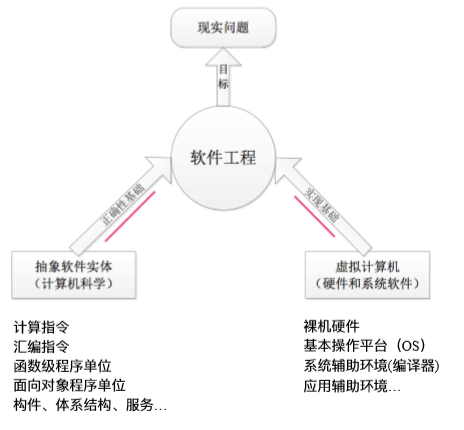

## 1.1. 现实
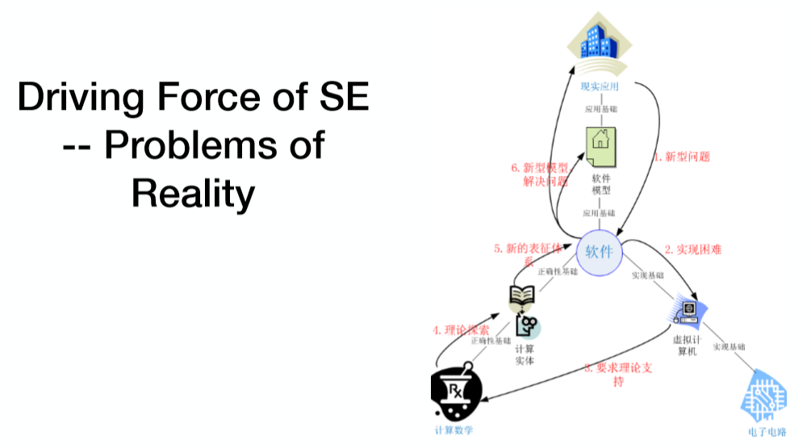

## 1.2. 抽象软件
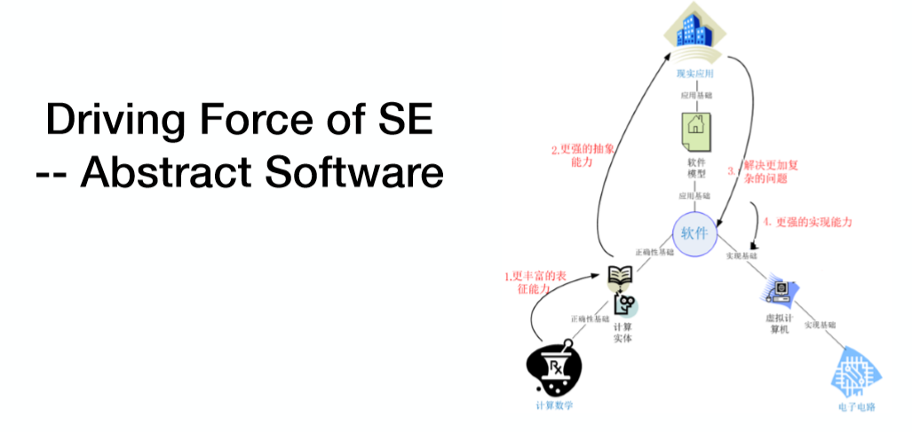

## 1.3. 虚拟机
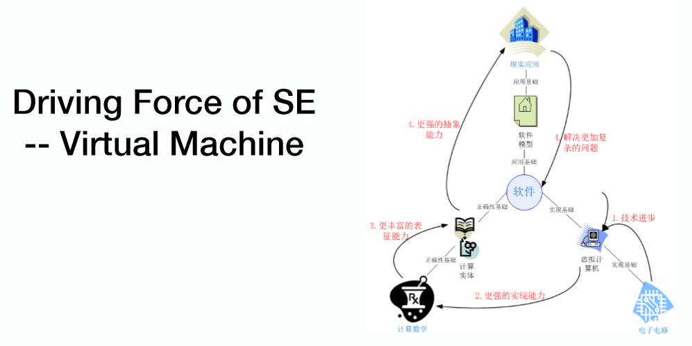

# 2. 软件发展历程

# 3. Before 1950s 软件是硬件一部分
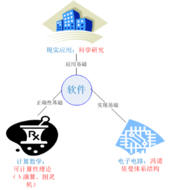

1. 科学研究(主要是军事用途)
2. 计算理论(lambda演算和图灵机)
3. 冯诺依曼架构
4. 软件是硬件的一部分

# 4. 年代:1950s

## 4.1. 软件工程和硬件工程是一样的
1. 第一代编程语言:机器语言，第二代编程语言:汇编语言
2. 主框架研究和BIOS
3. 硬件主导的发展过程

## 4.2. 发展过程
1. 虚拟计算机
    + 第一台商用计算机(UNIVAC I)
    + 机器为中心
2. 抽象软件实体
    + 格雷斯·霍珀是哈佛Mark I计算机的第一批程序员之一，该领域的先驱，大约在1952年为计算机编程语言开发了第一个编译器。
    + 20世纪50年代早期计算机的程序员，特别是UNIVAC I和IBM 701，使用机器语言程序，即第一代语言(1GL)。1GL编程很快被类似的机器专用语言(2GL)所取代，这种语言被称为汇编语言或"汇编程序"。

## 4.3. 机器为中心
1. 我⼯作的第⼀天(1950s)，我的主管向我展示了通用电⼒ERA1103计算机，这个家伙⾜⾜占满了⼀个⼤房间。他对我说："听着，我们每⼩时要为这台计算机⽀出600美元，⽽每⼩时只需为你⽀出2美元，我想你知道该怎么做了" -Boehm 2006

## 4.4. 软件发展方法
1. 在这⼀时期，⼈们的主要集中⼒放在硬件上，所以没有出现对软件开发专⻔⽅法与技术的需求，也就没有出现被普遍使用的软件开发⽅法与技术。

## 4.5. 软件发展过程
1. 美国和加拿大防空半自动化地面环境
2. 1个MLOC防空系统，实时，365 * 24，用户密集型
3. 成功让很多难以预估的系统的发展
4. 硬件主导的瀑布式过程

## 4.6. 总结
1. 科学计算
2. 机器为中心的科学主题
3. 第一代和第二代编程语言
4. 软件工程和硬件工程是相似的
5. 硬件主导的发展过程
6. 强调回溯和测试
7. 科学家和硬件工程师

# 5. 年代:1960s

## 5.1. 过程
1. 虚拟计算机
    + 更好的基础设施：操作系统、编译器(函数式)、应用
    + 产品系列：OS-360, CAD/CAM, math/statistics libraries
    + 许多巨大的成功：Apollo, ESS, BofA check processing
    + 信用卡、ATM
2. 抽象软件实体
    + 在20世纪50年代后期，汇编语言程序设计发展到包括宏指令的使用，随后又发展了"第三代"程序设计语言(3GL)，如FORTRAN、LISP和COBOL。
    + ASCII美国信息交换标准码

## 5.2. 两个重要的诉讼案
1. 通过⼀项诉讼案裁定ENIAC专利不再有效(1973裁决)
    + 使得计算机体系结构从此进⼊公共领域
2. 作为反垄断诉讼的结果，IBM同意分类定价软件
    + 使得软件不再依附于计算机硬件，独⽴存在

## 5.3. 应用为中心
1. 商业应用
2. 批处理过程

## 5.4. 软件不是硬件
1. 软件与现实世界关系更加密切，对需求的规格化更加困难：[Royce1970]提到"⽣产500万美元的硬件设备，30⻚的规格说明书就可以 为⽣产提供⾜够多的细节，⽣产500万美元的软件，1500⻚的规格说明书 才可以获取相当的控制。"
2. 软件⽐硬件容易修改的多，并且不需要昂贵的⽣产线复制产品：因为不需要昂贵的⽣产线，所以⼈⼒资源是软件开发的最⼤资源，⼈⼒成 本是软件开发的主要成本，⼈的因素是软件开发中的最⼤因素。
3. 软件没有损耗：软件维护的主要⼯作是修改软件，主要成本是修改的⼈⼒成本。为了降低维护成本，要求开发者在开发时就要让软件产品设计的易于修改。
4. 软件不可见：很难辨别软件进度是否正常，需要开发者更多地使用模型⼿段以可视图形的⽅式反映软件⽣产，也需要开发者使用更深⼊的⼿段(例如度量)监控软件⽣产过程。

## 5.5. 软件危机
1. 软件危机
    1. 对软件开发成本和进度的估计常常不准确。开发成本超出预算，实际进度⽐预定计划⼀再拖延的现象并不罕⻅。 
    2. 用户对"已完成"系统不满意的现象经常发⽣。
    3. 软件产品的质量不可靠。
    4. 软件的可维护程度⾮常之低。
    5. 软件通常没有适当的⽂档资料。
    6. 软件的成本不断提高。
    7. 软件开发⽣产率无法满足⼈们对软件的生产要求，软件开发⽣产率的提⾼落后于硬件的发展。
2. 这⼀情况迫使NATO科学委员会在1968和1969年召开两届⾥程碑式的"软件⼯程"会议，很多业界领先的研究者和实践者参加了这两届会议。1968年的会议主要分析了软件⽣产中的问题，提出了"软件危机"的说法。1969年的会议着重讨论了"软件危机"的解决⽅法，指出了"软件⼯程"的⽅向[Peter1969]，用⼯程的⽅法⽣产软件。

## 5.6. 软件发展方法
1. 因为缺乏正确科学知识的指导，也没有多少经验原则可以遵循，因此1960s的软件开发在总体上依靠程序员的个⼈能⼒，是"工艺式"的开发。
2. 到了1960s后期，因为认识到"工艺式"开发的问题，很多研究者开始从编程入手探索解决软件危机的办法，这些促成了1970s结构化编程⽅法的建⽴。

## 5.7. 软件发展过程
1. 牛仔式编程
2. 软件工艺
3. 个人英雄主义

## 5.8. 问题
1. 意大利面条，易读性低
2. 很多的bug
3. 大项目往往计划和控制很脆弱

## 5.9. 总结
1. 商业应用(批处理过程)
2. 应用为中心商业框架
3. 第三代编程语言
4. 软件不是硬件
5. 软件工艺的提出
6. 计算机科学系的出现
7. 软件危机的出现
8. 软件需求超过软件工程师的供应 
9. 图灵奖(1966)

# 6. 年代:1970s 结构化方法、瀑布模型和形式化方法

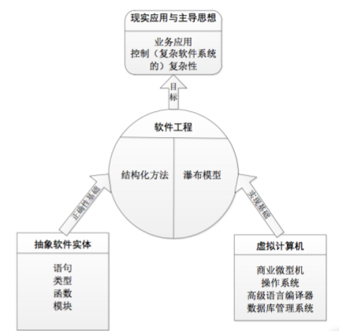

1. 软件产品
2. 商业微型计算机
3. 结构化编程语言
4. 结构化编程，瀑布模型和形式化方法
 
## 6.1. 过程
1. 虚拟计算机
    + 数据库管理系统
    + 编译器
    + 开发环境
    + 软盘，软盘驱动器
2. 抽象软件实体
    + 在1969到1973之间被作为一种系统编程语言发展，并且保持常用。
    + Pascal(1970)，Smalltalk(1972)，Prolog，Scheme(1975)，SQL(1978)
    + 函数式、块结构、顺序、分支、循环

## 6.2. 软件发展方法
1. 结构化编程语言
    + 函数
    + 顺序，分支，循环
2. 自上而下，逐步求解
3. 分解思想分层思想
4. 图的思想
5. 模块化，数据隐藏
6. 抽象数据类型
7. 结构化方法

## 6.3. 结构化方法
1. 结构化编程(Bohm-Jacopini: GO TO 是不应该常有的)
    + 形式化编程：Dijkstra, Hoare, Floyd
    + 正式自上而下的SP:Mills、Baker
2. 通过以下来组织程序
    + 函数：算法
    + 三种控制逻辑
    + 格式和格式检查
3. 当编译器处理好函数时，有组织的程序：模块化方法
4. 模块化使这些事情变得重要
    + 信息隐藏
    + 数据抽象
5. 使用数据流图、实体关系图和结构图来进行结构化设计。

## 6.4. 形式化方法
1. "形式方法"的分支，通过数学证明或通过"编程演算"的构造来关注程序的正确性
2. 在60年代的十年里，理论计算机科学作为一门被数学界和计算界都认可的学科，它可以指向应用和数学的优雅
3. 工作量大，一般是很重要的程序才使用形式化方法处理

## 6.5. 形式化方法的问题
1. 对于小的重要的程序是成功的
2. 最大的验证项目约10 KSLOC
3. 证据表明存在缺陷，而不是缺失
    + 规格有缺陷，证明有问题
4. 程序员社区的可伸缩性
    + 技术需要数学专业知识，500美元/SLOC
    + 1975年调查中的平均程序员
        + 两年大学，SW 经历
        + 熟悉两种语言和应用程序
        + 邋遢，呆板，凌驾于头脑中，管理不善

## 6.6. 软件发展过程

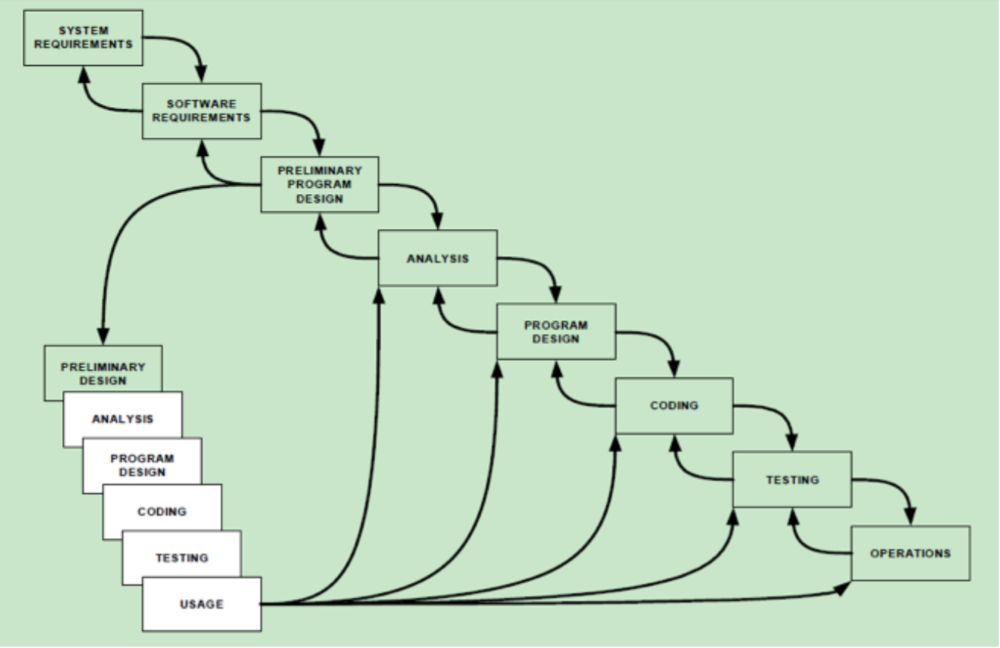

1. 瀑布模型
2. 每个阶段做至少两次

## 6.7. 瀑布模型的问题
1. 对连续里程碑的过度字面解释
    + 原型设计是在关键设计评审之前进行编码
    + 与用户密集型系统不匹配
2. 难以审查和维护的重量级文档
    + 7年项目，需求变化318%
    + 已通过但未验证的里程碑
3. 与COTS、重用、遗留软件不匹配：自下而上与自上而下的流程
4. 可扩展性、周期时间和过时 
    + Months = $5 * \sqrt[3]{KSLOC}$ for sequential development
    + 3000 KSLOC => 5*14.4 = 72 months : 4 computer generations

## 6.8. 软件与硬件成本代价变换
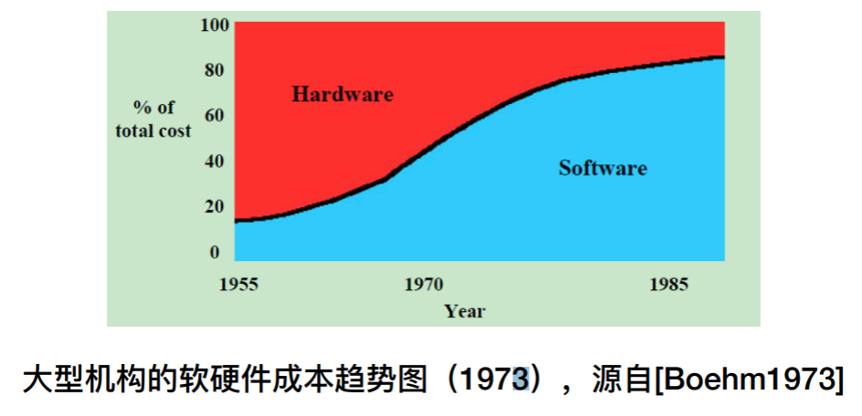

## 6.9. 时间与修复代价的问题
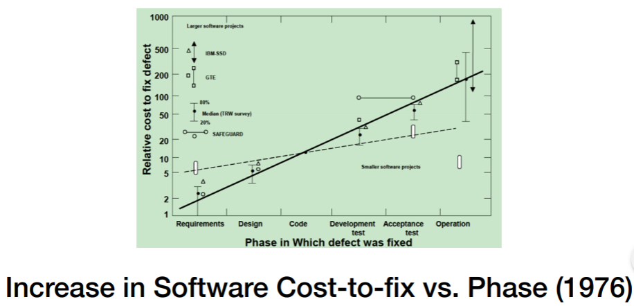

## 6.10. 量化方法
1. 软件生产效率数据：最好程序员可以是最差程序员的26倍
2. 按阶段和类型划分的软件缺陷
3. 复杂性度量
4. 软件质量
5. 成本和进度估算

## 6.11. 总结
1. 软件产品
2. 商业微型计算机
3. 结构化编程语言
4. 结构化方法
5. 瀑布模型
6. 形式化模型
7. 量化方法

# 7. 年代:1980s：生产力，面向对象，重用，软件过程模型

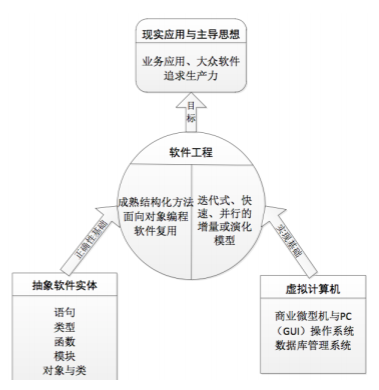

1. 个人消费者市场的应用
2. 面向对象
3. 个人计算机 图形界面

## 7.1. 过程
1. 虚拟计算机
    + 个人计算机
    + 更好的编译器
    + 图形化界面编程环境
    + 存储器
2. 抽象软件实体
    + 图形界面
    + 面向对象编程语言

## 7.2. 应用
1. 成指数型增长
    + 软件复杂度
    + 个人消费市场规模
2. 全世界对生产力、竞争力的关注
3. 日本的例子：将部分其他产业的方法引入到软件行业，丰田

## 7.3. 软件发展方法
1. 现代结构化分析和设计
    + 更多的结构化方法
    + 分析和设计的同时思考
2. 面向对象分析和设计
3. 软件重用

### 7.3.1. 现代结构化分析和设计
1. 1970s中后期基于结构化编程建⽴了早期的结构化⽅法，包括结构化分析与结构化设计：更多地还在关注于软件程序的构建。
2. 到了1980s，⼈们逐步开始将结构化分析与设计的关注点转向问题解决和系统构建，产⽣了现代结构化⽅法
    + 信息工程(Information Engineering)[Martin1981]、JSD(Jackson System Development)[Jackson1983]、SSADM(Structured systems analysis and design method )、SADT( Structure Analysis and Design Technique)[Marca1987]和现代结构化分析(Modern Structured Analysis)[Yourdon1989]。
+ 更注重系统构建⽽不是程序构建，所以更重视问题分析、需求规格和系统总体结构组织⽽不是让分析与设计结果符合结构化程序设计理论，更重视阶段递进的系统化开发过程，⽽不是⼀切围绕最后的编程进⾏。

### 7.3.2. 面向对象编程
1. 最早的面向对象编程思想可追溯到1960s的Simular-67语⾔[Nygaard1978]：使用了类、对象、协作、继承、多态(子类型)等最基础的⾯向对象概念。
2. 1970s的Smalltalk[Kay1993]就是完全基于面向对象思想的程序设计语⾔：它强化了⼀切皆是对象和对象封装的思想，发展了继承和多态。
3. 到了1980s中后期，随着C++的出现和⼴泛应用，面向对象编程成为程序设计的主流。C++只是在C语⾔中加⼊面向对象的特征，并不是纯粹的⾯向对象语⾔。
4. 面向对象特性 
    + ⾯向对象本身不像结构化⼀样有基于数学的程序设计理论的⽀撑
    + [Booch1997]认为模块化、信息隐藏等设计思想和数据库模型的进步都是促使⾯向对象概念演进的重要因素。
    + 与结构化⽅法相⽐，⾯向对象⽅法中的结构和关系(类、对象、⽅法、继承)能够为领域应用提供更加自然的⽀持，使得软件的复用性和可修改性更加强⼤。
    + 可复用性满⾜了1980s追求⽣产⼒的要求，尤其是提⾼了GUI编程的⽣产⼒，这也是推动⾯向对象编程发展的重要动⼒[Graham2001]。

### 7.3.3. 结构化编程 和 面向对象编程 对比
1. 结构化
    + 学术化
    + 严谨，充足的数学⽀持
2. ⾯向对象
    + 商业化
    + 原则的必要性，流派的复杂化
        + 相当数量的程序员使用⾯向对象的语⾔写着过程式的程序
        + ⾯向对象是个好东⻄，但是只有专家级程序员才能用好它
3. ⼯业界与学术界的鸿沟

### 7.3.4. 重用和面向对象
1. 1950’s: Math routines, utilities
2. 1960’s: McIlroy component marketplace, Simula – 67
3. 1970’s: Abstract data types, Parnas program families
4. 1980’s: Smalltalk, Eiffel, C++, OO methods, reuse libraries
5. 1990’s: Domain engineering, product lines, UML, pub-sub architectures
6. 2000’s: Model driven development, service oriented architectures

### 7.3.5. 软件重用
1. 面向对象
2. 第4代语言
3. 购买商用组件
4. 程序产⽣器(自动化编程)

## 7.4. Software Process 软件过程
1. 过程模型
    + 原型[Budde1984]
    + 渐进交付[Basili1975]
    + 演化式开发[Gilb1981]
    + 螺旋[Boehm1988]
2. 过程评价:很重要
    + CMU SEI(卡内基梅隆大学软件研究所)建⽴了软件能⼒成熟度模型 **SW-CMM**[Humphrey1988]，它通过评价**企业的开发过程管理来反映企业的生产能力**。
    + 国际标准化机构也完成⼀个类似的软件过程评价标准ISO-9001。
3. 使用⼯具支持过程
    + 计算机辅助软件⼯程(CASE)

## 7.5. 没有银弹
1. Frederick P. Brooks经过分析后认为，软件开发的根本困难在于软件产品的内在特性，它们是⽆法回避的，也不是可以轻易解决的，没有技术能够起到银弹的作用 ——没有银弹。
2. 布鲁克斯提出了主要的挑战
    + 很棒的设计者
    + 快速原型法
    + 快速迭代式开发
    + 在工作中避免重用

## 7.6. 人
1. 最终要的因素
    + 软件工程是依赖于人、为了人。
2. 1970’s: 温伯格计算机编程心理学
3. 1980’s: 《人件》
4. 1990’s – 2000’s: 在敏捷和CMM文化中强调的重要性
    + 流程和工具上的个人和交互
    + 人员CMM，个人软件过程，团队软件过程

## 7.7. 总结
1. 生产力
2. 个人消费
3. 个人计算机
4. 图像界面
5. 现代化结构化方法
6. 面向对象
7. 重用
8. 软件过程
9. 没有银弹
10. 人力成本

# 8. 年代:1990s：局域网，软件架构，RUP，过程改进

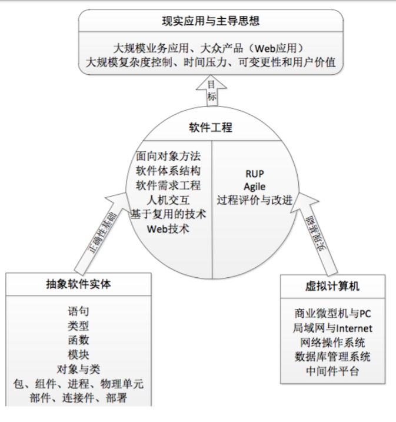

1. Web Application 网络应用
2. Intranet 软局域网
3. Software Architecture 软件框架
4. RUP

## 8.1. Progress
1. 虚拟计算机
    + 局域网
    + 中间件
2. 抽象软件实体
    + 软件结构
    + Java
    + ISBSG国际软件基准组织

## 8.2. 企业为中心
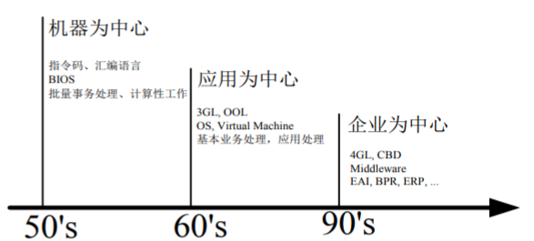

1. 整合以前建⽴的各个"应用孤岛"，实现对整个企业业务的全⾯整体化管理
2. 以局域⽹为基础的软件系统可以覆盖企业的所有重要部⻔、重要⼈员和重要⼯作，实现它们之间的有效协同，从根本上提⾼企业的业务能⼒，价值和复杂度上都⽐孤⽴应用有着质的提⾼。

## 8.3. 大规模软件系统
1. 复杂度：1990s的⼀个发展主题就是建⽴能够开发⼤规模软件系统的⽅法与技术。
2. 可修改性：1990s出现了对软件可变更性的持续追求，这种态势延续⾄今。
3. 开发周期：⼈们必须解决⼤规模软件系统开发周期过⻓的问题，并在1990s中后期提出了市场驱动开发(Market Driven Development)的⼝号
4. 用户价值：从1990s后期开始，⼈们认识到了用户价值的重要性，并持续探索⾄今，⼈机交互、涉众分析等很多新的⽅法与技术都是为了提⾼软件产品的用户价值⽽提出来的。

## 8.4. 软件发展方法
1. 面向对象
2. 软件架构
3. 人机交互
4. 需求工程
5. 基于大规模软件开发方法重用
6. 网络应用开发方法

## 8.5. 面向对象思想
1. 出现了OMT[Rumbaugh1991]、Booch⽅法[Booch1997]、
OOSE[Jacobson1992]、CRC卡[Beck1989,Wirfs-Brock1990]等⼀系列⾯向对象的分析与设计⽅法。
2. ⼀个统⼀的面向对象建模语⾔UML[UML]被建⽴和传播。
    + 对于开发的系统绘制的UML 第四层
    + UML的图例语法等 第三层
    + 描述UML的模型 第二层
    + 模型的模型 第一层
3. 设计模式[Gamma1995]、⾯向对象设计原则[Martin2002]等有效的⾯向对象实践经验被⼴泛的传播和应用。

## 8.6. 软件体系架构
1. 上世纪70年代开发复杂软件系统的初步尝试[Brooks1975]使得⼈们明确和发展了独立的软件设计体系，提出了模块化、信息隐藏等最为基础的设计思想。
2. 到了随后的80年代中期，这些思想逐⼀⾛向成熟，并且成功融⼊了软件开发过程。这时，⼀些新的探索就出现了，其中包括⾯向对象设计，也包括针对⼤规模软件系统设计的⼀些总结与思考
3. 于是，研究者们[Perry1992, Garlan1993]在1990s初期正式提出了"软件体系结构"这⼀主题，并结合上世纪90年代之后出现的软件系统规模⽇益扩⼤的趋势，在其后的⼗年中对其进⾏了深⼊的探索与研究。
4. ⼈们在体系结构的基本内涵、⻛格、描述、设计、评价等⽅⾯开展了卓有成效的⼯作，在2000s初建⽴了⼀个⽐较系统的软件体系结构⽅法体系[Kruchten2006, Shaw2006]。

## 8.7. 两种复用的模式
1. **框架**：是领域特定的复用技术。它的基本思想是根据应用领域的共性和差异性特点，建⽴一个灵活的体系结构，并实现其中⽐较固定的部分，留下变化的部分等待开发者补充。
2. **构件**：是在代码实现层次上进⾏复用的技术。它的基本思想是给所有的构件定义⼀个接⼝标准，就像机械工程定义螺丝和螺⺟的标准规格⼀样，这样就可以忽略每个构件内部的因素实现不同构件之间的通信和交互。COM和JavaBean就是1990s产⽣并流⾏起来的构件标准。

## 8.8. 网络开发发展方法
1. 在1990s早期，⼈们主要使用HTML开发静态的Web站点。
2. 到了1990s中后期，ASP、JSP、PHP、JavaScript等动态Web开发技术开始流⾏。
3. 在1990s后期，⼈们建⽴了Web程序的数据描述标准XML。

## 8.9. Software process
1. 过程模型 
    + RUP
    + Agile
    + 产品线
2. 过程改进：CMMI
3. 开源软件, 遗留软件，商用货架产品(COTS)
4. 反向工程
5. 风险驱动的并行工程：带锚点的双赢螺旋；合理的统一过程
6. RUP:
    + 颜色代表本阶段做的多少
    + 分为四个阶段

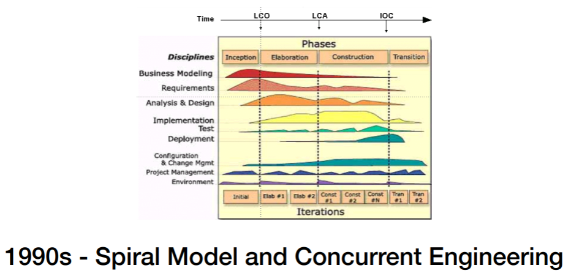

## 8.10. 开源
1. 开源
    + 来源于黑客文化
        + 集体代码所有权
        + 免费的软件，数据，计算介质
    + 免费软件
    + Linux
    + Raymond’s "The Cathedral and the Bazaar"
2. 组件和COTS是它们的未来

## 8.11. 总结
1. 企业为中心，避免信息孤岛
2. 大规模软件系统
3. Web
4. 软件结构
5. 特定领域方法
6. 产品先重用
7. 并行驱动、风险驱动过程：RUP
8. CMMI

# 9. 年代:00s：互联网、敏捷、混合敏捷和计划驱动
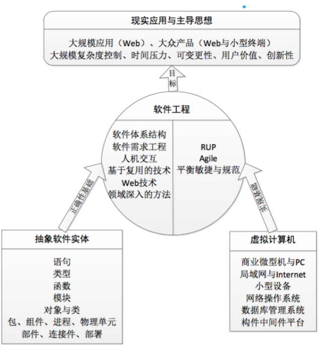

1. Internet
2. Agile 敏捷

## 9.1. 过程
1. 虚拟计算机
    + 互联网
    + 嵌入式设备
    + .Net, J2EE, 网络设备
    + Linux, WinCE, iOS, Android 移动设备
    + 团队协作开发环境
2. 抽象软件实体
    + UML 2.0
    + 模型驱动的开发和面向服务的体系结构
    + 混合敏捷和计划驱动的产品和过程架构
    + 用快速、不可预知的变化封装零件
    + 按规范并行构建、V&V、敏捷再选择

## 9.2. 以用户为中心的应用
1. 网络应用
2. 大众消费者
3. 提高系统工程和软件工程的集成度："软系统工程"的发展趋势
4. 越来越关注可用性和价值：使软件和硬件适合人们，而不是相反
5. 紧急需求与预定需求

## 9.3. 软件发展方法
1. 延续1990s的技术进展
    + 集成系统与软件工程
    + 混合敏捷、计划驱动方法
    + 面向服务的体系结构，模型驱动的开发
2. Web技术发展
3. 领域特定的软件工程方法
    + 以⽹络为中⼼的系统；
    + 信息系统；
    + ⾦融和电⼦商务系统；
    + ⾼可信系统；
    + 嵌⼊式和实时系统；
    + 多媒体、游戏和娱乐系统；
    + ⼩型移动平台系统。

## 9.4. 软件过程
1. 敏捷
2. 平衡

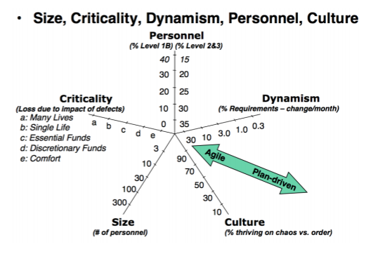

1. 上图中的部分度量
    1. 人员多少
    2. 企业文化
    3. 需求变更的情况
2. 越偏向中心，越敏捷

## 9.5. SE: 从商业到个人
1. 知识体系
2. 认可大学教育

## 9.6. 总结
1. 大规模网络应用
2. 大众消费应用
3. 领域特定软件工程
4. 敏捷

# 10. 年代:2010s - Big data & AI 
1. 云:云已经开始落地，并且效果很好
2. 众包
3. Facebook,twiter,wechat,tiktok
4. Big data
5. AI
6. 可穿戴式设备

## 10.1. Barry Bohem’s view
1. 八大惊喜潮流
    1. 增加SysE和SwE的集成
    2. 用户/价值焦点
    3. 软件关键性和可靠性
    4. 快速，持续变更
    5. 分布，移动性，互操作性，全球化
    6. 开源、重用、遗留集成
    7. 计算量
2. 两种发展趋势
    + 原子软件
    + 生物和计算机结合

## 10.2. 软件工程有可能的改进
1. 软件⽣产⼒和质量度量不精确
2. 存储认证可重用组件需要成为主流
3. 质量控制不稳定
4. 变更控制也做的不好
5. 项⽬估算也有待提⾼
6. 软件安全⼀直在警戒⽔平以下
7. 软件⼯程需要发放执照和职业资格认证的真正职业
8. ⾮功能性需求的新型度量⽅法
9. 遗留软件的维护

## 10.3. 最近的软件工程概念
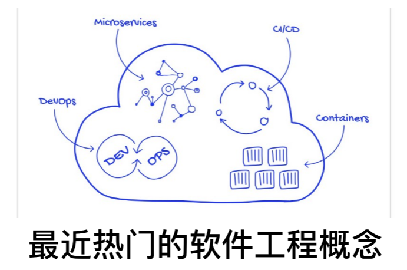

1. 开发运维一体化
2. 微服务
3. CI/CD:持续开发，持续集成
4. 容器开发

## 10.4. 开发过程
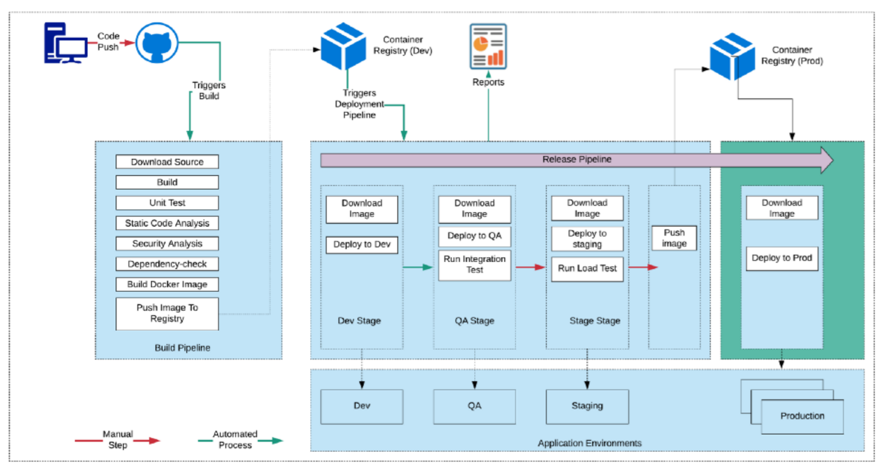

## 10.5. 服务网格
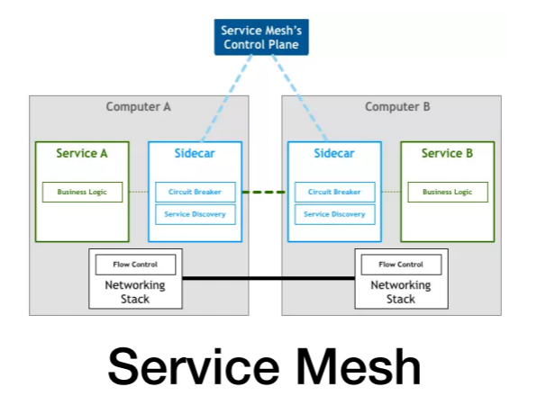

1. 一个结点，A服务和B服务，有控制面板控制所有的服务，将所有的服务集成起来，让开发人员更关注于绿色部分
2. 蓝色部分:sidecar(边车)，负责处理服务以外的建立的联系

## 10.6. 持续软件工程
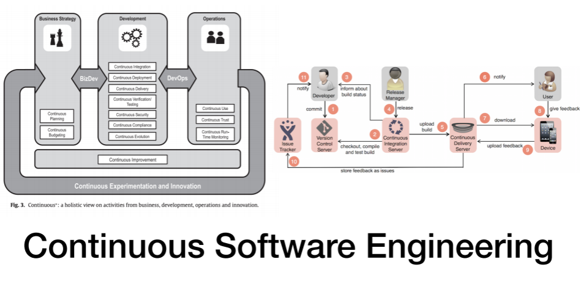

1. 将商业策略和开发运维结合
2. 中台设计:将业务和架构结合

## 10.7. 混沌工程

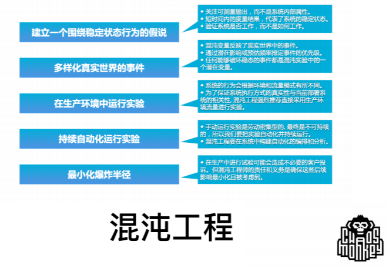

1. 比如在一个系统中出现问题(如何在双11之前确保双11不会出现问题)：如何保证在真实的需求下也是充足的。
2. 最小化爆炸半径:在生产环境中，随机在一些局部给系统一个爆炸，来确定具体的状况。

# 11. 总结

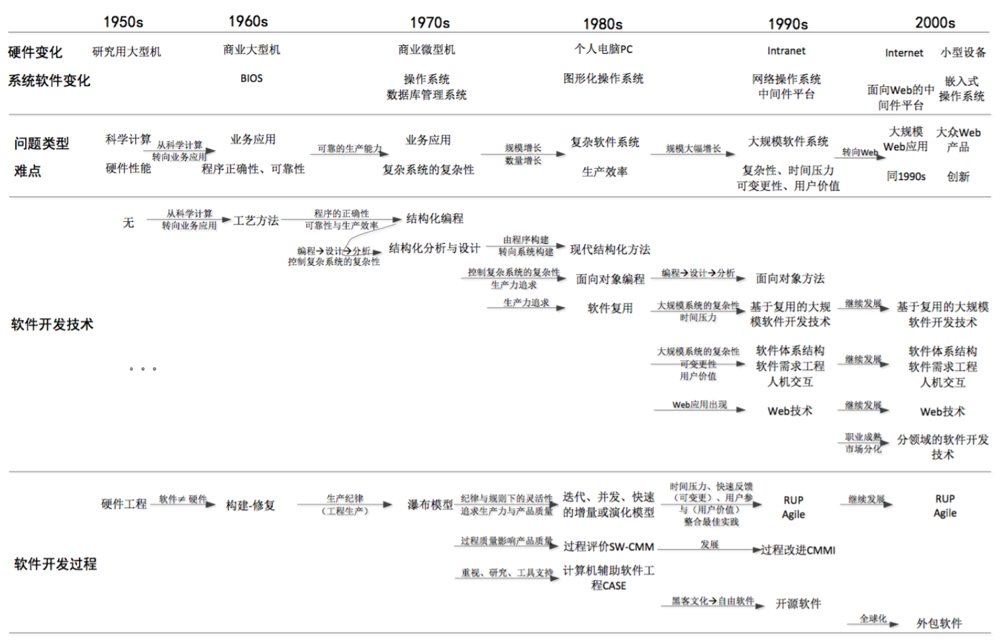

1. From the 1950’s
    + `+` 不要忽略科学
    + `+` 三思而后行(避免过早的承诺)
    + `-` 避免不连续的顺序过程
2. From the 1960’s
    + `+` 跳出框框思考
    + `+` 尊重软件的差异
    + `-` 避免牛仔编程
3. From the 1970’s
    + `+` 更早处理错误
    + `+` 确定系统布标
    + `-` 避免自上而下的发展还原论
4. From the 1980’s
    + `+` 提高生产力的途径有很多
    + `+` 对产品有益的东西对工艺有益
    + `-` 对银弹持怀疑态度
5. From the 1990’s
    + `+` 时间就是金钱，对人很重要
    + `+` 对人来说软件要实用
    + `-` 快速，但是不要急躁
6. From the 2000’s
    + `+` 如果变化很快，适应性胜过可重复性
    + `+` 考虑并满足所有利益相关者的价值主张
    + `-` 避免爱上你的口号(雅格尼)
7. For the 2010’s
    + `+` 把手放在手边
    + `+` 有生存策略
    + `-` 要什么都相信
        + `-` 不要完全相信互联网

# 12. 软件工程教育的未来挑战-2050年代的学生生涯
1. 不断更新课件
2. 预测未来趋势并为学生做好准备
3. 将永恒的原则与老化实践分离
4. 使小型学生项目与大型行业实践相关 
5. 参与研究；将结果纳入课程
6. 帮助学生学会学习
7. 为从业者提供终身学习

# 13. 从1950s—2000s之间的特点(简答)
1. 1950s：科学计算；以机器为中心进行编程；像生产硬件一样生产软件。
2. 1960s：业务应用(批量数据处理和事物计算)；软件不同于硬件；用软件工艺的方式生产软件。
3. 1970s：结构化方法；瀑布模型；强调规则和纪律。它们奠定了软件工程的基础，是后续年代软件工程发展的支撑。
4. 1980s：追求生产力最大化；现代结构化方法/面向对象编程广泛应用；重视过程的作用。
5. 1990s：企业为中心的大规模软件系统开发；追求快速开发、可变更性和用户价值；web应用出现
6. 2000s：大规模web应用；大量面向大众的web产品；追求快速开发、可变更性、用户价值和创新。