04-项目启动
---

<!-- TOC -->

- [1. 项目和项目管理](#1-项目和项目管理)
  - [1.1. 项目](#11-项目)
- [2. 团队组织与管理](#2-团队组织与管理)
  - [2.1. 团队](#21-团队)
  - [2.2. 团队的特征](#22-团队的特征)
  - [2.3. 团队结构](#23-团队结构)
  - [2.4. 团队建设(高凝聚力的团队被称为胶冻团队) 重要](#24-团队建设高凝聚力的团队被称为胶冻团队-重要)
- [3. 软件质量保障](#3-软件质量保障)
  - [3.1. 软件质量](#31-软件质量)
  - [3.2. 质量模型](#32-质量模型)
  - [3.3. 质量保障](#33-质量保障)
  - [3.4. 评审](#34-评审)
    - [3.4.1. 典型的评审过程](#341-典型的评审过程)
  - [3.5. 质量度量](#35-质量度量)
  - [3.6. 质量保障有哪些措施（重要）](#36-质量保障有哪些措施重要)
- [4. 软件配置管理](#4-软件配置管理)
  - [4.1. 软件配置管理的动机](#41-软件配置管理的动机)
  - [4.2. 配置管理](#42-配置管理)
  - [4.3. 配置项](#43-配置项)
  - [4.4. 基线](#44-基线)
  - [4.5. 配置管理活动（重要）](#45-配置管理活动重要)
  - [4.6. 辅助管理工具](#46-辅助管理工具)
  - [4.7. 版本管理示意图](#47-版本管理示意图)
    - [4.7.1. 分支管理常见策略](#471-分支管理常见策略)
    - [4.7.2. 查看不同](#472-查看不同)
    - [4.7.3. 为啥要暂存区](#473-为啥要暂存区)
  - [4.8. 变更要求表单](#48-变更要求表单)
- [5. 管理实践](#5-管理实践)
  - [5.1. 经济为本](#51-经济为本)
    - [5.1.1. 总结](#511-总结)
  - [5.2. 分工协作](#52-分工协作)
    - [5.2.1. 建议的团队](#521-建议的团队)
    - [5.2.2. 三架马车](#522-三架马车)
    - [5.2.3. 项目管理的角色](#523-项目管理的角色)
  - [5.3. 目标驱动](#53-目标驱动)
    - [5.3.1. 目标的SMART原则](#531-目标的smart原则)
  - [5.4. 常来常往](#54-常来常往)
    - [5.4.1. 观念](#541-观念)
  - [5.5. 有张有弛](#55-有张有弛)
    - [5.5.1. 方法](#551-方法)
  - [5.6. 不断总结](#56-不断总结)
    - [5.6.1. 给管理新手的建议](#561-给管理新手的建议)
- [6. 项目实践](#6-项目实践)

<!-- /TOC -->

# 1. 项目和项目管理
1. 项目的核心是计划：计划包括项目需要的资源、活动，以及在项目中需要产生的中间交付产品。

## 1.1. 项目
1. 项⽬是具有下列特征的⼀系列活动和任务[Kerzner2009]
    + 具有⼀个明确的目标；
    + 有限定的开始和结束日期；
    + 有成本限制；
    + 消耗人力和⾮人力资源；
    + 多工种合作。
2. 项目管理的目标
    + 在限定时间内；
    + 在⼀定的成本内；
    + 在要求的质量⽔平上；
    + ⾼效使⽤资源；
    + 获得客户认可。
3. 过程组：项目启动、项目计划、项目执⾏，项目跟踪与控制和项⽬收尾
4. 活动：计划制定、团队管理、成本控制、质量保障、度量、过程管理、进度跟踪 与控制、⻛险管理、配置管理

# 2. 团队组织与管理

## 2.1. 团队
1. ⼀个协作良好的团队是任何项目成功的基础。
2. 软件项⽬尤其依赖于有效的团队组织和管理：软件开发是⼀个以⼈为主的活动，⼈⼒资源是软件项⽬最⼤的资产。
3. 有很多实践者认为⽐⽣产⾼质量产品更⼤的成功是**在⽣产过程中建⽴⼀个凝聚的团队**

## 2.2. 团队的特征
1. [Katzenbach1993]将团队定义为：为了⼀致的⽬的、绩效标准、⽅法⽽共担 责任并且技能互补的少数⼈。
    + 团队成员要具备共同的目标。
    + 团队成员要共担责任。
    + 团队成员要技能互补。
    + 团队内部要有⼀个明确的结构。

## 2.3. 团队结构
1. 主程序员团队:决策需要由主程序员进行制定
    + 效率高，如果完成把握大，并且需要时间紧迫，可以优先考虑
    + 一个人的决断容易影响整个团队，如果项目复杂，主程序员会成为瓶颈。
    + 适用于把握性大，时间要求紧的情况
2. 民主团队:没有集中的瓶颈，成员发挥能动性，工作效率降低，冲突解决。敏捷+较有挑战性的项目
3. 开放团队:
    + 为了创新而存在的。黑箱管理，问题在于项目进展没有可视度。
    + 相对于前两个团队的需求明确，团队的需求并不明确
    + 管理者主要负责清除出现的障碍。
    + 开放团队是为了创新而存在

## 2.4. 团队建设(高凝聚力的团队被称为胶冻团队) 重要
1. **建立团队章程**：建立明确的团队章程，统一团队成员的目标，对团队成员进行一定的约束。经验：有必要指定一定的章程，约束团队成员之间的行为，比如开会请假必须得到其他三人的同意，又如一旦某项决策做出，不同意者不能再后续阶段违反等。

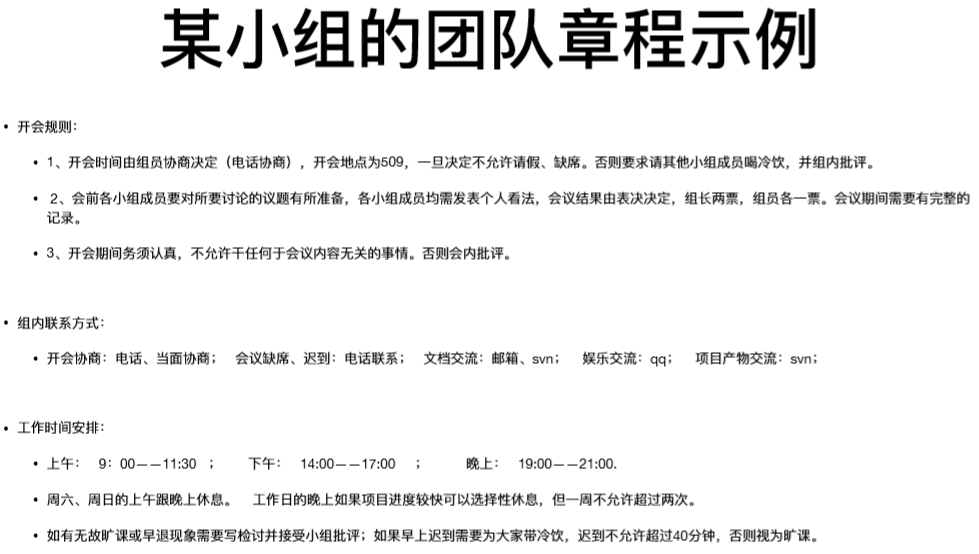

2. **持续成功**：设置小里程碑，每隔一段时间让团队体验成功。每次作业的检查结果一定程度上肯定了每个小阶段的工作。
3. **和谐沟通**：和谐沟通：建立持续有效的沟通机制，相互尊重，管道畅通，开放透明，坦诚真实。开会频率保持在每周一次左右为宜，在工作量大的时候，需要集体工作，当面沟通，另外吵架可以，但是需要达成一致。
4. **不断总结**：不断总结上一阶段的工作成果，运用项目评审等手段，进行反思回顾，指导后续阶段的开发。每个阶段都会有启动会议对上个阶段进行回顾，评审会议对此阶段进行评审。
5. **避免团队杀手**:需要对别人的工作全心全意的信任，尽管评审是必要的。产品质量的降低会使得凝聚力下降。
    + 防范式管理。
    + 官僚主义。
    + 地理分散:异地办公
    + 时间分割:可以保证全天候有人在
    + 产品质量的降低。
    + 虚假的最后期限。
    + ⼩圈子管理
6. 没有人能够成为多个胶冻团队的成员。

# 3. 软件质量保障

## 3.1. 软件质量
1. 软件工程师也要对软件产品的质量负责。
2. 对软件质量的要求可能是显式的，也可能是隐式的。
3. ⼈们通常会选⽤系统的某些质量要素进⾏量化处理，建⽴质量特征，这些特征被称为质量属性（Quality Attribute）。
4. 为了根据质量属性描述和评价系统的整体质量，⼈们从很多质量属性的定义当中选择了⼀些能够相互配合、相互联系的特征集，它们被称为质量模型。
5. 详见书上的IEEE的标准 P54页

## 3.2. 质量模型
1. 因素
2. 功能性
3. 可靠性
4. 易用性:人机交互
5. 效率
6. 可维护性
7. 可移植性

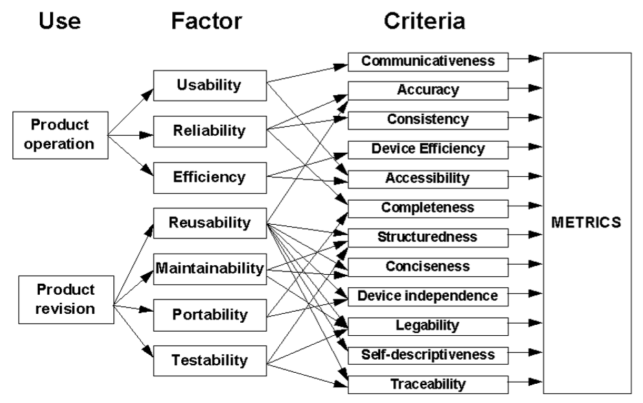

## 3.3. 质量保障

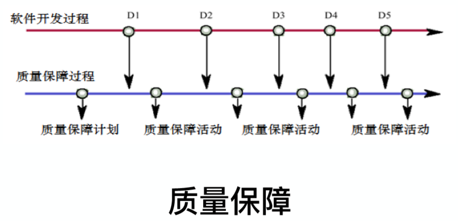
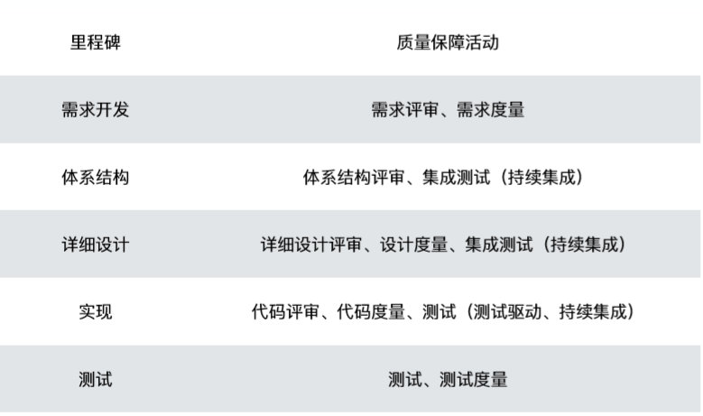

## 3.4. 评审

### 3.4.1. 典型的评审过程

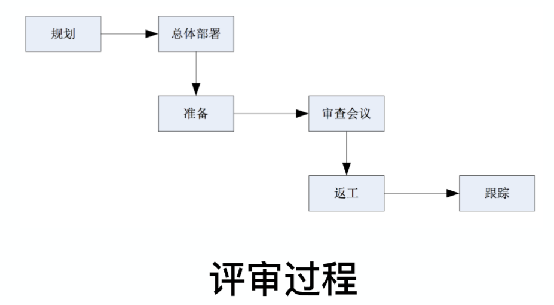

1. 在规划阶段（Planning），制定审查计划，决定审查会议的次数，安排每次审查会议的时间、地点、参与⼈员、审查内容等等。
2. 在总体部署阶段（Overview），向所有参与审查会议的⼈员描述待审查材料的内容、审查的⽬标以及⼀些假设，并分发⽂档。
3. 在准备阶段（Preparation），审查⼈员各⾃独⽴执⾏检查任务。在检查的过程当中，他们可能会被要求使⽤检查清单、场景等检查⽅法。检查中发现的问题会被记录下来，以准备开会讨论或者提交给收集 ⼈员。
4. 在审查会议阶段（Inspection Meeting），通过会议讨论，识别、确认、分类发现的错误。(200L/h)
5. 在返⼯阶段（Rework），修改发现的缺陷。
6. 在跟踪阶段（Follow-up），要确认所有发现的问题都得到了解决，所有的错误都得到了修正。

## 3.5. 质量度量
1. 度量产⽣⾃统计控制（Statistical Control）思想。“你不能控制⾃⼰⽆法度量的东⻄”[DeMarco1998]。
2. 测度（Measure）就是为了描述软件产品⽽提供的定量指标：代码⾏数
3. 进行测度的活动被称为测量（Measurement）。
4. 度量（Metric）是软件产品在特定属性上的量化测度程度。
5. 例如基于所有对象的代码⾏数测度可以建⽴平均代码⾏数、最⼤代码⾏数、最⼩代码⾏数

## 3.6. 质量保障有哪些措施（重要）
1. 需求开发——需求评审和需求度量；
2. 体系结构——体系结构评审和集成测试(持续集成)；
3. 详细设计——详细设计评审、设计度量和集成测试(持续集成)；
4. 构造阶段——代码评审、代码度量、测试（测试驱动和持续集成）；
5. 测试阶段——测试、测试度量。
6. 要及时的根据保障计划进行质量验证，质量验证的方法主要有评审、测试和质量度量三种。

# 4. 软件配置管理

## 4.1. 软件配置管理的动机
1. 在软件开发活动中，除了最终产品之外，还会产⽣很多中间制品，例如需求规格说明、需求分析模型、软件体系结构设计模型、详细设计模型等。这些制品是不同阶段、不同⻆⾊、不同软件开发活动进⾏协同的基础。
2. 在复杂软件系统开发中，产⽣的制品数量众多，以⾄于开发者需要维护⼀个清单才能清楚项⽬所处的状态，理解已经完成的⼯作和将要进⾏的⼯作。
3. 某个制品发⽣变化带来的最⼤挑战是如何确保其使⽤者能够得到最新的制品，避免开发协同出现问题。

## 4.2. 配置管理
1. IEEE将配置管理定义为[IEEE610.12-1990]：“⽤技术的和管理的指导和监督⽅法，来标识和说明配置项的功能和物理特征，控制对这些特征的变更，记录和报告变更处理及其实现状态，并验证与规格需求的⼀致性”。

## 4.3. 配置项
1. IEEE将配置项定义为[IEEE610.12-1990]：“置于软件配置管理之下的软件配置的各种有关项⽬，包括各类管理⽂档、评审记录与⽂档、软件文档、源码及其可执⾏码、运⾏所需的系统软件和⽀持软件以及有关数据等”。

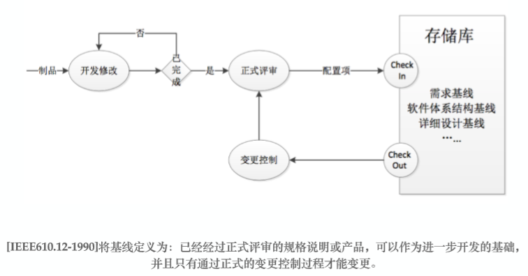

2. 一旦需求发生变更，则需要从评审开始重新操作

## 4.4. 基线
1. 基线是指通过了评审和验证，可以作为后续开发工作基础而进入协同工作过程，需要纳入配置管理和执行变更控制的制品称为该配置项的**基线**。

## 4.5. 配置管理活动（重要）
1. 标识配置项版本管理:确定应该被保留的部分，并且给予他们确定标识，包含配置项的特征，包括生产者、基线建立时间、使用者等。
2. 版本管理：极其重要
3. 变更控制：变更请求表单，教材61页
4. 配置审计:验证配置项的完整性、正确性、一致性和可追踪性。
5. 状态报告:反映当前的配置状态。
6. 软件发布管理:将配置项发布到开发活动之外，例如发布给客户。

## 4.6. 辅助管理工具
在项目实践中，使用配置管理工具对项目进行配置管理，如SVN。 

## 4.7. 版本管理示意图
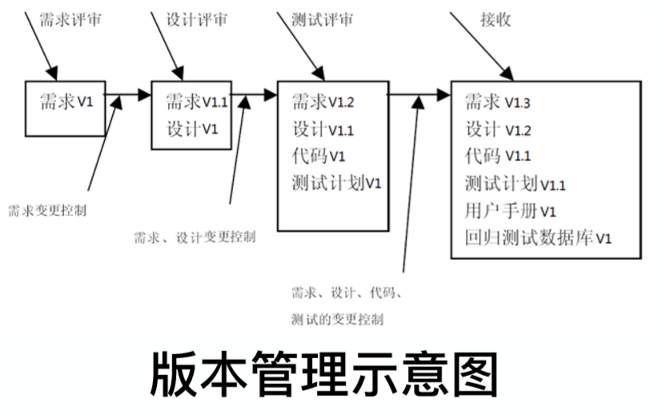
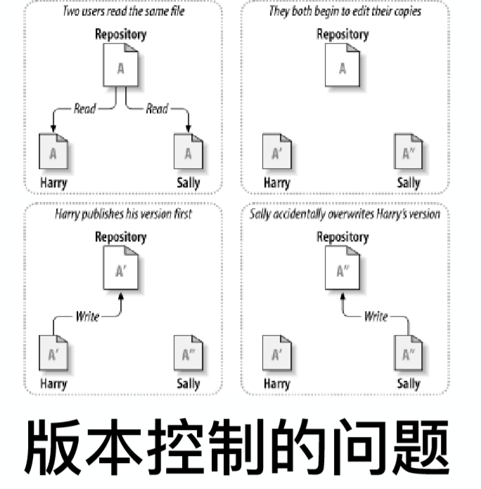
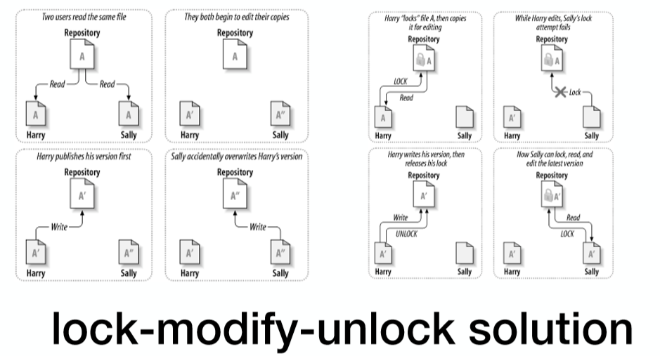
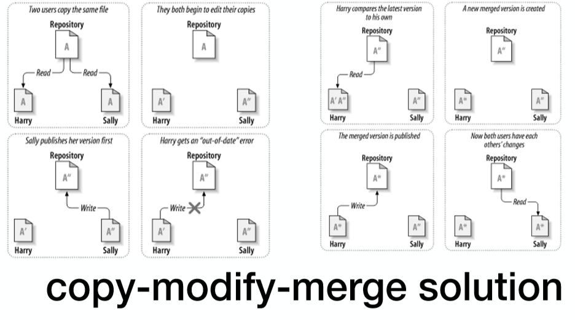
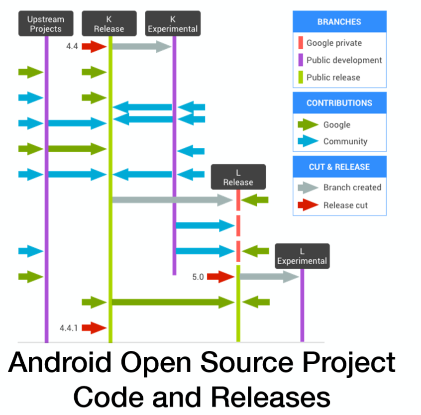

### 4.7.1. 分支管理常见策略
1. 主分支（Master）
2. 开发分支（Develop）
3. 临时性分支
    + 功能（Feature）
    + 预发布（Release）
    + 修补bug（Fixbug）

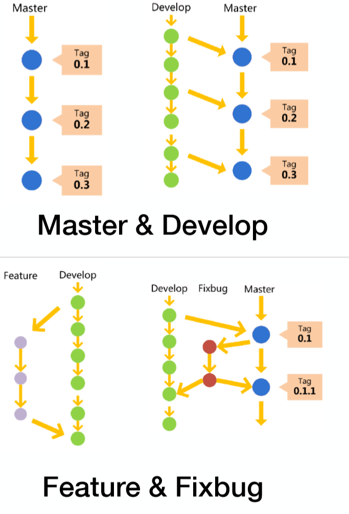

### 4.7.2. 查看不同
1. git diff
    + ⼯作区 vs 暂存区
2. git diff head
    + ⼯作区 vs 版本库
3. git diff --cached
    + 暂存区 vs 版本库

### 4.7.3. 为啥要暂存区
1. 增加灵活性
    + 修改了4个⽂件，在不放弃任何修改的情况下，其中⼀个⽂件不想提交，如何操作？（没add : git add 已经add: git reset --soft ）
    + 修改到⼀半的⽂件，突然间不需要或者放弃修改了，怎么恢复未修改前⽂件？ (git checkout)
    + 代码写⼀半，被打断去做其他功能开发，未完成代码保存？(git stash)
    + 代码写⼀半，发现忘记切换分支了？(git stash & git checkout)
    + 代码需要回滚了？（git reset）

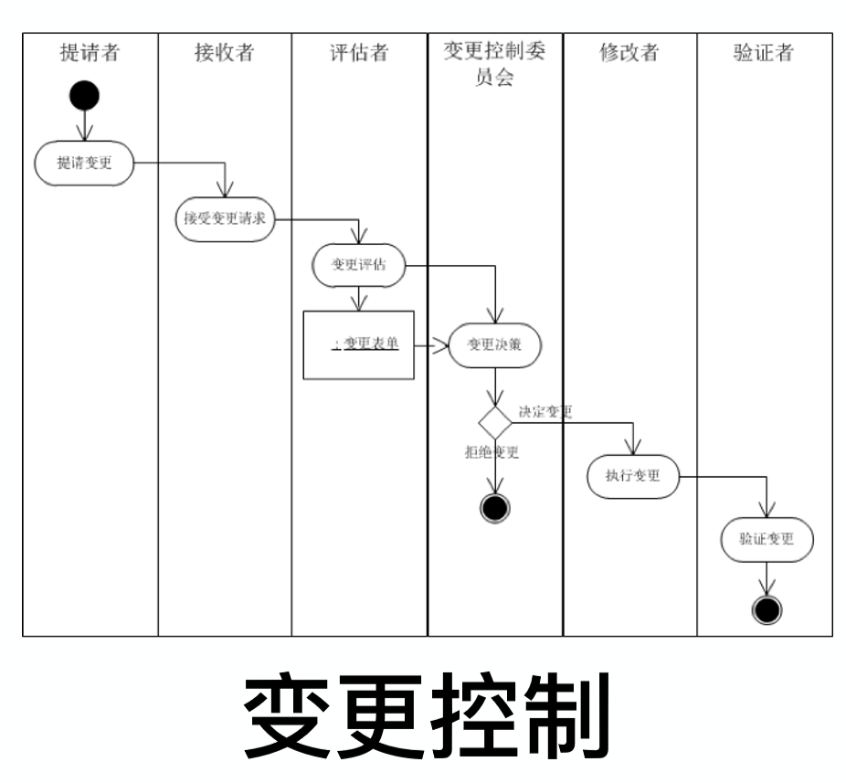

## 4.8. 变更要求表单

# 5. 管理实践

## 5.1. 经济为本
1. ⼈员的成本：这是最重要的一部分投⼊。现在的软件从业⼈员的⼯资不断上涨，⼯资占整个软件成本的⽐例更是呈上升趋势。 除了开发⼈员外，还要计算项⽬管理⼈员和其他相应⽀持⼈员的费⽤（不是全职的，按时间乘⽐例计算）。
2. 工具的购买：包括计算机及其周围配套设备等硬件，也包括开发⼯具、办公套件等软件。
3. 培训的费⽤：开发⼈员接受培训，获得开发项⽬所需技能的费⽤。
4. 差旅费：拜访客户，参加会议等的费⽤。
5. 维护的费⽤：定时的数据备份、系统监控、系统维修和升级等引起的费⽤。
6. 生产停顿的损失：因为项⽬调试引起正常⼯作业务停顿的损失。
7. 市场和服务的费⽤：推⼴软件产品所要的⼴告费⽤、参加展览会的费⽤等。
8. 机会成本：因为投资该项⽬，⽽不能投资别的项⽬或者放银⾏收取利息的机会成本。
9. 节约商业活动成本：只要是和⽆新软件系统时候⽐较，将节省的时间和原材料折算成量化的数字。例如，开发了 新的库存管理系统后，加快了流通并减少了库存浪费。
10. 创新商机增加销售：指由于使⽤新软件带来的盈利，可能是软件产品本身的销售，也可能是软件项⽬带来的营业 成⻓。
11. 提⾼品牌含⾦量： 提⾼质量和客户满意度，可以带来品牌含⾦量的提⾼。这⽐较虚⼀点，但也可以像企业的⽆ 形资产⼀样估算。

### 5.1.1. 总结
1. 为技术⽽技术是条死胡同
2. 以经济原则指导软件项⽬的决策过程
3. 按照产品规律来营销软件产品
4. 以收益为依据规划设计产品

## 5.2. 分工协作

### 5.2.1. 建议的团队
1. ⾸席程序员
2. 副⼿
3. ⾏政助理
4. 编辑
5. 秘书两名
6. 程序管理员
7. ⼯具专家
10. 测试员
11. 语⾔专家

### 5.2.2. 三架马车
1. 产品经理:关于产品需求
2. 项目经理:实施过程中的管理
    + 配置管理、合理、管理、控制
3. 技术经理:保证可以克服技术难题

### 5.2.3. 项目管理的角色
1. 非正式的角色
2. 明确定义的角色(PM)
    + 领导整个团队以了解项⽬⼯作（计划，进度安排以及收集需求）
    + 带领项⽬进⾏设计和开发⼯作（沟通、决策以及中期策略）
    + 以及驱动完成整个项⽬（领导⼒、⻛险管理以及终局策略）

## 5.3. 目标驱动
1. 确保原因的合理性

### 5.3.1. 目标的SMART原则
1. specific 明确的
2. measurable 可度量的
3. achievable 可实现的
4. reasonable 有理由的
5. time 时间

## 5.4. 常来常往

### 5.4.1. 观念
1. 相互尊重
2. 管道流畅
3. 开放透明
4. 坦诚真实

## 5.5. 有张有弛

### 5.5.1. 方法
1. 启动大会
2. 发布聚会
3. 休假
4. 技术培训
5. ⼈员培训和被培训
6. 换个项⽬

## 5.6. 不断总结
1. 关键是"不断"

### 5.6.1. 给管理新手的建议
1. 压⼒和分⼼
2. 不要将流程与⽬标相混淆
3. 适度参与
4. 利⽤好⾃⼰的观点
5. 创造独特的价值
6. 你所知道的⽐你想象的要多。
7. 让⼈喜欢是好事，但不⽤刻意讨好。
8. ⼈们并不介意⾃⼰被管理。
9. 如果你想唤起别⼈对某件事的热情，⾃⼰先表现出热情。
10. 需要坦⽩的时候就直⾔不讳。
11. 你需要不停地进步。

# 6. 项目实践
1. 为实践项⽬组建你的团队：
    + 选择技能互补的成员组成团队，明确分⼯；
    + 根据成员特点，选择团队结构；（建议使⽤⺠主团队）
    + 建⽴团队章程；
    + 明确团队的交流沟通⼿段。
    + 需要保留开发过程，用来确保可查
2. 配置管理
    + 所有产物都通过Gitlab来管理
    + 建⽴Group
    + ⽂档采⽤MD⽂件
3. 项目结构:

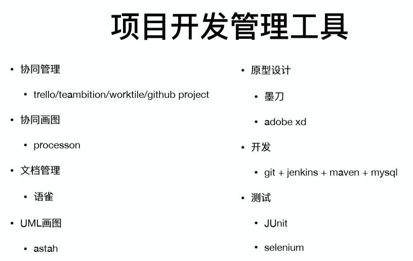