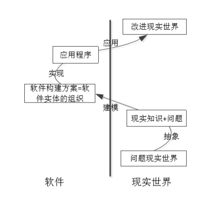
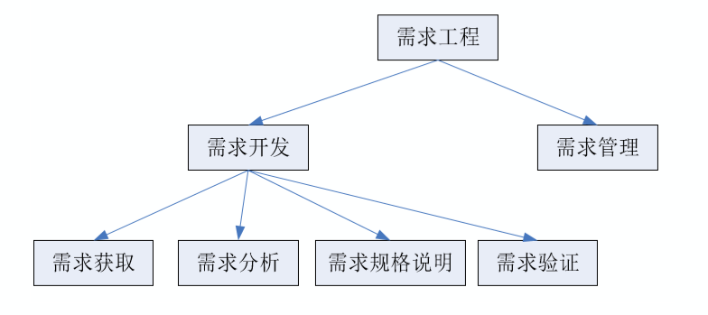
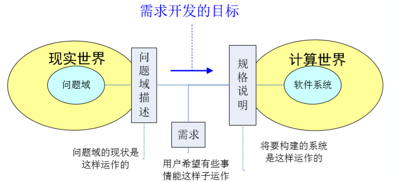
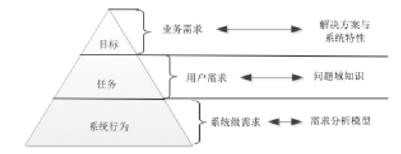
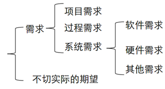
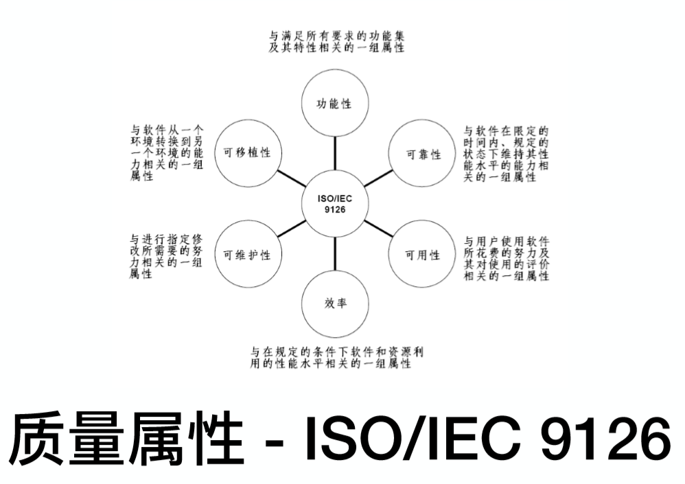
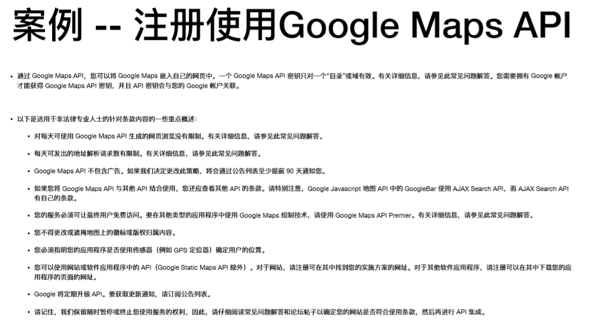

05-需求基础
---
1. 软件需求是一个连接现实世界与计算机世界的活动:它既需要从问题出发，分析问题域，研究解决问题所需要的互动效应。

<!-- TOC -->

- [1. 一个产品的开发过程](#1-一个产品的开发过程)
- [2. 需求工程的内容](#2-需求工程的内容)
  - [2.1. 软件建立的依据](#21-软件建立的依据)
  - [2.2. 需求工程](#22-需求工程)
  - [2.3. 需求工程的具体活动](#23-需求工程的具体活动)
  - [2.4. 需求开发过程模型](#24-需求开发过程模型)
  - [2.5. 需求获取](#25-需求获取)
    - [2.5.1. 目标分析](#251-目标分析)
    - [2.5.2. 需求获取的常见困难](#252-需求获取的常见困难)
    - [2.5.3. 用户需求获取的方法](#253-用户需求获取的方法)
    - [2.5.4. 以Story board作为原型](#254-以story-board作为原型)
    - [2.5.5. 重新认识需求获取](#255-重新认识需求获取)
  - [2.6. 需求分析](#26-需求分析)
    - [2.6.1. 边界分析](#261-边界分析)
    - [2.6.2. 需求建模](#262-需求建模)
  - [2.7. 需求规格说明](#27-需求规格说明)
  - [2.8. 需求验证](#28-需求验证)
  - [2.9. 需求管理](#29-需求管理)
- [3. 需求基础](#3-需求基础)
  - [3.1. 需求 重要](#31-需求-重要)
  - [3.2. 需求的表述方式](#32-需求的表述方式)
  - [3.3. 软件解决方案](#33-软件解决方案)
  - [3.4. 需求开发的目标](#34-需求开发的目标)
  - [3.5. 问题域](#35-问题域)
  - [3.6. 问题的解决](#36-问题的解决)
  - [3.7. 区分需求、问题域和规格说明](#37-区分需求问题域和规格说明)
    - [3.7.1. 问题域](#371-问题域)
    - [3.7.2. 规格说明](#372-规格说明)
  - [3.8. 超市销售系统](#38-超市销售系统)
- [4. 三种需求层次:业务需求、用户需求、系统级需求(需求的层次性)](#4-三种需求层次业务需求用户需求系统级需求需求的层次性)
  - [4.1. 业务需求(目标，解决方案与系统特性)](#41-业务需求目标解决方案与系统特性)
  - [4.2. 用户需求(任务，问题域知识)](#42-用户需求任务问题域知识)
  - [4.3. 系统需求](#43-系统需求)
  - [4.4. 综合示例](#44-综合示例)
  - [4.5. 课堂练习](#45-课堂练习)
- [5. 需求分类](#5-需求分类)
  - [5.1. 需求谱系分类](#51-需求谱系分类)
  - [5.2. 综合案例](#52-综合案例)
  - [5.3. 软件需求的分类(IEEE)](#53-软件需求的分类ieee)
    - [5.3.1. 功能需求](#531-功能需求)
    - [5.3.2. 数据需求](#532-数据需求)
    - [5.3.3. 性能需求](#533-性能需求)
    - [5.3.4. 需求的灵活性](#534-需求的灵活性)
    - [5.3.5. 质量属性](#535-质量属性)
      - [5.3.5.1. 常见质量属性](#5351-常见质量属性)
      - [5.3.5.2. 质量属性的开发](#5352-质量属性的开发)
    - [5.3.6. 对外接口](#536-对外接口)
    - [5.3.7. 约束](#537-约束)
  - [5.4. 一些说明](#54-一些说明)
- [6. 题目](#6-题目)

<!-- /TOC -->

# 1. 一个产品的开发过程
1. 客户想要什么
2. 产品经理理解
3. 设计师分析
4. 程序员进行编写
5. 交给测试人员测试
6. 商业人员描述这个产品
7. 项目的文档
8. 如何进行部署
9. 价格像过山车一样变化
10. 如何进行支持运维
11. 进行广告宣传
12. 最后使用用户需要什么

# 2. 需求工程的内容

## 2.1. 软件建立的依据
1. 单纯的软件系统是不能解决问题的，它只有和现实世界之间形成**有效互动**才能实现问题的解决



## 2.2. 需求工程
1. 需求工程的概念：所有需求处理活动的总和。它**收集**信息、**分析**问题、**整合**观点、记录需求并**验证**其正确性，最终描述出软件被应用后与其环境互动形成的**期望效应**。 
2. 三个主要任务：
    1. 需求工程必须说明软件系统将被应用的应用环境及其**目标**，说明用来达成这些目标的软件功能，也即要同时说明软件"需要**做什么**"和"**为什么**需要做"。
    2. 需求⼯程必须将⽬标和功能反映到软件系统当中，映射为**可行的软件行为**，并对软件⾏为进⾏准确的**规格说明**。
    3. 现实世界是**不断变化**的世界，因此需求⼯程还需要妥善处理⽬标和功能随着时间演化的变动情况。

## 2.3. 需求工程的具体活动



1. 需求要逐步进行**验证**，越早发现bug所付出的代价越少。
2. 需求工程活动包括需求开发和需求管理两部分。

## 2.4. 需求开发过程模型


1. 需求获取是从利益相关人的问题域中提取出来的。
2. 需求应该是面向很多人的，这样子才能体现出来需求的有用性。

## 2.5. 需求获取
1. 从**人、文档或者环境**当中获取需求的过程
2. 要利⽤各种⽅法和技术来**发现**需求
    + 需求是客观存在的，但是一定是由需求开发人员提出的

### 2.5.1. 目标分析
1. 根据问题确定目标:发现用户的期望和现实之间的差距
2. 通过分析利害关系⼈确定目标:一个软件系统可能会有很多的厉害关系人，他们需要从各自立场出发，具有不同的目标要求

### 2.5.2. 需求获取的常见困难
1. ⽤户和开发人员的背景不同，立场不同："床边B超,肝胆胰脾":很难以保证开发人员懂得这句话的含义
2. 普通用户缺乏**概括性、综合性**的表述能⼒：不聪明的记者:请别人进行一句话描述
3. ⽤户存在**认知困境**：平板电脑,在ipad还没有出现的时候
4. ⽤户**越俎代庖**：双机热备:如果甲方有一定的经验，我们就是要求系统能够...，⾄于怎么实现是你开发者的事
5. **缺乏用户参与**：不愿参与的医⽣：有一些情况下用户并不愿意参与开发

### 2.5.3. 用户需求获取的方法
1. 面谈:面对面的会见；问答格式
2. 问卷:集体获取方法之一
3. 文档分析
4. 头脑风暴:特殊的群体面谈方法，目的是发现潜在需求
5. 专题讨论
6. 原型:建立一个有形的制品来方便沟通和交流

### 2.5.4. 以Story board作为原型


### 2.5.5. 重新认识需求获取
1. ⽤户和开发⼈员的背景不同，⽴场不同："床边B超,肝胆胰脾"：消除默认知识
2. 普通⽤户缺乏概括性、综合性的表述能力：不聪明的记者：专业的需求人员
3. ⽤户存在认知困境：平板电脑：原型(做一个原型帮助用户理解的草图模型)
4. ⽤户越俎代庖
    + 双机热备：需求是开发人员开发出来的，不是⽤户提出来的
    + 我们就是要求系统能够....，⾄于怎么实现是你开发者的事：协商
5. 缺乏用户参与：不愿参与的医⽣：为用户参与提供⽅便

## 2.6. 需求分析
1. 通过**建模**来整合各种信息，以使得人们更好的理解问题。
2. 为问题定义出⼀个需求集合，这个集合能够为问题界定⼀个有效的**解决方案**。
3. **检查**需求当中存在的错误、遗漏、不⼀致等各种缺陷，并加以修正。

### 2.6.1. 边界分析
1. 定义项目的范围。系统边界之内定义的是系统需要对外提供的功能。
2. 系统边界的定义要保证系统能够和周围环境形成有效的互动
3. 系统⽤例图、上下文图通常被⽤来定义系统的边界。

### 2.6.2. 需求建模
1. 建模是为展现和解释信息⽽进⾏的抽象描述活动
2. 常⽤的技术包括类图、顺序图、状态图等建模技术
3. 在为需求建模时，常用的技术包括**数据流图、实体关系图、状态转换图、类图**等半形式化建模技术。

## 2.7. 需求规格说明
1. 在系统用户之间**交流需求信息**
2. 要简洁、精确、⼀致和易于理解
3. 需求⼯程师在这个阶段的重要工作包括:
   1. 定制文档模版，提高效率
   2. 编写文档(模型预言和自然语言两种)

## 2.8. 需求验证
1. 需求规格说明文档至少要满足下面几个标准:
    1. ⽂档内每条需求都**正确、准确**的反映了用户的意图；
    2. ⽂档记录的需求集在整体上具有**完整性和⼀致性**；
    3. ⽂档的组织⽅式和需求的书写⽅式具有**可读性**和**可修改性(方便保证版本简化)**。
2. 需求验证的方法:包括同级评审、原型、模拟等。

## 2.9. 需求管理
1. 保证需求作用的持续、稳定和有效发挥：在需求开发活动之后，设计、测试、实现等后续的软件系统开发活动都需要以围绕需求开展⼯作
2. 进⾏变更控制：纳入和实现合理的变更请求，拒绝不合理的变更请求，控制变更的成本和影响范围

# 3. 需求基础

## 3.1. 需求 重要
1. IEEE对需求的定义为[IEEE610.12-1990]：
   1. 用户为了解决问题或达到某些目标所需要的条件或能力；
   2. 系统或系统部件为了满足合同、标准、规范或其它正式文档所规定的要求而需要具备的条件或能力；
   3. 对1或2中的一个条件或一种能力的一种文档化表述。
2. 需求是一种期望：源自现实又高于现实，需求是多变和可调整的，项⽬可以依据实际情况调整需求的实现程度。

## 3.2. 需求的表述方式
1. 作为⼀种**期望**，需求通常被表述为"系统应该…"、"在…时，系统应该…"、 "⽤户可以通过系统…"等，例如R1。
2. R1：系统应该允许顾客退回已经购买的产品。

## 3.3. 软件解决方案
1. 需求是一种**解决问题后所能达到的期望**
2. 一件事情的两面
    + 问题是糟糕的一面
    + 需求是理想的一面

## 3.4. 需求开发的目标


## 3.5. 问题域
1. 现实世界运行规律的一种反映
2. 需求的**产生域**，也是需求的**解决地**。
3. 最终的软件产品要在现实中部署，它能够部分影响问题域，但不能任意改变现实
    + 软件开发必须尊重问题域，不能因为技术原因妄⾃修改现实世界的实际情况。

## 3.6. 问题的解决
1. 基础：模拟与共享现象
2. ⽅法：直接与间接
3. 解决⽅案：需求规格说明

## 3.7. 区分需求、问题域和规格说明

### 3.7.1. 问题域
1. 现实世界运⾏规律的⼀种反映
2. 需求的**产生域**，也是需求的**解决地**。
3. 最终的软件产品要在现实中部署，它能够部分影响问题域，但不能任意改变现实
    + 软件开发必须尊重问题域，不能因为技术原因妄⾃修改现实世界的实际情况。

### 3.7.2. 规格说明
1. 软件产品的方案描述，它以软件产品的运行机制为主要内容。
2. 它不是需求但实现需求，不是问题域但需要与问题域互动。
3. 规格说明要以关注**对外交互**的⽅式描述软件解决⽅案，它既需要从软件产品的⻆度⽽不是⽤户的⻆度进⾏描述，⼜不能太多地涉及软件产品的内部构造机制。
4. 为什么描述的是交互?
    + 因为交互对我们而言是一个对外的重要展示。

## 3.8. 超市销售系统
1. 问题：超市的成本太⾼
2. 需求：超市的成本应该降低:比较笼统
3. 问题域：超市的成本主要由⼈⼒成本和库存成本组成
4. 规格说明
    + 库存预测:大致进行推测
    + 库存报警



# 4. 三种需求层次:业务需求、用户需求、系统级需求(需求的层次性)
1. 题型:给出一个实例，给出三个层次的例子，对给定的需求实例，判断其层次

## 4.1. 业务需求(目标，解决方案与系统特性)
1. 业务需求是高层次的解决方案和系统特性、系统开发的战略出发点、高层次的需求，描述为什么要开发系统。
2. 为什么是系统特性？因为还没有到细节的部分
3. 特性说明了系统为⽤户提供的各项功能，它限定了系统的**范围**(Scope)
```
[示例]
1. R2：在系统使⽤3个月后，销售额度应该提⾼20%(期望，没有从软件角度进行描述，业务需求)
2. 可以建⽴高层次的解决⽅案，其系统特性如SF1～SF4所示。(Feature)，如下是系统需求
    SF1：管理VIP顾客信息。
    SF2：提供VIP顾客服务，增加回头率。
    SF3：使⽤多样化的特价⽅案，吸引顾客购买，增加销售额。
    SF4：使⽤多样化的赠送⽅案，吸引顾客购买，增加销售额。
```

## 4.2. 用户需求(任务，问题域知识)
1. 问题域知识：执行具体任务的用户对系统所能完成任务的期望，描述了系统能帮用户做什么
   1. 直接用户
   2. 间接用户(**通用软件的销售人员和售后支持人员**)
2. 问题域知识：是需要了解到期望所来源的背景知识。
3. **特性**
    + 模糊、不清晰(允许适度的用形容词和副词) 
    + 多特性混杂 (功能和⾮功能的混杂)
    + 多逻辑混杂 (⼀个任务需要多次系统交互才能完成)
```
[示例]
1. R3：系统要帮助收银员完成销售处理(期望，用户需求) 
2. SF1：管理VIP顾客信息 针对系统需求
3. 针对每⼀个系统特性，都可以建⽴⼀组⽤户需求。例如对SF1，可以建⽴⽤户需求 组如UR1.1～UR1.7，它们中每⼀条都是⽤户完成具体任务所需要的功能：
    UR1.1：系统应该允许客户经理添加、修改或者删除会员个⼈信息。(问题域)
    UR1.2：系统应该记录会员的购买信息。
    UR1.3：系统应该允许客户经理查看会员的个⼈信息和购买信息。
    UR1.4：系统应该允许客户经理查看所有会员的统计信息。
```
- 例如对UR1.1，需要**补充问题域知识**如下：会员的个⼈信息有：客户编号、姓名、联系⽅式(具体是什么：手机、邮箱等)、积分。

## 4.3. 系统需求
1. 需求分析模型：用户对**系统行为的期望**，每个系统级需求反映了**一次外界与系统的交互行为**，或者**系统的⼀个实现细节**(和用户需求有着很大的区别)
2. 描述了开发人员**需要实现什么**
3. 将用户需求转化为系统需求的过程是⼀个复杂的过程
    + 首先需要分析**问题领域**及其特性，从中发现问题域和计算机系统的共享知识，建⽴系统的知识模型；
    + 然后将⽤户需求**部署到系统模型**当中，即定义系列的系统⾏为，让它们联合起来实现⽤户需求，每⼀个系统⾏为即为⼀个系统需求。
    + 该过程就是需求⼯程当中最为重要的需求分析活动，⼜称**建模与分析活动**。 
4. 系统级需求还可能会补充一些与软件实现相关的细节。

```
[示例]
1. UR1.3：系统应该允许客户经理查看会员的个⼈信息和购买信息。
2. R4：收银员输⼊购买的商品时，系统要显示该商品的描述、单价、数量和总价。(期望，展现系统输入输出，系统级需求)
3. 对⽤户需求UR1.3，可以依据任务中的交互细节将之转化为系统级需求SR1.3.1～ SR1.3.4。
    SR1.3.1在接到客户经理的请求后，系统应该为客户经理提供所有会员的个⼈信息。
    SR1.3.2在客户经理输⼊会员的客户编号时，系统要提供该会员的个⼈信息。
    SR1.3.3在客户经理选定⼀个会员并申请查看购买信息时，系统要提供该会员的历史购买记录。
    SR1.3.4经理可以通过键盘输⼊客户编号，也可以通过读卡器输⼊客户编号。
```

## 4.4. 综合示例
1. R1：在系统使用3个月后，销售额度应该提高20%(业务需求－为何开发系统)
2. R2：系统要帮助收银员完成销售处理；(用户需求－帮助用户做什么)
3. 系统特性SF1：管理VIP顾客信息，针对每一个系统特性，都可以建立一组用户需求。例如对SF1，每一条都是用户完成具体任务所需要的功能：
    + UR1.1：客户经理可以使用系统添加、修改或者删除会员个人信息。(用户需求)
    + UR1.2：收银员使用系统进行销售时会记录会员的购买信息。 (用户需求)
    + UR1.3：客户经理可以使用系统查看会员的个人信息和购买信息。(用户需求)
    + UR1.4：客户经理可以使用系统查看所有会员的统计信息。 (用户需求)
4. R3：收银员输入购买的商品时，系统要显示该商品的描述、单价、数量和总价(系统级需求－系统怎么与外界交互)
5. 对用户需求UR1.3，可以依据任务中的交互细节将之转化为系统级需求SR1.3.1～SR1.3.4。
    + SR1.3.1在接到客户经理的请求后，系统应该为客户经理提供所有会员的个人信息。(系统级需求)
    + SR1.3.2在客户经理输入会员的客户编号时，系统要提供该会员的个人信息。(系统级需求)
    + SR1.3.3在客户经理选定一个会员并申请查看购买信息时，系统要提供该会员的历史购买记录。
    + SR1.3.4经理可以通过键盘输入客户编号，也可以通过读卡器输入客户编号。(系统级需求)
6. ATM机：问题：营业厅人力成本过高，不吸引客户(业务需求)
7. 问题域：存钱、取钱、转账(用户需求)

## 4.5. 课堂练习
1. NBA数据分析应用
2. 业务需求
    1. NBA球队⽼板希望知道谁是2014-2015赛季最大⼼脏的投⼿？
    2. 老板想要买球星
    3. 老板想要知道应该派遣哪位球星上
3. ⽤户需求？
    1. 系统应该允许老板可以查看各个投手的数据
    2. 系统应该允许老板查看最后两分钟，投手的得分率和投篮次数。
    3. 系统应该允许老板查看投手的转会信息和身价
4. 系统级需求？
    1. 在接到老板的请求后，系统应该为老板提供所有球星的相关信息。
5. 千万不要忘记业务需求，一定要基于业务需求出发。

# 5. 需求分类
1. 题型:对给定实例，给出不同类型的需求例子；对给定的需求示例，判断需求类型

## 5.1. 需求谱系分类


1. 需求展开为三项，系统需求展开为三项

## 5.2. 综合案例
1. 项目需求(**人的数量、计划成本、时间**)
    + R5：项⽬的成本要控制在60万元人民币以下。
    + R6：项⽬要在6个月内完成。
2. 过程需求(**人的分工、合作、方法、工具**)
    + R7：在开发中，开发者要提交软件需求规格说明⽂档、设计描述⽂档和测试报告。
    + R8：项⽬要使⽤持续集成⽅法进⾏开发。
3. 其他需求
    + R9：系统要购买专用服务器，其规格不低于….。
    + R10：系统投⼊使⽤时，需要对⽤户进⾏1个星期的集中培训。
4. 不切实际的期望
    + R11：系统要分析会员的购买记录，预测该会员将来⼀周和⼀个月内、会购买的商品；(技术上不可行)
    + R12：系统要能够对每⽉的出入库以及销售行为进⾏标准的财务分析；(在有限的资源条件下可行)
    + R13：在使⽤系统时，收银员必须要在2个⼩时内完成⼀个销售处理的所有操作。(超出了软件所影响的问题域范围)
5. 正确的形式
    + R14：如果⼀个销售处理任务在2个小时内没有完成，系统要撤销该任务的所有已执⾏操作

## 5.3. 软件需求的分类(IEEE)
1. 功能需求(Functional Requirement)：和系统主要共作相关的需求，即在不考虑物理约束的情况下，⽤户希望系统所能够执行的活动，这些活动可以帮助⽤户完成任务。**功能需求主要表现为系统和环境之间的⾏为交互**。
2. 性能需求(Performance Requirement)：系统整体或系统组成部分应该拥有的性能特征，例如CPU使⽤率、内存使⽤率等。
3. 质量属性(Quality Attribute)：系统完成工作的质量，即系统需要在⼀个"好的程度"上实现功能需求，例如可靠性程度、可维护性程度等。
4. 对外接口(External Interface)：系统和环境中其他系统之间需要建⽴的接⼝，包括硬件接⼝、软件接⼝、数据库接⼝等等。
5. 约束：进⾏系统构造时需要遵守的约束，例如**编程语言、硬件设施**等

### 5.3.1. 功能需求
1. 功能需求是最常见、最主要和最重要的需求，是能够为用户带来业务价值的系统⾏为
2. **最需要按照三个抽象层次进行展开**，说明了关系
3. 软件产品产生价值的基础，需求检查最重要的部分
4. 比如:在接到客户经理的请求后，系统应该为客户经理提供所有会员的个人信息。

### 5.3.2. 数据需求
1. **功能需求**的补充：如果在功能需求部分明确定义了**相关的数据结构**，那么就不需要再行定义数据需求
2. 数据需求是需要在数据库、⽂件或者其他介质中存储的数据描述，通常包括下列内容：
    + 各个功能使⽤的**数据信息**；
    + 使用频率；
    + 可访问性要求；
    + **数据实体及其关系**；
    + 完整性约束；
    + **数据保持**要求。
3. 例如，连锁超市销售系统可以使用数据需求DR1和DR2。
    + DR1：系统需要存储的数据实体及其关系为图6-14的内容。(数据实体及其关系)
    + DR2：系统需要存储1年内的销售记录和退货记录。(数据保持)

### 5.3.3. 性能需求
1. 需要进⾏专门的模拟和测试
    + 速度(Speed)，系统完成任务的时间，例如PR1。
        + PR1：所有的⽤户查询都必须在**10秒**内完成。
    + 容量(Capacity)，系统所能存储的数据量，例如PR2。
        + PR2：系统应该能够存储⾄少100万个销售信息。
    + 吞吐量(Throughput)，系统在连续的时间内完成的事务数量，例如PR3。
        + PR3：解释器每分钟应该⾄少解析5000条没有错误的语句。
    + 负载(Load)，系统可以承载的并发⼯作量，例如PR4。
        + PR4：系统应该允许50个营业服务器同时从集中服务器上进⾏数据的上传或下载。
    + 实时性(Time-Critical)，严格的实时要求，例如PR5。
        + PR5：监测到病⼈异常后，监控器必须在0.5秒内发出警报。(和故障警报不同，故障不是系统的正常功能)
2. 一定避免使用**很快、较快**等修饰词，而如果难以估计明确，应当结合需求的灵活性，保证可行性。

### 5.3.4. 需求的灵活性
1. PR6：98％的查询不能超过10秒。
2. PR7：
    + (最低标准)在200个⽤户并发时，系统不能崩溃；
    + (⼀般标准)在200个⽤户并发时，系统应该在80％的时间内能正常⼯作；
    + (理想标准)在200个⽤户并发时，系统应该能保持正常的⼯作状态。
    
### 5.3.5. 质量属性
1. 系统为了满⾜**规定的及隐含**的所有要求而需要具备的要素称为质量 
2. 质量属性是为了度量质量要素而选用的特征 
3. 质量模型就是能够为质量需求的描述和评价提供工作基础的特征集及特征之间的联系 
4. 质量属性的重要性 
    + 对设计的影响很⼤ 
    + 对越复杂的系统越为重要 
    + [Robert19901] ：真实的现实系统中，在决定系统的成功或失败的因素中，满⾜⾮功能属性往往被满⾜功能性需求更为重要。



#### 5.3.5.1. 常见质量属性
1. **可靠性**(Reliability)：在规格时间间隔内和规定条件下，系统或部件执⾏所要求能⼒的能⼒。
    + QA1：在进⾏数据的下载和上传中，如果⽹络故障，系统不能出现故障。能不能检测网络中断，并且进行恢复。
2. **可用性**(Availability)：软件系统在投⼊使⽤时可操作和可访问的程度或能实现其指定系统功能的概率。
    + QA2：系统的可⽤性要达到98%。
3. **安全性**(Security)：软件阻⽌对其程序和数据进⾏未授权访问的能⼒，未授权的访问可能是有意，也可能是⽆意的。
    + QA3：VIP顾客只能查看⾃⼰的个⼈信息和购买记录；
    + 收银员只能查看，不能修改、删除VIP顾客的信息。
4. **可维护性**(Maintainability)：软件系统或部件能修改以排除故障、改进性能或其他属性或适应变更了的环境的容易程度，包括可修改性(Modifiability)和可扩展性(Extensibility)。
    + QA4：如果系统要增加新的特价类型，要能够在2个⼈⽉内完成。
5. **可移植性**(Portability)：系统或部件能从⼀种硬件或软件环境转换⾄另外⼀种环境的特性。
    + QA5：集中服务器要能够在1⼈⽉内从Window 7操作系统更换到Solaris 10操作系统。
6. **易用性**(Usability)：与⽤户使⽤软件所花费的努⼒及其对使⽤的评价相关的特性。
    + QA6：使⽤系统1个⽉的收银员进⾏销售处理的效率要达到10件商品/分钟。

#### 5.3.5.2. 质量属性的开发
1. 用户并不能明确地提出他们对产品质量的期望：并不了解软件系统的开发过程，也就⽆从判断哪些质量属性会在怎样的程度上给设计带来多大的影响，也⽆法将他们对软件系统的质量要求细化成⼀组组的可量化的质量属性
2. 需求工程师
    + 质量属性⼤都是和功能需求联系在⼀起的，因此需要对照软件的质量属性检查每⼀项功能需求，尽⼒去判断质量属性存在的可能性 ，形容词和副词通常意味着质量属性的存在 
    + 对于⼀些不和任何功能需求相联系的全局性质量属性，需求⼯程师要在碰到特定的实例时意识到它们的存在 
    + 开发原型判断能不能保证可靠性等，和工程师进行确定

### 5.3.6. 对外接口
1. **解系统和其他系统**之间的软硬件接⼝:包括硬件接口、软件接口、数据库接口等
    + 接口的用途
    + 接口的输⼊输出
    + 数据格式
    + 命令格式
    + 异常处理要求
2. 用户界面
3. 案例，注册使用Google Maps API



### 5.3.7. 约束
1. 总体上限制了开发⼈员设计和构建系统时的选择范围 
2. **系统开发及运行的环境**
    + 包括目标机器、操作系统、⽹络环境、编程语⾔、数据库管理系统等
    + C1：系统要使⽤Java语言进⾏开发。
3. **问题域内的相关标准**
    + 包括法律法规、⾏业协定、企业规章等。
4. **商业规则**
    + ⽤户在任务执⾏中的⼀些潜在规则也会限制开发⼈员设计和构建系统的选择范围

```
R1：已过保质期的食品不能销售
R2：顾客可以使用美元付款
```

1. 提交的地址解析请求次数是否有限制？(这就是为什么Google Map API进行控制)
    + 如果在 24 ⼩时时段内收到来⾃⼀个 IP 地址超过 15,000 个地址解析请求，或从⼀个 IP 地址提交的地址解析请求速率过快，Google 地图 API编 码器将⽤ 620 状态代码开始响应。如果地址解析器的使⽤仍然过多，则 从该 IP 地址对 Google 地图 API 地址解析器的访问可能被永久阻⽌。

## 5.4. 一些说明
1. 整个需求：项目需求、过程需求、系统需求(包括软件需求、硬件需求和其他需求)
2. 软件需求有着三中不同的层次需求:业务需求、用户需求和系统需求，分类是按照性能需求等等。
3. 层次性:是指细节不一样，分类是指描述的东西不一样。

# 6. 题目
```
1. 为了有效地捕获系统需求,应采用(C) 。
A.瀑布模型
B.V 模型
C.原型模型
D.螺旋模型
2. 软件开发过程中，需求分析阶段的输出不包括(D)
A.数据流图
B.实体联系图
C.数据字典
D.软件体系结构图
3. "软件产品必须能够在 3 秒内对用户请求作出响应"属于软件需求中的(B)
A.功能需求
B.非功能需求
C.设计约束
D.逻辑需求
```