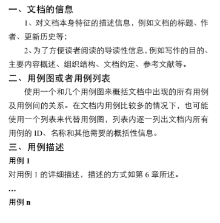
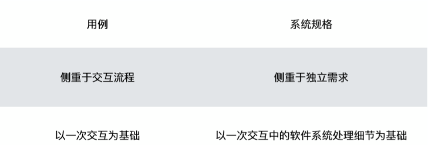
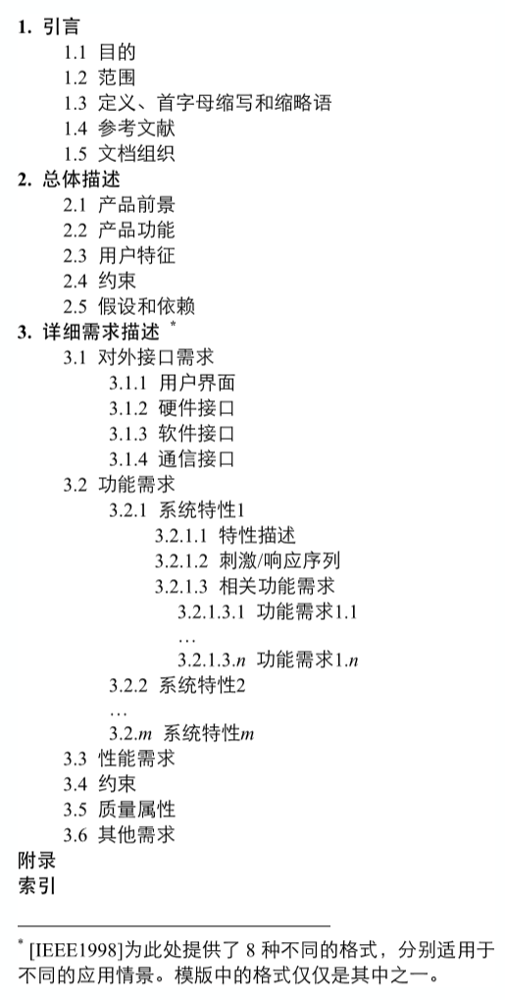
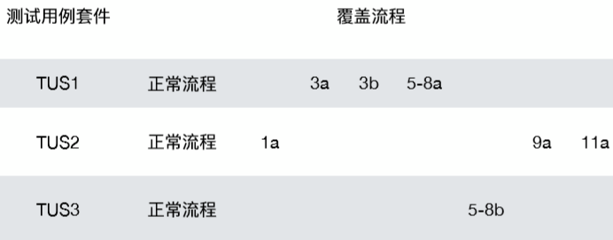
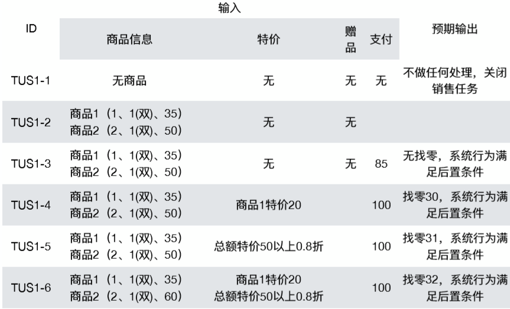
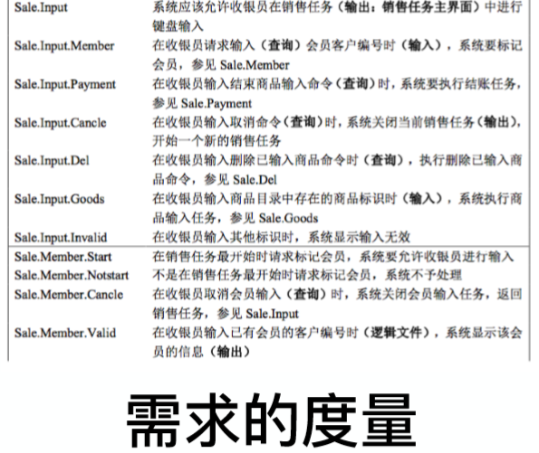
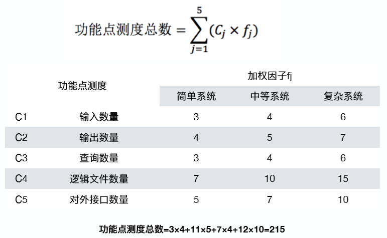
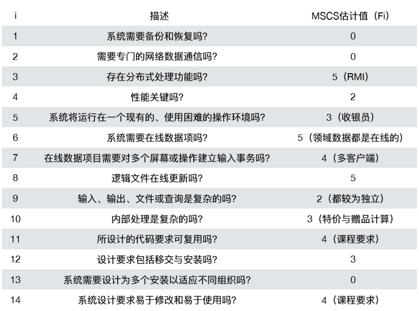
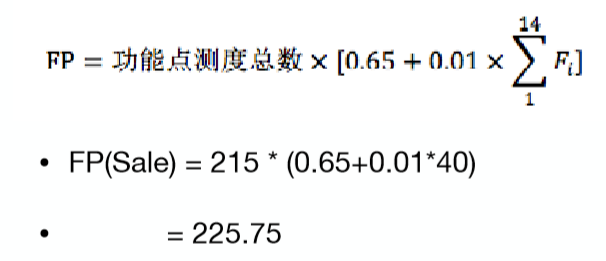

07-需求文档化与验证
---

<!-- TOC -->

- [1. 为什么文档化需求](#1-为什么文档化需求)
- [2. 为什么建立需求规格说明？结合试验说明 重要](#2-为什么建立需求规格说明结合试验说明-重要)
- [3. 需求文档基础](#3-需求文档基础)
  - [3.1. 需求文档的交流对象](#31-需求文档的交流对象)
  - [3.2. 用例文档](#32-用例文档)
  - [3.3. 软件需求规格说明文档(SRS，software Requirements Specification)](#33-软件需求规格说明文档srssoftware-requirements-specification)
    - [3.3.1. 实例](#331-实例)
  - [3.4. SRS模板](#34-srs模板)
- [4. 技术文档写作要点](#4-技术文档写作要点)
  - [4.1. 系统化的方式](#41-系统化的方式)
  - [4.2. 需求书写要点](#42-需求书写要点)
  - [4.3. Requirements Review](#43-requirements-review)
- [5. 验证需求的方法](#5-验证需求的方法)
  - [5.1. 评审](#51-评审)
  - [5.2. 开发系统测试用例](#52-开发系统测试用例)
    - [5.2.1. 测试用例套件](#521-测试用例套件)
    - [5.2.2. 建立测试用例](#522-建立测试用例)
  - [5.3. 度量](#53-度量)
    - [5.3.1. 度量需求](#531-度量需求)
    - [5.3.2. 度量的意义](#532-度量的意义)
    - [5.3.3. 功能点度量](#533-功能点度量)
  - [5.4. 功能点测度总数](#54-功能点测度总数)
  - [5.5. 销售用例的功能点](#55-销售用例的功能点)
- [6. 对给定的需求规格说明实例，判定并修正其错误-Summary](#6-对给定的需求规格说明实例判定并修正其错误-summary)
- [7. 将需求制品纳入配置管理](#7-将需求制品纳入配置管理)

<!-- /TOC -->

# 1. 为什么文档化需求
1. 方便团队工作和沟通
2. 方便项目管理
3. 更加明确的体系架构
4. 方便软件设计
5. 方便编码
6. 方便维护

# 2. 为什么建立需求规格说明？结合试验说明 重要
1. 方便交流，软件开发过程中，**子任务与人员**之间存在错综复杂的关系，存在大量的沟通和交流，所以要编写软件开发中要编写不同类型的文档，每种文档都是针对项目中需要广泛交流的内容。因为**软件需求**需要进行**广泛交流**，所以要把需求文档化。
2. 需求规格说明是在**软件产品的角度以系统级需求列表的方式**描述软件系统解决方案，书写需求规格说明，可以建立管理控制的基线，方便任务分配，制定工作计划，进行跟踪和度量。
3. 在实验中，需求规格的重要性不只体现在结果上，还包括中间过程，在书写需求规格过程中，才真正把问题域的问题和分析模型的成果转化为系统级需求，方便小组成员真正明确需求，个人认为在这个阶段包含一部分的需求在发现和完整化。

# 3. 需求文档基础

## 3.1. 需求文档的交流对象
1. 用户:用户要验证文档内描述的需求信息是否和最初的意图一致
2. 项目管理者:软件需求文档全面、准确地定义了软件的功能和非功能要求。
3. 设计人员和程序员:设计人员和程序员需要根据软件需求文档来完成自己的任务
4. 测试人员:测试人员需要根据文档的需求内容进行验收测试，确保最终产生的软件系统能满足用户的需求
5. 文档编写人员:用户使用手册的编写人员需要根据需求信息编写用户使用手册
6. 维护人员:在软件维护中，维护人员需要在充分理解软件原有需求的基础上进行信息的修改

## 3.2. 用例文档
1. 在用户的角度以用例文本为主描述软件系统与外界的交互
2. 基本职责是把问题域信息和需求传达给软件系统解决方案的设计者
3. 示例

4. 用例图等描述图可以更加直观的了解这部分。

## 3.3. 软件需求规格说明文档(SRS，software Requirements Specification)
1.  在软件产品的⻆度以系统级需求列表的⽅式描述软件系统解决⽅案

### 3.3.1. 实例
1.  在一栋⼤楼中有一个电梯，现在有⼈打算从1楼使用电梯到达x楼。
    + 请写出其用例的场景描述
    + 根据⽤例场景编写SRS⽚段
2. 用例的场景描述:
    1. 这个人在1楼按的按钮，等待电梯(系统调度图)
    2. 电梯到达，电梯开门，登上电梯
    3. 用户按x楼的按钮，系统关门
    4. 电梯启动开始上行
    5. 该人到达x楼，电梯开门
    6. 电梯关门
3. 异常流程:
    1. 电梯故障:和电梯、人无关的不加入
    2. 超载超重
    3. 其他楼层按钮
    4. 电梯运行方向

## 3.4. SRS模板
    

# 4. 技术文档写作要点
1. 简洁:动词名词+辅助词，不要使用复杂长句、形容词和副词。
2. 精确:不能产生起义或无法理解。

3. 易读（查询）
    1. 有效使⽤引言、目录、索引等能够增强⽂档易读性的⽅法。
    2. 使⽤系统化的方式组织内容信息，提供⽂档内容的可读性。
4. 易修改：使用相同的语句格式组织相关联或相似的信息；使用列表组织独立、并列的信息；使用编号表达繁杂信息之间的关系。引用而不是重复

## 4.1. 系统化的方式
1. 使⽤**相同**的语句格式来描述相似、关联的信息。
2. 使⽤**列表或者表格**来组织独立、并列的信息。
3. 使⽤**编号**来表达繁杂信息之间的关系,包括顺序关系、嵌套关系和层次关系。 
    + 对图、表进⾏编号
    + 对⽂档的章节进⾏编号
    + 对信息内容进⾏标识和编号

## 4.2. 需求书写要点
1. 需求书写要点
   1. 使用用户术语:不要使用计算机术语(导致用户无法理解)
   2. 可验证：不可验证的需求一般是因为描述模糊或者过于抽象
   3. 可行性：需求必须能够在系统及其运行环境的已知条件和约束下实现。要考虑在限定成本、时间和人力约束内，实现需求的可能性
2. 需求规格说明文档书写要点
   1. 充分利⽤标准的文档模版，保持所有内容位置得当
   2. 保持⽂档内的需求集具有完备性和⼀致性。
   3. 为需求划分优先级(可以分为高中低、也可以分为1-10等分)

## 4.3. Requirements Review 
1. “After the payment process is complete, the relevant information should be appended to a log file.”(b)
    + a. This requirement should be rewritten; it is incorrect. 不正确
    + b. This requirement should be rewritten; it is ambiguous or inconsistent. 模糊的
    + c. This requirement should be rewritten; it is unrealistic. 不现实的
    + d. This requirement should be rewritten; it is unverifiable. 不可验证的
    + e. This requirement is fine. 好的
2. “The system should be constructed so that it will be easy to add new functionality in the future.”(b)
    + a. This requirement should be rewritten; it is incorrect.
    + b. This requirement should be rewritten; it is ambiguous or inconsistent.
    + c. This requirement should be rewritten; it is unrealistic.
    + d. This requirement should be rewritten; it is unverifiable.
    + e. This requirement is fine.
3. “The price of a gasoline purchase is computed as the price per gallon for the type of gas purchased, multiplied by the number of gallons purchased (use two decimal points for representing fractions of gallons).”(e)
    + a. This requirement should be rewritten; it is incorrect.
    + b. This requirement should be rewritten; it is ambiguous or inconsistent.
    + c. This requirement should be rewritten; it is unrealistic.
    + d. This requirement should be rewritten; it is unverifiable.
    + e. This requirement is fine.
4. “The system should be available 24 hours a day, 7 days a week.(c)
    + a. This requirement should be rewritten; it is incorrect.
    + b. This requirement should be rewritten; it is ambiguous or inconsistent.
    + c. This requirement should be rewritten; it is unrealistic.
    + d. This requirement should be rewritten; it is unverifiable.
    + e. This requirement is fine.

# 5. 验证需求的方法

## 5.1. 评审
1. 重视需求评审:坚实的需求基础是影响项目成败的重要因素
2. 需求评审的组织
   1. 评审的人员不能仅由技术人员组成，必须包括客户和用户
   2. 在评审中使用线索，⽤户对场景与线索表现出了最⼤的兴趣
   3. 使⽤需求检查列表

## 5.2. 开发系统测试用例
1. 以需求为线索，开发测试⽤例套件；
2. 使⽤测试技术确定输⼊/输出数据，开发测试⽤例。
3. 我们可以开发出黑盒测试用例

### 5.2.1. 测试用例套件
1. 基于⽤例描述，可以为销售处理确定测试⽤例套件
2. 测试用例套件是测试用例的集合，将有关测试用例集合在一起

### 5.2.2. 建立测试用例
1. 主要是基于规格的技术，设计测试场景的输⼊与输出数据

2. 不断地添加测试用例来完成测试

## 5.3. 度量
1. 度量需求功能点

### 5.3.1. 度量需求
1. ⽤例的数量
    + 平均每个⽤例中的场景数量
    + 平均⽤例⾏数
    + 在一个尺度下进行分析
2. 软件需求数量
3. ⾮功能需求数量
4. 功能点数量

### 5.3.2. 度量的意义
1. 如果平均的⽤例场景**数量过低**，那么就可能存在对**异常流程考虑不周**的可能。
2. 如果**平均用例行数过大或者过小**，那么可能对⽤例的细分粒度过⼤或者过⼩。
3. ⽤例数量、软件需求数量和功能点数量应该是相对⽐例均衡的，如果三者之间有着**⾮常⼤的差距**，那么可能会有需求的遗漏。

### 5.3.3. 功能点度量
1. ⽤于**估算和度量软件系统规模与复杂度**的抽象单位。
2. 在需求开发阶段，估计代码⾏数误差较⼤，使⽤功能点来估算和度量软件系 统的规模与复杂度则有较好的效果。
   1. 输⼊数量：⼀次有意义的输⼊，需要程序员进⾏⼀次编程处理
   2. 输出数量：系统需要对外展示的内容组，表现为屏幕界⾯、打印输出、错误提示等等。
   3. 查询数量：⽤户的“命令”输⼊，通常表现为⿏标点击和键盘输⼊（热键）
   4. 逻辑⽂件数量：系统内部的持久化数据，包括⽂件、数据表等
   5. 对外接⼝数量：与外部系统交换数据的软硬件通信接⼝。

## 5.4. 功能点测度总数

- Fi为调整系统复杂度的因子，每一项都是经验估计数值，从0(不重要或不需要)到5(必须且重要)

1. 0.65是一个标准值的测算值

## 5.5. 销售用例的功能点

# 6. 对给定的需求规格说明实例，判定并修正其错误-Summary
1. 首先了解需求文档化要点：
   1. 技术文档写作要点（简洁，精确，易读，易修改）；
   2. 需求书写要点（使用用户术语，可验证，可行性）；
   3. 需求规格说明文档书写要点（充分利用标准的文档模板，保持所以内容位置得当；保持文档内的需求集具有完备性和一致性；为需求划分优先级）

# 7. 将需求制品纳入配置管理
1. 重要的需求制品:
   1. 需求分析模型
   2. 需求文档
   3. 系统测试用例