9-软件体系结构基础
---

<!-- TOC -->

- [1. 软件体系结构](#1-软件体系结构)
  - [1.1. Until the late 1980 直到1980年底](#11-until-the-late-1980-直到1980年底)
  - [1.2. 下一阶段:1992](#12-下一阶段1992)
  - [1.3. Importance 重要性](#13-importance-重要性)
  - [1.4. 软件体系结构的十年 -- Philippe Kruchten](#14-软件体系结构的十年----philippe-kruchten)
  - [1.5. IEEE 1471-2000](#15-ieee-1471-2000)
  - [1.6. Books](#16-books)
  - [1.7. 软件架构的黄金时代：Mary Shaw](#17-软件架构的黄金时代mary-shaw)
- [2. 理解软件体系结构](#2-理解软件体系结构)
  - [2.1. 什么是软件体系结构](#21-什么是软件体系结构)
    - [2.1.1. Kruchten](#211-kruchten)
    - [2.1.2. Shaw 重要定义](#212-shaw-重要定义)
    - [2.1.3. Perry(公式化角度)](#213-perry公式化角度)
    - [2.1.4. Bass(组成成分等角度)](#214-bass组成成分等角度)
    - [2.1.5. Wiki(需求角度)](#215-wiki需求角度)
  - [2.2. Summary](#22-summary)
  - [2.3. 区分物理与逻辑](#23-区分物理与逻辑)
    - [2.3.1. 逻辑 vs 物理](#231-逻辑-vs-物理)
    - [2.3.2. 例子](#232-例子)
    - [2.3.3. 概念式 + 逻辑式 + 物理式](#233-概念式--逻辑式--物理式)
    - [2.3.4. 模块](#234-模块)
    - [2.3.5. 物理实现的载体](#235-物理实现的载体)
    - [2.3.6. 导入导出机制](#236-导入导出机制)
    - [2.3.7. 抽象vs实现](#237-抽象vs实现)
- [3. 高层抽象(体系结构 = 部件 + 连接件 + 配置) 重要](#3-高层抽象体系结构--部件--连接件--配置-重要)
  - [3.1. 理解高层抽象](#31-理解高层抽象)
  - [3.2. 部件(Components)](#32-部件components)
    - [3.2.1. 原始部件和复合部件](#321-原始部件和复合部件)
    - [3.2.2. 原始部件常用的软件实现机制](#322-原始部件常用的软件实现机制)
  - [3.3. 连接件(Connectors)](#33-连接件connectors)
    - [3.3.1. 原始连接件和复合连接件](#331-原始连接件和复合连接件)
    - [3.3.2. 原始连接件常用的软件实现机制](#332-原始连接件常用的软件实现机制)
    - [3.3.3. Connector in ACME](#333-connector-in-acme)
  - [3.4. Configurations 配置](#34-configurations-配置)
    - [3.4.1. ACME中的配置](#341-acme中的配置)
    - [3.4.2. Wright](#342-wright)
    - [3.4.3. 配置](#343-配置)
  - [3.5. 高级抽象的好处](#35-高级抽象的好处)
- [4. 体系结构风格初步](#4-体系结构风格初步)
  - [4.1. 主程序子进程风格](#41-主程序子进程风格)
    - [4.1.1. 设计决策与约束](#411-设计决策与约束)
    - [4.1.2. 实现](#412-实现)
    - [4.1.3. 主程序/子程序风格的优点](#413-主程序子程序风格的优点)
    - [4.1.4. 主程序/子程序风格的缺点](#414-主程序子程序风格的缺点)
    - [4.1.5. 应用](#415-应用)
  - [4.2. 面向对象风格](#42-面向对象风格)
    - [4.2.1. 设计决策及约束](#421-设计决策及约束)
    - [4.2.2. 实现](#422-实现)
    - [4.2.3. 面向对象式风格的优点](#423-面向对象式风格的优点)
    - [4.2.4. 面向对象式风格的缺点](#424-面向对象式风格的缺点)
    - [4.2.5. 效果](#425-效果)
    - [4.2.6. 应用](#426-应用)
  - [4.3. 分层风格](#43-分层风格)
    - [4.3.1. 设计决策与约束](#431-设计决策与约束)
    - [4.3.2. 实现](#432-实现)
    - [4.3.3. 优点](#433-优点)
    - [4.3.4. 缺点](#434-缺点)
    - [4.3.5. 应用](#435-应用)
  - [4.4. Model-View-Controller Style MVC风格](#44-model-view-controller-style-mvc风格)
    - [4.4.1. 设计决策和约束](#441-设计决策和约束)
    - [4.4.2. 实现](#442-实现)
    - [4.4.3. 模型-视图-控制风格的优点有:](#443-模型-视图-控制风格的优点有)
    - [4.4.4. 模型-视图-控制⻛格的缺点有:](#444-模型-视图-控制格的缺点有)
  - [4.5. 应用](#45-应用)
  - [4.6. 分层和MVC](#46-分层和mvc)
- [5. 观察者模式](#5-观察者模式)
  - [5.1. Observable](#51-observable)
  - [5.2. Observer](#52-observer)
- [6. 题目](#6-题目)

<!-- /TOC -->

# 1. 软件体系结构
1. 1969年出现软件体系结构
2. 历史部分了解即可

## 1.1. Until the late 1980 直到1980年底
1. 从那时到1980年代后期，"体系结构"一词的使用主要是指系统体系结构(即计算机系统的物理结构)，或者有时是指给定的一系列计算机指令集的狭义含义。
2. 有关软件系统组织的主要信息来自1975年的Fred Brooks，1983年的Butler Lampson，1972年至1986年的David Parnas以及1985年的John Mills(其文章着眼于架构的过程和实用性)。

## 1.2. 下一阶段:1992
1. 1992年，Dewayne Perry和Alexander Wolf 发表了开创性的文章"**软件体系结构研究基础**"。
2. 本文介绍了著名的公式" {**元素，形式，基本原理**} =软件体系结构"，此后不久Barry Boehm对其添加了"**约束**"。
3. 对于许多研究人员而言，公式中的"元素"是组件和连接器。 这些是众多架构描述语言(ADL)的基础，其中包括C2，Rapide，Darwin，Wright，ACME和Unicon，不幸的是，这些语言尚未在业界扎根。

## 1.3. Importance 重要性
1. 体系结构是我们现在和将来需要的高度复杂，大规模，高度可互操作的系统的关键" – Rolf Siegers，雷神
2. "从根本上说，有以下三个原因：
   1. 相互交流
   2. 早期设计决策
   3. [Clements1996] 系统的可转移抽象

## 1.4. 软件体系结构的十年 -- Philippe Kruchten
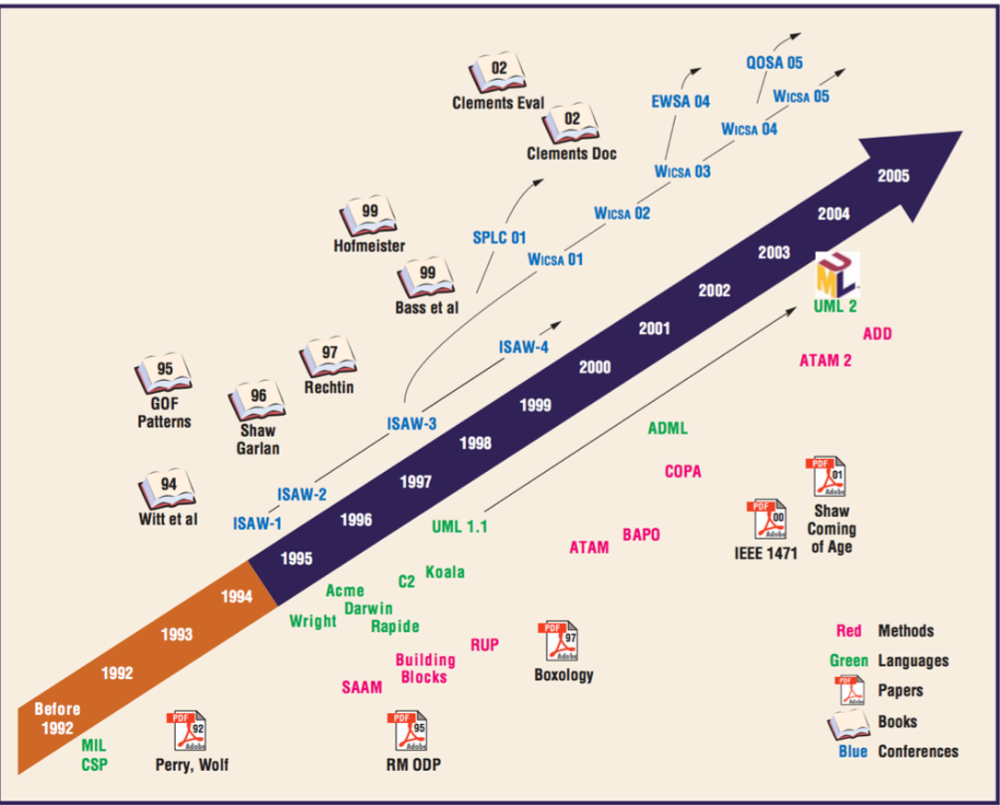

## 1.5. IEEE 1471-2000
1. IEEE关于软件密集型系统的体系结构描述的推荐实践

## 1.6. Books
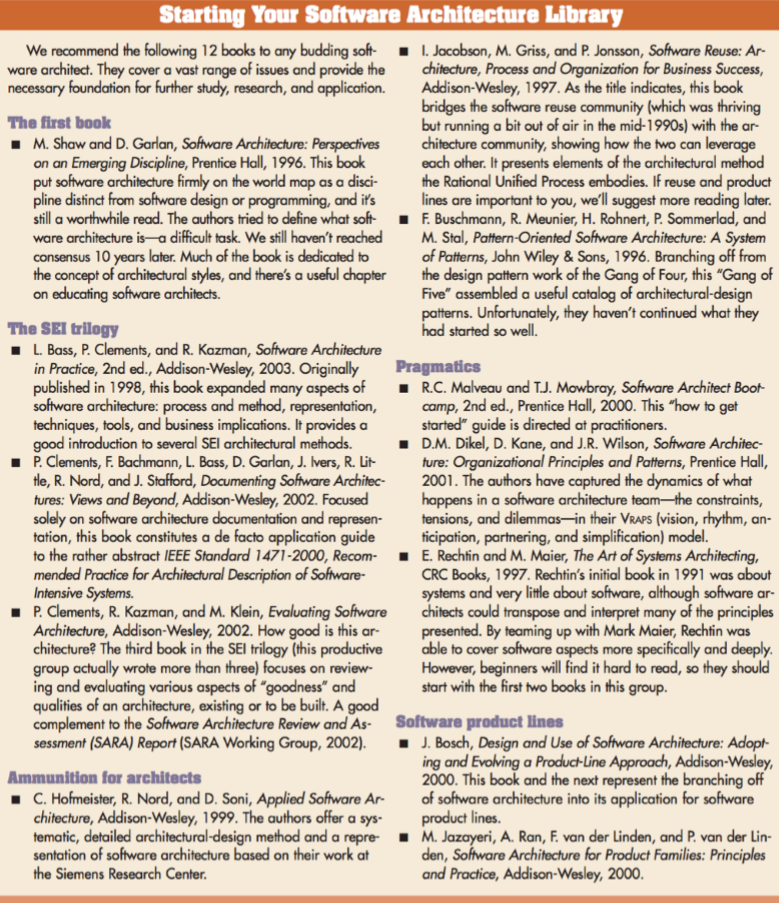

1. 推荐first book

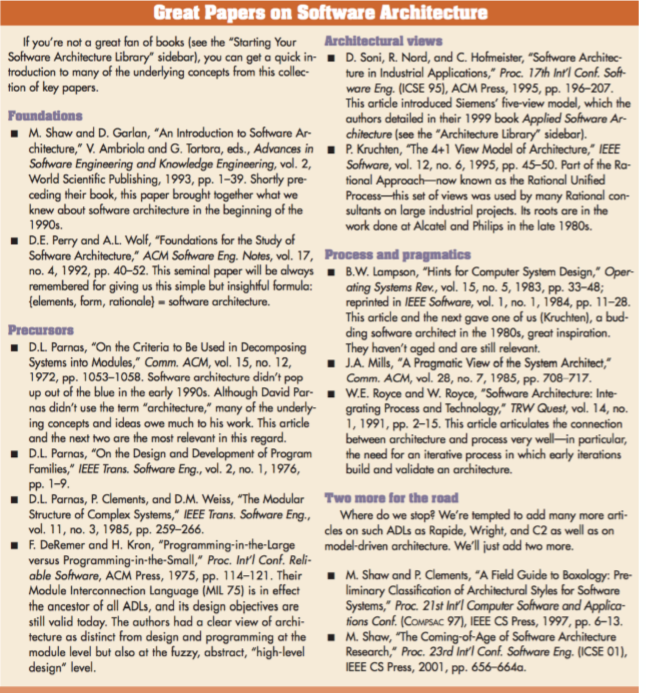

1. M.show and D.Garlan的文章必读经典
2. Kuechen(4+1)

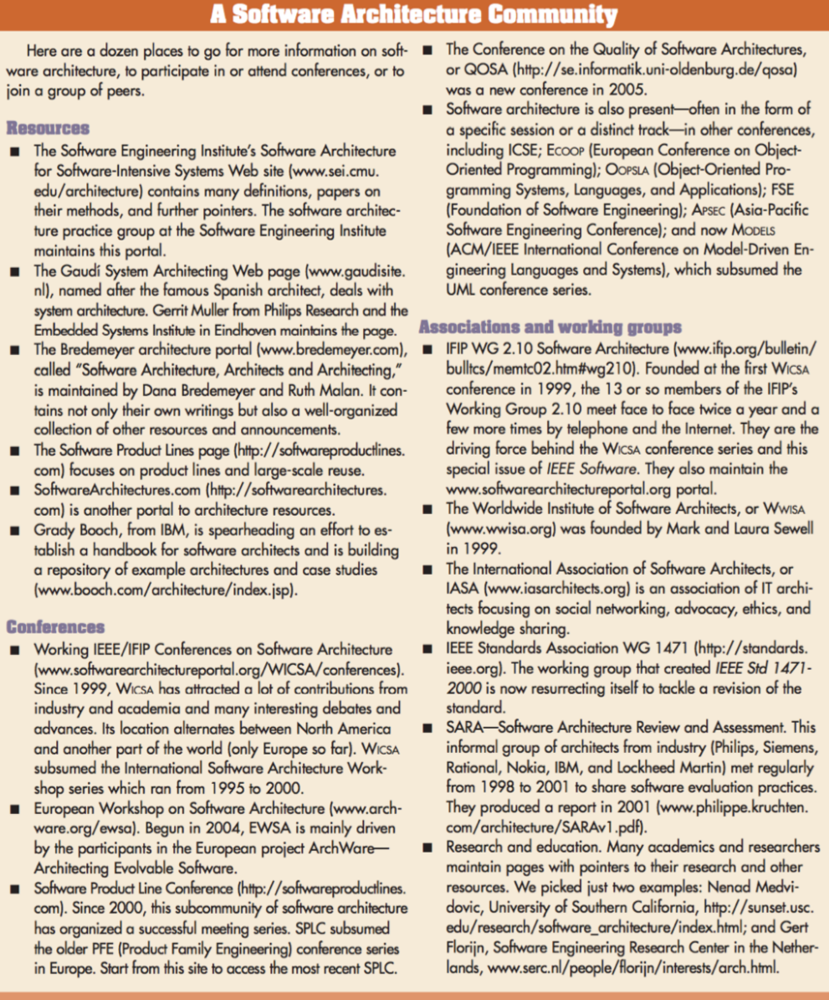

1. 架构实战
2. 软件架构Python实现？印度人写的

## 1.7. 软件架构的黄金时代：Mary Shaw
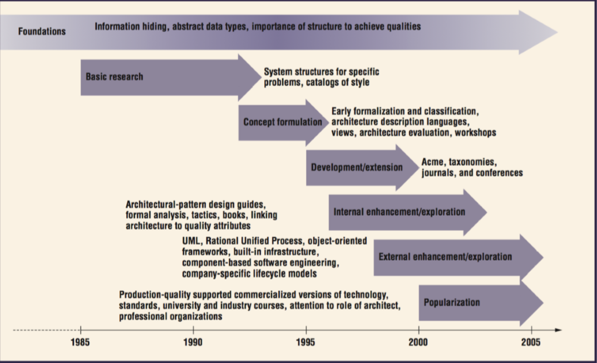

# 2. 理解软件体系结构

## 2.1. 什么是软件体系结构

### 2.1.1. Kruchten
1. 软件体系结构：现代系统组件和子系统相互作用形成系统的结构和组织，以及最好在系统级别设计和分析的系统属性。
2. (加拿大不列颠哥伦比亚省温哥华的Rational软件公司流程开发总监)：软件体系结构包含有关以下方面的重要决策
   1. 软件系统的**组织**
   2. 选择组成系统的**结构元素及其接口**，以及-这些元素之间的协作所指定的**行为**，
   3. 将这些元素组成越来越大的**子系统**，
   4. 指导该组织，这些元素及其界面，协作和组成的结构元素及其接口。
3. 软件体系结构不仅与结构和行为有关，而且与**使用，功能，性能，弹性，重用，可理解性，经济和技术约束以及贸易和美观**有关。 (与G. Booch和R. Reitman一起)引文：Rational Unified Process 5.0，Rational，Cupertino，1998年。 PBK，《理性统一过程—简介》，Addison-Wesley-Longman(1999)。

### 2.1.2. Shaw 重要定义
1. [Shaw1995]将软件体系结构模型定义为:
    1. 软件体系结构={部件(Component),连接件(Connector),配置(Configuration)} 
       1. **部件**是软件体系结构的基本组成单位之⼀,承载系统的主要功能,包括处理与数据;
       2. **连接件**是软件体系结构的另一个基本组成单位,定义了部件间的交互,是连接的抽象表示;
       3. **配置**是对"形式"的发展,定义了"部件"以及"连接件"之间的关联方式,将它们组织成系统的总体结构。 
2. 按照这个模型,[Shaw1996]给出了⼀个简洁的软件体系结构定义:⼀个软件系统的体系结构规定了系统的计算部件和部件之间的交互。

### 2.1.3. Perry(公式化角度)
1. 软件构架= {元素，形式，原理} [Perry1992]
2. 过程 + 数据 + 连接

### 2.1.4. Bass(组成成分等角度)
1. "程序或计算系统的软件体系结构是系统的一个或多个结构，其中包括软件组件，这些组件的外部可见属性以及它们之间的关系。"[Bass1998]
2. 每个软件都有一个或多个架构结构

### 2.1.5. Wiki(需求角度)
1. 软件体系结构是非功能性需求的实现，而软件设计是功能性需求的实现。

## 2.2. Summary
1. 高层抽象
2. 利益相关者的关注

## 2.3. 区分物理与逻辑

### 2.3.1. 逻辑 vs 物理
1. 高层 vs 低层
2. 抽象 vs 实践
3. 逻辑是更加高层的视角

### 2.3.2. 例子
1. 从凤凰城到波士顿，从逻辑上讲，从凤凰城到波士顿的消息从逻辑上讲是从一个城市传到另一个城市。 
2. 但是，物理电话线路可能是凤凰城到芝加哥，费城到波士顿。通过Internet，该消息可能会遍历许多其他位置的交换点。
3. 逻辑驱动器C：-物理驱动器0在Windows PC中，单个物理硬盘驱动器为驱动器0；而物理驱动器为0。 但是，它可以分为几个逻辑驱动器，例如C：D：和E:。
4. 虚拟化各种虚拟化方法创建用于处理物理硬件的逻辑"抽象层"。 例如，虚拟机使多个操作系统可以在计算机中运行，每个操作系统都通过逻辑层而不是直接物理接触来访问硬件。
5. 用户通过数据元素名称在逻辑上关联数据； 但是，实际数据字段实际上位于磁盘的扇区中。
6. 为了找出哪些客户订购了多少特定产品，逻辑视图是客户名称和数量。 它的物理组织可能在客户文件中有客户名称，而在订单文件中有数量(由客户编号交叉引用)。 客户文件的物理顺序可以被索引，而订单文件的顺序可以是顺序的。

### 2.3.3. 概念式 + 逻辑式 + 物理式


### 2.3.4. 模块
1. 逻辑：⼀个模块调用另⼀个模块
2. 物理实现
   1. 基本：接口调用
   2. 需要传递数据对象怎么办？
3. 逻辑：⼀个模块给另⼀个模块传递数据流
4. 物理实现：读写共享数据、pipe…

### 2.3.5. 物理实现的载体
1. 低层：基本类型+基本控制结构
2. 中层：OO编程语言机制
   1. 类声明、实例创建与撤销、实例⽣命期管理
   2. 类权限控制机制
   3. 复杂机制：继承…
3. 高层：导⼊导出和名称匹配

### 2.3.6. 导入导出机制
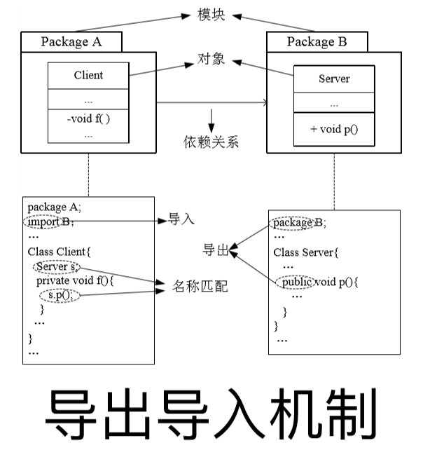

### 2.3.7. 抽象vs实现
1. 建筑设计
2. 函数式组织
3. 体系结构设计
4. 软件实施机制

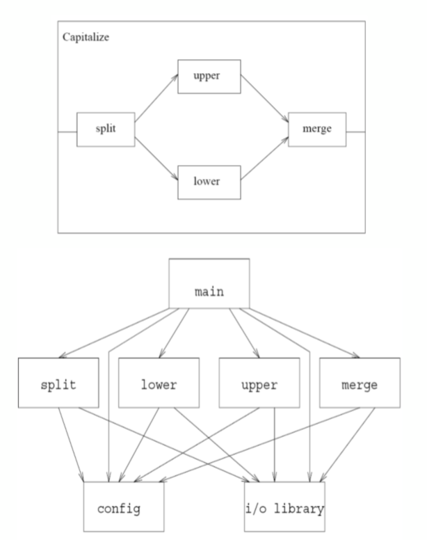

5. 上面的图是流式的处理

# 3. 高层抽象(体系结构 = 部件 + 连接件 + 配置) 重要
1. **组件**是计算和状态的聚合
2. **连接件**是组件之间的关系的聚合


## 3.1. 理解高层抽象
1. 连接件是⼀个与部件平等的单位。
2. 部件与连接件是⽐类、模块等软件单位更⾼层次的抽象。

## 3.2. 部件(Components) 
1. 封装系统架构中的处理和数据的元素称为软件组件
2. 件通常提供特定于应用程序的服务

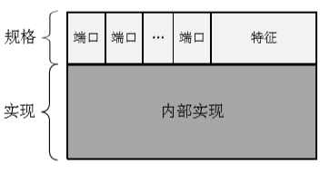

3. 部件承载系统主要功能，包括处理和数据

### 3.2.1. 原始部件和复合部件
1. 部件可以分为**原始**(Primitive)和**复合**(Composite)两种类型。
2. 原始类型的部件可以直接被实现为相应的软件实现机制。
3. 复合部件则由**更细粒度**的**部件和连接件**组成,复合部件通过局部配置将其内部的部件和连接件连接起来,构成⼀个整体。

### 3.2.2. 原始部件常用的软件实现机制


## 3.3. 连接件(Connectors)
1. 在复杂的系统中，交互可能比单个组件的功能更重要和更具挑战性

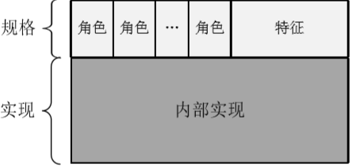

2. 连接件定义了部件间的交互，是连接的抽象表示

### 3.3.1. 原始连接件和复合连接件
1. 与部件相似,在实现上连接件也可以分为**原始**(Primitive)和**复合**(Composite)两种类型。原始类型的连接件可以直接被实现为相应的软件实现机制。
2. 复合连接件则由更细粒度的**部件和连接件**组成,复合连接件通过局部配置将其内部的部件和连接件连接起来,构成⼀个整体。

### 3.3.2. 原始连接件常用的软件实现机制
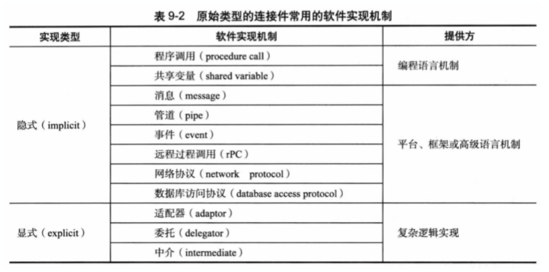

### 3.3.3. Connector in ACME


## 3.4. Configurations 配置
1. 组件和连接器以给定系统体系结构中的特定方式构成，以实现该系统的目标
2. 为了对软件体系结构进行更严格、准确的描述，人们建立了体系结构描述语言(ADL)，用于描述软件体系结构的形式化模型语言。

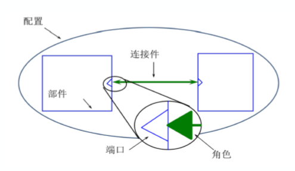

### 3.4.1. ACME中的配置
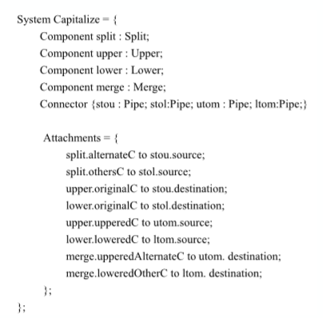

### 3.4.2. Wright
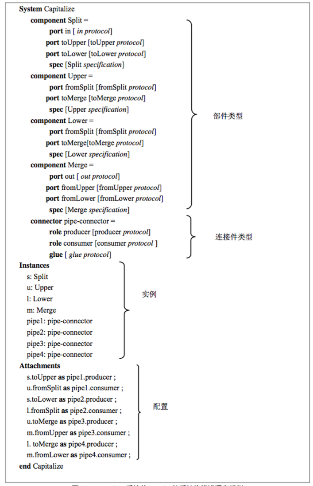
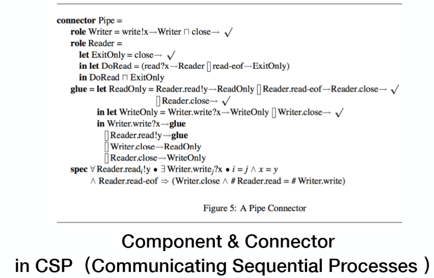

### 3.4.3. 配置
1. 定义了部件和连接件之间的关联方式，将他们组织成系统的总体结构。

## 3.5. 高级抽象的好处
1. 直观，便于理解
2. 验证正确性
3. 关注度分离，降低复杂度

# 4. 体系结构风格初步
1. 这部分需要重要掌握每一种风格的优点缺点和画图

## 4.1. 主程序子进程风格
1. 组件：程序、函数和模块
2. 连接件：在上述三个组件之间相互调用
3. 图解

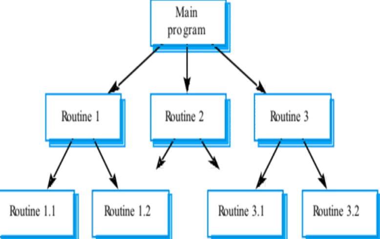

### 4.1.1. 设计决策与约束
1. 基于声明-使用(程序调用)关系建立连接件,以层次分解的方式建立系统部件, 共同组成层次结构。
2. 每⼀个上层部件可以"使用"下层部件,但下层部件不能"使用"上层部件,即不允许逆方向调用。(层次性分解，基于定义使用关系)
3. 系统应该是**单线程**执⾏。主程序部件拥有初的执⾏控制权,并在"使用"中将控制权转移给下层子程序。
4. 子程序只能够通过上层转移来获得控制权,可以在执⾏中将控制权转交给下层的子程序,并在自身执行完成之后必须将控制权还交给上层部件。
5. 隐含子系统结构。

### 4.1.2. 实现
1. 主要实现机制:模块实现。
2. 功能分解
3. 集中控制
4. 每个构件⼀个模块实现：主要是**单向依赖**
5. 使⽤utility或tools等基础模块

### 4.1.3. 主程序/子程序风格的优点
1. 流程清晰,易于理解(符合分解和分治的思想)。
2. 强控制性(容易保证正确性)。

### 4.1.4. 主程序/子程序风格的缺点
1. 程序调用是⼀种**强耦合**的连接⽅式,⾮常依赖交互⽅的接口规格,这会使得系统难以修改和复⽤。
2. 程序调⽤的连接⽅式限制了各部件之间的数据交互,可能会使得不同部件使⽤隐含的共享数据交流,产⽣不必要的公共耦合,进⽽破坏它的"正确性"控制能⼒。

### 4.1.5. 应用
1. 主程序/子程序风格主要⽤于能够将系统功能依层次分解为多个顺序执行步骤的系统。
2. [Shaw1996]发现,在很多受到限制的编程语⾔环境下,这些编程语⾔没有模块化⽀持, 系统通常也会使⽤主程序/⼦程序⻛格,这时主程序/子程序风格的实现是程序实现,即主程序和子程序都被实现为单独的程序。
3. ⼀些使⽤结构化风格(自顶向下或自底向上)建立的软件系统也属于主程序/⼦程序⻛格。

## 4.2. 面向对象风格
1. 组件：对象或模块(调用方法)
2. 连接件函数或者调用

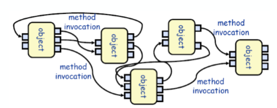

### 4.2.1. 设计决策及约束
1. 依照对数据的用情况,⽤**信息内聚**的标准,为系统建⽴对象部件。每个对象部件基于内部数据提供对外服务接口,并隐藏内部数据的表示。
2. 基于⽅法调用(Method Invocation)机制建立连接件,将对象部件连接起来。
3. 每个对象负责维护其自身数据的⼀致性与完整性,并以此为基础对外提供"正确"的服务。
4. 每个对象都是⼀个自治单位,不同对象之间是平级的,没有主次、从属、层次、分解等关系。

### 4.2.2. 实现
1. 主要实现机制:模块实现
2. 任务分解
3. (委托式)分散式控制
4. 每个构件⼀个模块实现
   1. 使⽤接⼝将双向依赖转换为单向依赖
   2. 将每个构件分割为多个模块，以保证单向依赖
   3. 每个模块内部可以是基于⾯向对象⽅法，也可以基于结构化 
5. 使⽤utility或tools等基础模块

### 4.2.3. 面向对象式风格的优点
1. 内部实现的可修改性(隐藏内部实现)。
2. 易开发、易理解、易复用的结构组织(契合模块化思想)。

### 4.2.4. 面向对象式风格的缺点
1. 接口的耦合性(由于方法调用机制，接口的耦合性无法消除)
2. 标识(Identity)的耦合性(一个对象要和其他对象交互，必须知道标识)
3. 副作用:难以理解、高耦合性以及数据的不一致视图

### 4.2.5. 效果
1. ⾯向对象式⻛格借鉴了⾯向对象的思想,也引⼊了⾯向对象的副作⽤,因此更难实现程序的"正确性"。
2. 例如,如果 A 和 B 都使⽤对象 C,那么 B 对 C 的修改可能会 对 A 产⽣未预期的影响。
3. 例如，对象的重入(Reentry)问题:如果 A 的⽅法 f()调⽤了 B 的 ⽅法 p(),⽽ p()⼜调⽤了 A 的另⼀⽅法 q(),那么就可能使得 q()失败,因为在 q()开始执⾏时,A 正处于 f()留下的执⾏现场,这个现场可能是**数据不⼀致**的。

### 4.2.6. 应用
1. ⾯向对象式⻛格适⽤于那些能够基于数据信息分解和组织的软件系统,这些系统: 
   1. 主要问题是标识和保护相关的数据信息;
   2. 能够将数据信息和相关操作联系起来,进⾏封装。
2. 实践中,基于抽象数据类型建⽴的软件系统⼤多属于⾯向对象式⻛格。

## 4.3. 分层风格
1. 组件：通常是过程或对象的集合。
2. 连接件：通常在受限可见性下进行过程调用或方法调用。
   
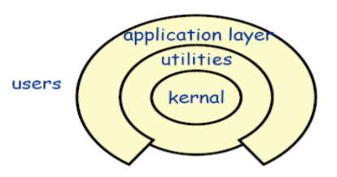

### 4.3.1. 设计决策与约束
1. 从低层到高层,部件的抽象层次逐渐提升。每个下层为邻接上层提供服务, 每个上层将邻接下层作为基础设施使⽤。也就是说,在程序调⽤机制中上层调⽤下层。
2. 两个层次之间的连接要遵守特定的交互协议,该交互协议应该是**成熟、稳定和标准化**的。也就是说,只要遵守交互协议,不同部件实例之间是可以互相替换的。
3. 跨层次的连接是禁⽌的,不允许第 I 层直接调⽤ I+N(N>1)层的服务。(也就是必须逐层进行调用)
4. 逆向的连接是禁⽌的,不允许第 I 层调⽤第 J(J < I)层的服务。

### 4.3.2. 实现
1. 关注点分离(每层逐次抽象)
2. 层间接⼝使用固定协议(固定控制)
3. 每层⼀或多个模块实现
   1. 单向依赖
   2. 层间数据传递建⽴专门模块
4. 使⽤utility或tools等基础模块

### 4.3.3. 优点
1. 设计机制清晰,易于理解(抽象层次分离，隔离复杂度)。
2. 支持并行开发(层次之间遵守程序稳定的接口)。
3. 更好的可复用性与内部可修改性(接口的稳定性，不同层次的部件能够互相替代)。

### 4.3.4. 缺点
1. **交互协议难以修改**(可能需要改变所有的层次，接口具有强耦合性)。
2. 性能损失(禁止跨层调用)。
3. 难以确定层次数量和粒度。

### 4.3.5. 应用
1. 分层风格适⽤于具备下列特性的系统:
   1. 主要功能是能够在不同抽象层次上进⾏任务分解的复杂处理;
   2. 能够建⽴不同抽象层次之间的稳定交互协议;
   3. 没有很⾼的**实时性能要求**,能够容忍稍许的延迟; 
2. 此外,那些需要进⾏并⾏开发的软件系统也可能会使⽤分层⻛格,以便于任务分配和⼯作开展。在现有的软件系统中,分层⻛格是⼀种经常被⽤到的体系结构⻛格,像⽹络通信、交互
3. 系统、硬件控制系统、系统平台等都会使⽤分层⻛格。例如,ISO ⽹络通信模型、TCP/IP 的⽹络通信模型等都使⽤了分层⻛格。

## 4.4. Model-View-Controller Style MVC风格
1. 子系统模型被设计的不用依赖任何一种视图或者控制子系统
2. 任何他们状态的修改都会被传播给显示子系统

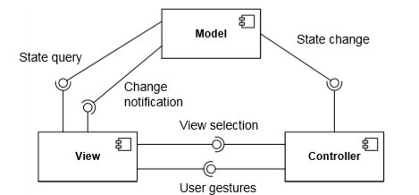

1. 组件
   1. 模型组件负责保持问题域知识和确认视图层的修改
   2. 视图组件负责显示信息给用户并且将用户的行为传递给控制器
   3. 控制器
      1. 修改模型的状态：将用户的行为和模型的更新映射起来
      2. 选择用来反映的视图
2. 连接件：方法调用，信息，事件

### 4.4.1. 设计决策和约束
1. 模型、视图、控制是分别是关于业务逻辑、表现和控制的三种不同内容抽象。
2. 如果视图需要持续地显示某个数据的状态,那么它⾸先需要在模型中注册对该数据的兴趣。如果该数据状态发⽣了变更,模型会主动通知视图,然后再由视图查询数据的更新 情况。
3. 视图只能使用模型的数据查询服务,只有控制部件可以调⽤可能修改模型状态的程序。
4. ⽤户⾏为虽然由视图发起,但是必须转交给控制部件处理。对接收到的⽤户⾏为, 控制部件可能会执⾏两种处理中的⼀种或两种:调⽤模型的服务,执⾏业务逻辑;提供下⼀个业务展现。
5. 模型部件相对独⽴,既不依赖于视图,也不依赖于控制。虽然模型与视图之间存在⼀个"通知变更"的连接,但该连接的交互协议是⾮常稳定的,可以认为是⾮常弱的依赖。

### 4.4.2. 实现
1. 模型-视图-控制⻛格需要为模型、视图和控制的每个部件实例建⽴模块实现,各模块间存在导⼊/导出关系,程序调⽤连接件不需要显式的实现。
2. 特定技术实现，通常专⽤于WEB
   1. Model与Controller单向
   2. Controller与View双向
   3. Model与View双向
3. 典型实现
   1. View：JSP，HTML
   2. Controller：Servlet
   3. Model：JavaBean

### 4.4.3. 模型-视图-控制风格的优点有:
>模型封装了系统的业务逻辑,所以是三种类型中为复杂的系统部件。MVC 中模型是相对独⽴的,所以对视图实现和控制实现的修改不会影响到模型实现。再考虑到业务逻辑通常⽐业务表现和控制逻辑更加稳定,所以 MVC 具有⼀定的可修改性优势。

1. 易开发性(分别抽象了业务逻辑，表现和控制机制清晰，易于开发)
2. 视图和控制的可修改性。
3. 适宜于网络系统开发的特征。(MVC 不仅允许视图和控制的可修改性,⽽且其对业务逻辑、表现和控制的分离使得⼀个模型可以同时建⽴并保持**多个视图**,这⾮常适⽤于⽹络系统开发)。

### 4.4.4. 模型-视图-控制⻛格的缺点有:
1. 复杂性。MVC将⽤户任务分解成了表现、控制和模型三个部分,这增加系统的复杂性,不利于理解任务实现。
2. 模型修改困难。视图和控制都要依赖于模型,因此,模型难以修改。(往往会我们带来比较高的复杂度问题)

## 4.5. 应用
1. 适合以下的应用
   1. 在运行状态下根据用户接口的变化的变更是很方便和可行的
   2. 适应或移植用户界面不应影响应用程序功能部分的设计或代码。
2. 例子:网络应用

## 4.6. 分层和MVC
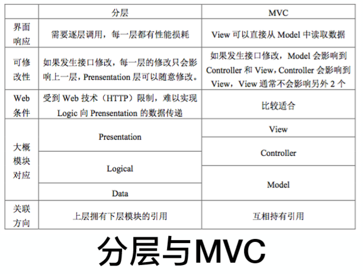
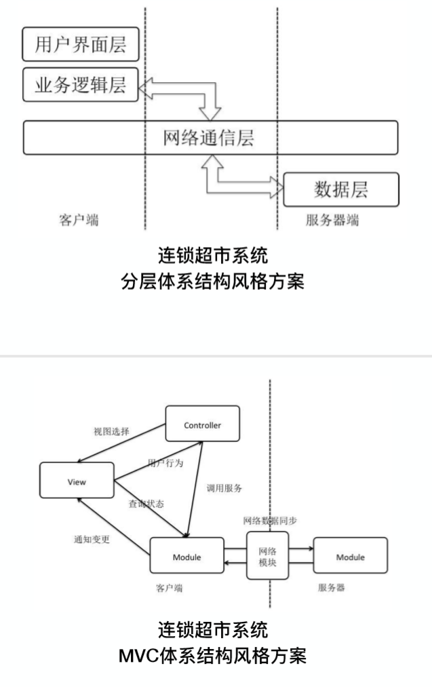

# 5. 观察者模式
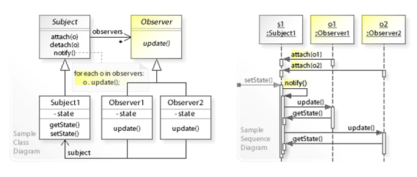

## 5.1. Observable
```java
public class Observable {
   private boolean changed = false;
   private final ArrayList<Observer> observers;
   /** Construct an Observable with zero Observers. */

   public Observable() {
      observers = new ArrayList<>();
   }

   /**
   * 将⼀个观察者添加到观察者集合
   */
   public synchronized void addObserver(Observer o) {
      if (o == null)
         throw new NullPointerException();
      if (!observers.contains(o)) {
         observers.add(o);
      }
   }
}
```

## 5.2. Observer
```java
public interface Observer {
    /**
     * 当被观察者对象的状态发⽣变化时，被观察者对象的notifyObservers()⽅法就会调用这⼀⽅法。
     */
    void update(Observable o, Object arg);
}
```

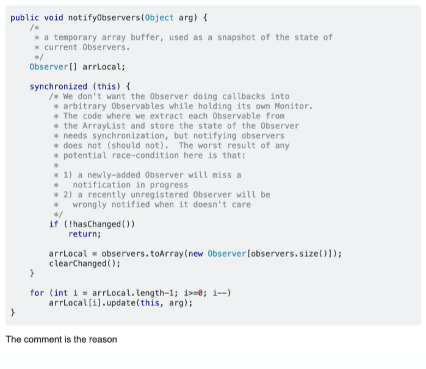

# 6. 题目
1. 按照功能分解的方式进行模块分割能够实现高内聚的软件设计:√
2. 软件系统设计的主要目的是为系统制定蓝图, (D)并不是软件设计模型所关注的。
   1. 系统总体结构
   2. 数据结构
   3. 界面模型
   4. 项目范围(这个是在需求部分已经完成)
3. 体系结构设计是软件非功能性的实现，而详细设计主要是软件功能性的实现。√
   1. 很重要，一定要记住
