11-人机交互设计
---
1. 不良的界面会导致用户感到不适

<!-- TOC -->

- [1. 用户和不好的设计](#1-用户和不好的设计)
- [2. 什么是人机交互设计(HCI)](#2-什么是人机交互设计hci)
  - [2.1. 什么是好的人机交互](#21-什么是好的人机交互)
  - [2.2. HCI的重要组成：可用性 重要](#22-hci的重要组成可用性-重要)
    - [2.2.1. 不同的用户的学习曲线](#221-不同的用户的学习曲线)
    - [2.2.2. 记忆](#222-记忆)
- [3. 人机交互的三个因素](#3-人机交互的三个因素)
  - [3.1. 人](#31-人)
    - [3.1.1. 人的特性](#311-人的特性)
    - [3.1.2. 你看到了什么](#312-你看到了什么)
    - [3.1.3. 精神模型 重要](#313-精神模型-重要)
    - [3.1.4. 发现精神模型](#314-发现精神模型)
    - [3.1.5. 差异性](#315-差异性)
- [4. 人机交互设计中的计算机的因素](#4-人机交互设计中的计算机的因素)
  - [4.1. 计算机设备](#41-计算机设备)
  - [4.2. 可视化设计](#42-可视化设计)
  - [4.3. 不要暴露内部结构](#43-不要暴露内部结构)
  - [4.4. 展示细节](#44-展示细节)
  - [4.5. 常见界面类型](#45-常见界面类型)
  - [4.6. 交互](#46-交互)
    - [4.6.1. 交互方式](#461-交互方式)
    - [4.6.2. 直接操作](#462-直接操作)
    - [4.6.3. 菜单系统](#463-菜单系统)
    - [4.6.4. 表单接口](#464-表单接口)
    - [4.6.5. 命令行模式](#465-命令行模式)
    - [4.6.6. 自然语言模式](#466-自然语言模式)
  - [4.7. 总结](#47-总结)
- [5. 人机设计的交互性](#5-人机设计的交互性)
  - [5.1. 导航 重要](#51-导航-重要)
  - [5.2. 反馈 重要](#52-反馈-重要)
  - [5.3. 协作式设计 重要](#53-协作式设计-重要)
- [6. 一些人机交互设计原则 重要(至少记住5条以上)](#6-一些人机交互设计原则-重要至少记住5条以上)
  - [6.1. 简洁设计(7±2原则)](#61-简洁设计72原则)
  - [6.2. 一致性设计](#62-一致性设计)
  - [6.3. 低出错率设计](#63-低出错率设计)
  - [6.4. 易记性设计](#64-易记性设计)
  - [6.5. 可视化设计要点](#65-可视化设计要点)
- [7. 人机交互设计过程](#7-人机交互设计过程)
  - [7.1. ⼈机交互设计过程](#71-机交互设计过程)
  - [7.2. 对话结构图](#72-对话结构图)
  - [7.3. 页面设计](#73-页面设计)
  - [7.4. 原型化界面](#74-原型化界面)
- [8. GUI设计](#8-gui设计)
  - [8.1. 在建立有效的GUI方面的关键点](#81-在建立有效的gui方面的关键点)
  - [8.2. 常见的GUI元素](#82-常见的gui元素)
    - [8.2.1. 欢迎和支持信息](#821-欢迎和支持信息)
  - [8.3. 查找内容的设施](#83-查找内容的设施)
  - [8.4. 主要收藏内容](#84-主要收藏内容)
  - [8.5. 扩展功能](#85-扩展功能)
  - [8.6. 规划您的GUI](#86-规划您的gui)
  - [8.7. 建立您的GUI](#87-建立您的gui)
  - [8.8. 检查列表](#88-检查列表)
    - [8.8.1. 数据输入界面](#881-数据输入界面)
    - [8.8.2. 可定制的视觉设计](#882-可定制的视觉设计)
    - [8.8.3. 搜索和检索界面](#883-搜索和检索界面)
    - [8.8.4. 附加的用户功能](#884-附加的用户功能)
    - [8.8.5. 控制用户访问](#885-控制用户访问)
    - [8.8.6. 与其他集合的互操作性](#886-与其他集合的互操作性)
  - [8.9. 确保可用性](#89-确保可用性)
  - [8.10. 评估您的GUI](#810-评估您的gui)
  - [8.11. 为可用性而设计](#811-为可用性而设计)
  - [8.12. 开发高质量和可用接口的过程(ISO 13407)](#812-开发高质量和可用接口的过程iso-13407)
  - [8.13. 确保可访问性](#813-确保可访问性)
  - [8.14. 开发在线收藏夹时要考虑的一些事情](#814-开发在线收藏夹时要考虑的一些事情)
    - [8.14.1. 接口](#8141-接口)
    - [8.14.2. 导航](#8142-导航)
    - [8.14.3. 搜索和检索。](#8143-搜索和检索)
    - [8.14.4. 文件的尺寸和大小](#8144-文件的尺寸和大小)
    - [8.14.5. 文件说明](#8145-文件说明)
  - [8.15. 黄金法则](#815-黄金法则)
  - [8.16. 十条原则](#816-十条原则)

<!-- /TOC -->

# 1. 用户和不好的设计
1. 系统用户通常通过系统界面而非功能来判断系统：用户界面的设计应与预期用户的技能，经验和期望相匹配。
2. 界面设计不当会导致用户发生灾难性错误：不好的UI的设计往往是很多软件系统不被使用的原因。
3. IPAD的良好的体验感和可操作性，而早期的Andriod操作系统则主要是从工程师角度出发的操作系统。
4. 比如医院书写病历:老医生打字困难，所以我们我们应该针对性的进行设计。

# 2. 什么是人机交互设计(HCI)
1. 人机交互设计旨在发现最有效的方法来设计人机界面之间的可用和有效的体验

## 2.1. 什么是好的人机交互 
1. 良好的HCI界面设计可鼓励用户与系统之间**轻松，自然且引人入胜**的交互。
2. "当程序的行为完全符合用户的想法时，用户界面就会经过精心设计。"
   1. 它允许用户执行我们所需的任务。
   2. 一个好的界面应该是**透明**的。有了一个好的用户界面，用户会**忘记自己正在使用计算机**。
3. 如何判断好坏？ 唯一标准:**可用性**

## 2.2. HCI的重要组成：可用性 重要
1. 可用性不是用户界面的单一一维属性，它包含以下维度。
   1. 易学性：新手用户容易学习，能够很快使用系统。
   2. 效率：熟练的用户可以高效使用它
   3. 易记性：使用过软件系统的用户，能够有效记忆或快速重新学会使用该系统。(超市可以缓存之前的信息)
   4. 出错率：几乎没有错误，可以从错误中快速恢复
   5. 主观满意度：让用户有良好的体验。

### 2.2.1. 不同的用户的学习曲线
1. 易学性和效率是存在冲突的

2. 大多数的GUI界面都是友好新手的，而命令界面是友好专家用户的。

### 2.2.2. 记忆
1. 涉及编码和回忆知识并采取适当行动
2. 我们不记得所有的事情:涉及过滤和处理
3. 上下文对于影响我们的记忆很重要
4. 我们认识事物比回忆事物好得多
5. GUI在基于命令的界面上的兴起
6. 相比文字，人们更加容易记住图片
7. 使用图标而不是名称

# 3. 人机交互的三个因素

## 3.1. 人
1. 什么是人机交互中的人？
   1. 用户 - 拥有一台笔记本电脑的人，一群一起或远程工作的人，一系列按顺序工作的人...
   2. 一个或多个试图使用计算技术完成工作的人
   3. **用户只想看到它想要看到的**

### 3.1.1. 人的特性
1. 短期记忆有限
   1. 7±2原则
   2. 电脑可以存储知识
2. 人会犯错：避免，恢复，帮助
3. 人是不同的：新手用户，知识渊博的间歇用户，专家频繁用户
4. 人们有不同的互动偏好：有一些人喜欢照片，有一些人喜欢文本

### 3.1.2. 你看到了什么

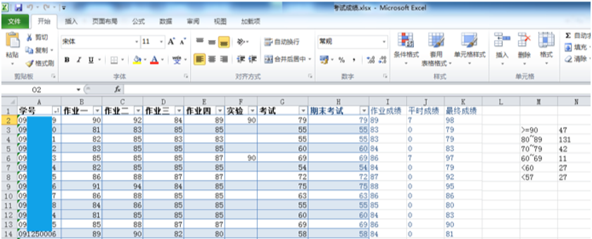

1. 用户答案
   1. 成绩
   2. 统计 
2. 技术答案
   1. 2维画面
   2. 可控的组件
      1. 文本和图片
      2. 图标和工具栏
      3. 可扩展栏和菜单栏
      4. 任务栏和状态信息
      5. 控制器和指针
      6. 颜色集合
   3. 文档的代表
   4. 软件功能的代表
3. 进行人机交互设计师，一定要谨记从用户的角度来进行学习和分析

### 3.1.3. 精神模型 重要
1. 尝试发现用户对程序帮助他们执行任务的心理模型
2. 如何？请注意模型的固有隐喻，它们代表任务的概念性组成部分
3. 隐喻:左上角的开关就应该是控制左上角的灯
4. **精神模型**就是用户进行人机交互时头脑中的任务模型。依据精神模型可以进行**隐喻**(Metaphor)设计：
   1. 隐喻又被称为视觉隐喻，是视觉上的图像，但会被用户映射为业务事物。用户在识别图像时，会依据隐喻将控件功能与已知的熟悉事物联系起来，形成任务模型；
   2. 隐喻本质上是在用户已有知识的基础上建立一组新的知识，实现界面视觉提示和系统功能之间的知觉联系。
5. 进行人机交互设计时，要调查用户的目标和任务，分析用户的任务模型，并且据此设计界面隐喻。

### 3.1.4. 发现精神模型
1. 发现用户的精神模型
   1. 找到用户在尝试去做什么！目标！
   2. 用户，目标，结果任务的需求
   3. 仅在确定有助于解决任务的功能时才应添加功能:诱惑：如果添加附加功能很便宜，那么通常要这样做-这会严重损害用户界面的概念！
   4. 与用户个人资料相关的任务的频率

### 3.1.5. 差异性
1. 新手用户
   1. 是对业务不熟悉的⼈
   2. 例如新员工或者新接触系统的⼈。为新手用户设计系统时要关注易学性，进⾏业务导航，尽量避免出错。如果⼀个系统的⼤多数⽤户都是新手用户，整个系统的⼈机交互设计都要侧重**易学性**。
2. 专家用户
   1. 是能够熟练操作计算机完成业务任务的⼈，⼀般都是⻓时间使⽤软件系统并且计算机操作技能熟练的人。
   2. 为专家用户设计系统时，要关注效率。如果⼀个系统的大多数用户都是专家⽤户，整个系统的⼈机交互设计都要侧重效率。
3. 熟练用户：是介于新手用户和专家用户之间的⼈。为熟练用户设计⼈机交互系统要在易学性和效率之间进行折中。
4. 好的人机交互应该为不同的用户群体提供差异化的交互机制。
   1. 既为新⼿用户提供易学性高的⼈机交互机制(图形界面)
   2. ⼜为专家用户提供效率高的⼈机交互机制(命令行、快捷方式、热键)

# 4. 人机交互设计中的计算机的因素

## 4.1. 计算机设备
1. ⼈机交互设备
   1. 输入设备
      1. 键盘
      2. 鼠标
      3. ⼿写板
   2. 输出设备
      1. 显示屏
      2. 喇叭
      3. 打印机

## 4.2. 可视化设计
1. 从可视化设计语言Visual Basic开始，对可视化构件的布局就成为可视化设计的主要⼯作。
2. 常⻅的可视化构件包括：窗⼝、菜单、标签(Tab)、表单、按钮、列表、树形控件、组合框、输⼊框等等，[Cooper2007]对此有详细的描述。
3. 要点:
   1. 按照任务模型设计界⾯隐喻，同时不要把软件系统的**内部构造机制**暴露给⽤户
   2. 可视化设计还应该基于界面隐喻，尽可能地把功能和任务细节表现出来

## 4.3. 不要暴露内部结构
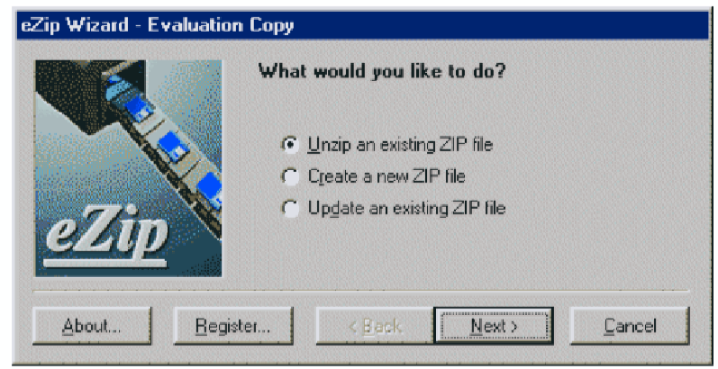

1. 最初的压缩软件:只有这3个功能，很明白地全部显示了出来
2. 现在的压缩软件:停到特定的文件的时候给出拉出菜单
3. 功能和场景结合起来，而不是完全要全新选择，避免用户做出不当的行为

## 4.4. 展示细节
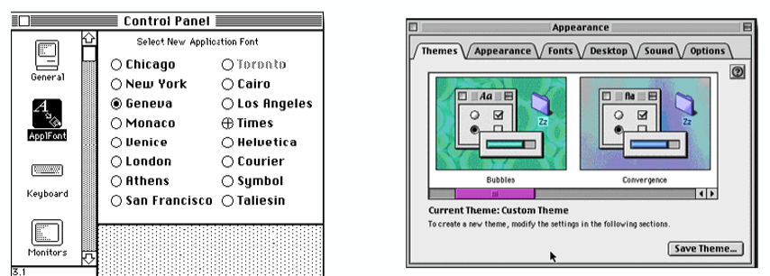

1. 左侧选择字体没有更加细节的展示，而右侧则展示了其中的细节问题

## 4.5. 常见界面类型
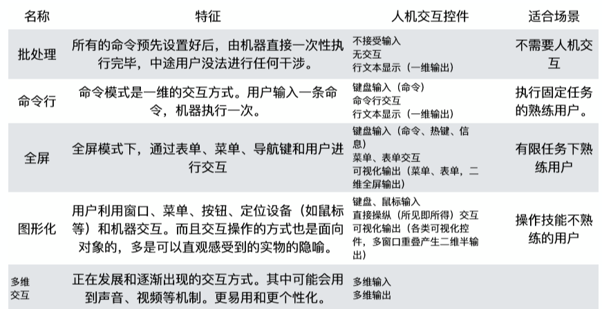

## 4.6. 交互
1. "交互"是双向的：
   1. ⼀⽅⾯⽤户主动向软件系统提出请求(输⼊信息)，软件系统给予⽤户响应(输出信息)；
   2. 另⼀⽅⾯，软件系统也应该主动告知⽤户相应的信息，并等待⽤户的响应。

### 4.6.1. 交互方式
1. 直接操作(图形)：视窗图标
2. 菜单选择
3. 表单输入
4. 命令语言
5. 自然语言

### 4.6.2. 直接操作
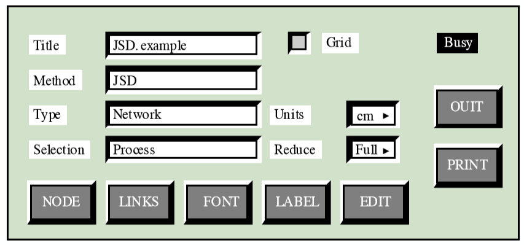

1. 优点
   1. 用户感到可以控制计算机，而不会被计算机吓倒。
   2. 用户学习时间相对较短。
   3. 用户会立即收到有关其操作的反馈。错误经常可以被发现并迅速纠正。
2. 问题
   1. 如何得出适当的信息模型和隐喻？
   2. 鉴于用户拥有很大的信息空间，他们如何在该空间中导航并始终了解其当前位置
   3. 接口通常很复杂。

### 4.6.3. 菜单系统
1. 下拉式菜单
   1. 可预测的，但需要更多的屏幕空间
   2. 显示菜单标题。
   3. 用户可以通过此菜单选择命令。
2. 弹出式菜单
   1. 灵活，量身定制，可能会引起用户惊讶
   2. 它们与实体(例如字段)相关联。
3. 优点
   1. 用户不需要知道命令名称。
   2. 打字非常少。
   3. 可以避免一些用户错误。
   4. 可以提供上下文相关的帮助。
4. 缺点
   1. 涉及逻辑结合(和)的动作：或析取(或)难以代表
   2. 注意大型菜单的结构。以下是解决方案
      1. 滚动菜单
      2. 层级菜单
      3. 步行菜单
      4. 相关的控制面板

### 4.6.4. 表单接口
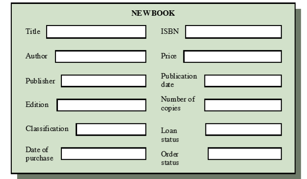

1. 优点：用于结构化数据表示和填充
2. 缺点：仅仅是用于结构化数据表示和填充

### 4.6.5. 命令行模式
1. 优点
   1. 由于语言处理，实现起来很简单。
   2. 它可以通过许多命令支持非常复杂的系统。
   3. 用户界面需要一些技巧。
   4. 打字非常少。
   5. 可以避免一些用户错误。
   6. 可以提供上下文相关的帮助。
2. 缺点：
   1. 用户必须学习并记住所有命令。
   2. 难以学习的系统，操作起来不容易。
   3. 用户不可避免地会犯错误

### 4.6.6. 自然语言模式
1. 用户以自然语言键入命令。通常，词汇量是有限的，并且这些系统仅限于特定的应用领域(例如，时间表查询)
2. NL处理技术现在已经足够好，可以使这些接口对休闲用户有效，但是有经验的用户发现他们需要太多的输入
3. 往往结合机器学习中的NLP技术

## 4.7. 总结
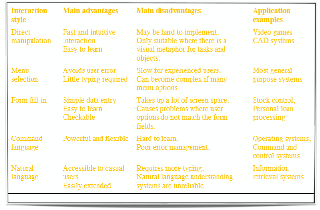

# 5. 人机设计的交互性

## 5.1. 导航 重要
1. 好的人机交互设计就像⼀个服务周到的推销员，能够主动将自己的产品和服务简明扼要地告诉⽤户，这个就是导航。
2. 好的导航就像⼀个好的餐厅菜单，餐厅菜单能够帮助顾客快速地找到喜欢的⻝物，软件系统导航也要能帮助⽤户找到任务的⼊⼝。
3. 导航的⽬的就是为⽤户提供⼀个很好的完成任务的⼊⼝，好的导航会让这个⼊⼝⾮常符合⼈的精神模型。
4. 全局结构按照任务模型将软件产品的功能组织起来，并区分不同的重要性和主题提供给 不同的⽤户。
   1. 全局结构常⽤的导航控件包括**窗口、菜单、列表、快捷方法、热键**等等。
   2. 全局结构的设计主要以功能分层和任务交互过程为主要依据。
5. 局部结构通过安排界面布局细节，制造**视觉上的线索**来给⽤户提供导航。
      1. 局部结构常用的导航控件包括可视化控件布局与组合、按钮设置、文本颜色或字体大小等等。
6. 局部结构的设计主要以⽤户关注的任务细节为主要依据。

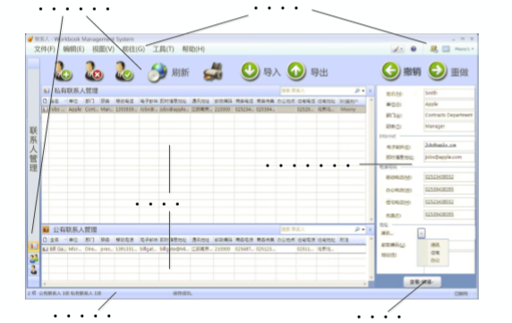

>标注部分详见课本189页

## 5.2. 反馈 重要

1. 一定要有反馈，避免进行错误的操作
2. ⽤户喜欢较短的响应时间；
3. 较⻓的响应时间(>15秒)具有破坏性；
4. ⽤户会根据响应时间的变化调整⾃⼰的⼯作⽅式；
5. 较短的响应时间导致了较短的⽤户思考时间；
6. 较快的节奏可能会提⾼效率，但也会增加出错率；
7. 根据任务选择适当的响应时间：
   1. 打字、光标移动、⿏标定位：50～150毫秒
   2. 简单频繁的任务：1秒
   3. 普通的任务：2～4秒
   4. 复杂的任务：8～12秒
8. 响应时间适度的变化是可接受的；
9. 意外延迟可能具有破坏性；
10. **经验测试**有助于设置适当的响应时间。

## 5.3. 协作式设计 重要
1. ⼈和计算机是⼈机交互的方法，其中⼈的因素是⽐较固定的，一定时期内不会发⽣⼤的变化，所以要让二者交互顺畅，就需要让计算机更多地适应⼈的因素，这也是⼈机交互设计以⽤户为中⼼的根本原因。
2. 这种调整计算机因素以更好地适应并帮助⽤户的设计⽅式被称为协作式设计

# 6. 一些人机交互设计原则 重要(至少记住5条以上)

## 6.1. 简洁设计(7±2原则)
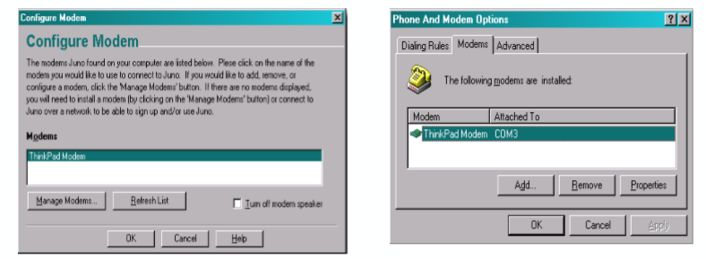

1. 人类的信息处理能力是受限的，一般满足7±2原则

## 6.2. 一致性设计
1. 用户在使用软件系统时，会为软件系统建立精神模型。
2. 以下是一个不一致性设计的例子。

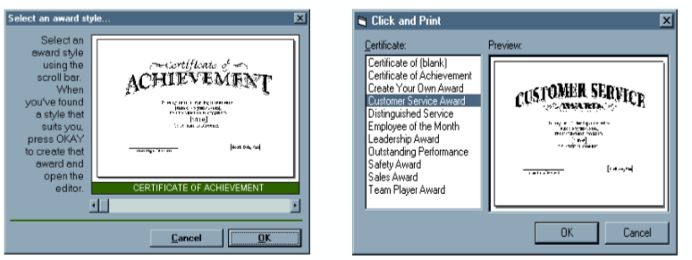

## 6.3. 低出错率设计
1. 人机交互设计首先要帮助人们避免犯错，尽可能设计不让⽤户犯严重错误的系统
   1. 具体措施包括将不适当的菜单选项功能以灰色显示屏蔽
   2. 禁⽌在数值输入域中出现字母字符
2. 当错误出现时，系统还要在⼈机交互中提供简洁、有建设性、具体的指导来帮助⽤户消除错误：填写表单时如果使用输⼊了无效的编码，那么系统应该引导他们对此进行修改，⽽不是要求⽤户重新填写整个表单。
3. 出错信息应当遵循以下四个简单原则[Shneiderman1982]：
   1. 应当使用清晰的语言来表达，而不要使用难懂的代码；
   2. 使⽤的语言应当精炼准确，而不是空泛、模糊的；
   3. 应当对用户解决问题提供建设性的帮助；
   4. 出错信息应当友好，不要**威胁或责备**使用。
4. 系统还应该提供错误恢复和故障解决帮助⼿册。
5. 应当尽快的进行校验(检查用户名重复)

## 6.4. 易记性设计
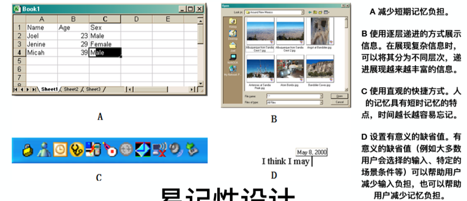

1. 减少短期记忆的负担
2. 使用逐层递进的方式展示信息
3. 使用直观的快捷方式
4. 设置有意义的默认值

## 6.5. 可视化设计要点
1. 按照任务模型设计界面隐喻，同时不要把软件系统的内部构造机制暴露给用户
2. 可视化设计还应该基于界面隐喻，尽可能地把功能和任务细节表现出来。

# 7. 人机交互设计过程

## 7.1. ⼈机交互设计过程
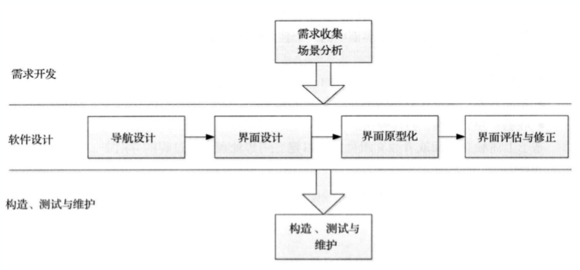

1. 导航设计:建立多次交互之间的逻辑衔接结构
2. 页面设计:设计交互中的具体界面的细节
3. 页面原型化:使用界面原型工具
4. 页面的评估与修改:用户进行评估

## 7.2. 对话结构图
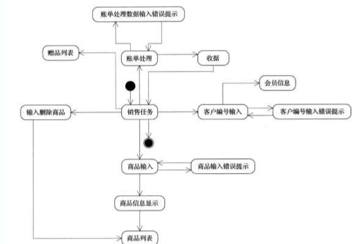

## 7.3. 页面设计
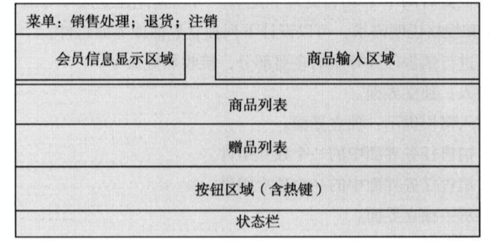

## 7.4. 原型化界面
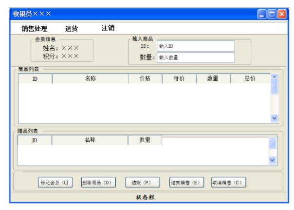

# 8. GUI设计
1. 关键点
2. 常见的GUI元素
3. 设计你的GUI
4. 创建你的GUI
5. 保证实用性
6. 保证可行性

## 8.1. 在建立有效的GUI方面的关键点
1. 在所有阶段吸引用户
2. 去看看别人怎么做的
3. 知道并且在你知道的限制内工作完成
4. 保证你的GUI是可以使用的并且可行的

## 8.2. 常见的GUI元素
1. 介绍和支持信息
2. 获取内容的设施
3. 主要收藏内容
4. 扩展特点

### 8.2.1. 欢迎和支持信息
1. 欢迎：通常情况下，彩色的"初始"页面反映了馆藏的某些内容
2. 收藏的相关信息：谁生产的，它的范围，有时是它的制造方式
3. 帮助信息：如何使用资源
4. 联系信息：如何与负责资源的人取得联系
5. 权利信息或使用条款：有关所有权，版权和用户义务的信息

## 8.3. 查找内容的设施
1. 浏览信息的方式：用户可以通过单击超链接在集合中导航
2. 查找信息的方式：用户可以在其中输入搜索查询并查看结果

## 8.4. 主要收藏内容
1. 总结页：提供浏览或搜索结果的概述，通常带有缩略图
2. 细节页：具有屏幕大小的图像，视频或音频播放器以及完整的元数据

## 8.5. 扩展功能
1. 能够查看更大尺寸的数字图像：通常通过缩放
2. 可以观看不同尺寸的视频流：取决于网络带宽
3. 选择下载文件：到本地硬盘以供以后使用
4. 嵌入文件的选项：用户将数字视频剪辑嵌入到另一个在线环境中
5. 能够"标记"文件以供以后参考：通常称为"相册"或"收藏夹"
6. 能够对图像，视频或音频文件进行注释或评论：供个人使用或公开展示的标签

## 8.6. 规划您的GUI
1. 您的用户GUI是首先要考虑的事情-不是最后一件！
2. 让您的用户参与其GUI的设计
3. 找出别人做了什么或正在做什么

## 8.7. 建立您的GUI
1. 使用"货架"解决方案
2. 自己动手GUI
3. 组合解决方案

## 8.8. 检查列表

### 8.8.1. 数据输入界面
1. 您是否可以自定义数据输入界面以改善您的编目工作流(例如，重命名或重新排序字段，设置模板或下拉列表，从不使用的字段中删除)？
2. 还有其他功能可以提高生产力或准确性吗(例如键盘快捷键，制表键，自动单词补全，拼写检查，数据验证)？
3. 可以放大字体或更改颜色组合吗？

### 8.8.2. 可定制的视觉设计
1. 您可以添加自己的图形和文本以使其外观和感觉与网站的其余部分一样吗？
2. 它在不同的Web浏览器和操作系统上是否都能正常工作并且看起来不错？

### 8.8.3. 搜索和检索界面
1. 您可以自定义搜索或浏览界面以更好地适合您的用户和收藏吗？
2. 有高级搜索选项吗？
3. 搜索结果显示良好吗？

### 8.8.4. 附加的用户功能
1. 一些系统具有额外的功能，例如使用户能够收集和注释自己的选择，对项目进行分组的能力等。

### 8.8.5. 控制用户访问
1. 您可以将集合的一部分限制为特定用户或用户组吗？
2. 您能否根据用户提供不同的功能或功能级别或详细信息？
3. 是否有数字版权管理(DRM)功能，例如自动水印？

### 8.8.6. 与其他集合的互操作性
1. 是否支持链接内容和元数据？
2. 用户可以搜索集合吗？

## 8.9. 确保可用性
1. ISO 9241：视觉显示终端(VDT)的人机工程学要求，特别是第11部分：可用性指南(1998)
2. ISO 13407：以人为本的交互式系统设计过程(1999年)

## 8.10. 评估您的GUI
1. **实际用户的可用性测试**。 向典型用户提供一些任务以执行并记录他们的工作以及对资源的看法。 这可能涉及观察用户的行为并记下他们的导航方式。
2. 您或者专家的可用性评估。 他们可能会使用正式的准则，清单或问题(例如"可用性检查"或"启发式评估")，也可能会涉及扮演特定用户类型的角色("认知演练")。
3. 收集用户反馈。这些方法涉及在用户使用资源后寻求用户的反馈。常见且简便的方法是**调查用户**，但**访谈和焦点**小组可能会提供更丰富的信息。
4. 使用情况记录。许多有用的信息由用于传递资源的服务器或软件自动记录。通过分析用户访问了哪些页面以及他们的搜索成功程度，可以构建资源可用性的图景。

## 8.11. 为可用性而设计
1. 看竞争对手的设计。让一些典型的最终用户评估与您正在开发的资源相似的资源；并告诉您他们对他们的喜好。
2. 卡分类和标签。要求用户以最有意义的方式组织和标记您的内容和界面。不同的用户会提出不同的解决方案，但是这种方法可能会提供一些有用且令人惊讶的想法。
3. 原型。要求用户评估资源的模型和模型。 这些可以在纸上或屏幕上创建，并且可以包括真实内容或虚拟内容。

## 8.12. 开发高质量和可用接口的过程(ISO 13407)
1. 指定使用环境。了解谁将使用资源以及他们将如何使用它(例如，他们将使用哪个浏览器访问资源？)。
2. 指定用户和组织要求。列出必须支持的任务(例如，搜索视频)以及一些可衡量的目标，以了解如何有效，有效和令人满意地执行这些任务(例如，"在70％的搜索中找到视频，两次单击即可获得90％的满意度 ")。
3. 产生设计解决方案。设计资源以满足第2步中确定的要求。
4. 根据用户要求评估设计。检查开发是否确实符合您在先前步骤中确定的要求和目标。

## 8.13. 确保可访问性
1. 考虑无障碍性的法律义务
2. 无障碍不仅是残疾人的问题
3. 努力做到灵活
4. 开发在线收藏时要考虑的一些事情

## 8.14. 开发在线收藏夹时要考虑的一些事情

### 8.14.1. 接口
1. 可以通过各种设备和浏览器访问该界面吗？
2. 用户是否可以更改颜色和字体大小？
3. 是否使用样式表来格式化资源(而不是框架，表格或图形)？所有说明都写清楚吗？
4. 文字信息是否以文字形式显示(而不只是文字图片)？

### 8.14.2. 导航
1. 是否总是清楚您在哪里以及可以去哪里？
2. 是否清楚地标识了超链接并以文本形式(而不是仅图形形式)提供超链接？
3. 用户能否完全控制其导航和资源使用(例如，暂停任何视频或声音元素)？

### 8.14.3. 搜索和检索。
1. 用户可以通过键盘访问搜索表单(还是取决于鼠标)？
2. 搜索和结果是否以HTML或XML(或嵌入到其他应用程序，如Flash或Java)中显示？

### 8.14.4. 文件的尺寸和大小
1. 是否有满足不同需求的图像/视频尺寸范围(尺寸和文件尺寸)？
2. 当用户将要访问很大的文件时，用户是否知道？ 
3. 是否可以详细查看图像(大图像，图像的放大部分或缩放功能)？

### 8.14.5. 文件说明
1. 是否有所有视觉资源的文字说明？
2. 是否有音频和视频文件的抄录？
3. 在书写页面已被数字化的情况下，是否存在可搜索的等效文本？

## 8.15. 黄金法则
1. 让用户掌控一切
2. 减少用户的内存负载
3. 始终如一

## 8.16. 十条原则
1. 紧凑而自然的对话
2. 设计图和颜色
3. 简约就足够了
4. 使用用户语言
5. 用户所需的最小内存
6. 一致的
7. 反馈
8. 识别退出清除
9. 捷径
10. 良好的错误讯息
11. 避免错误
12. 帮助和文件