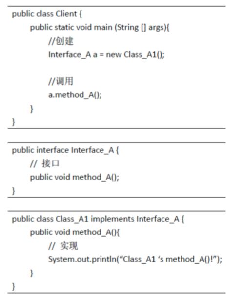
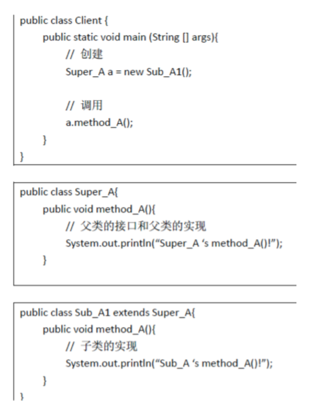
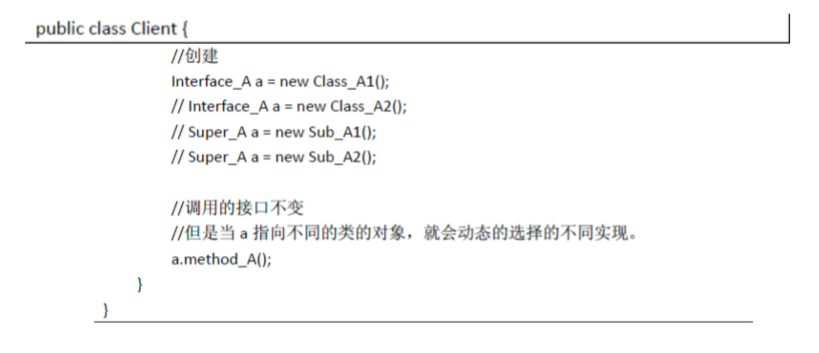
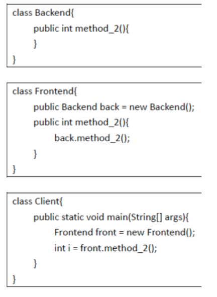
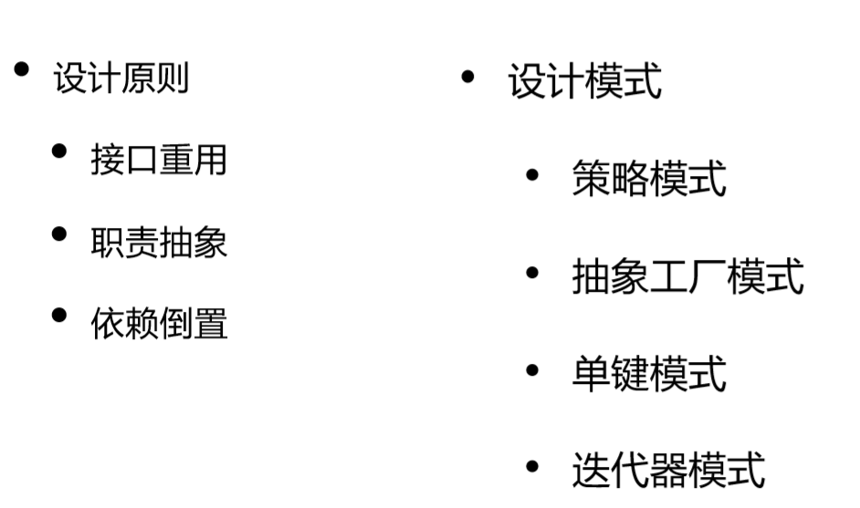

16-设计模式
---

<!-- TOC -->

- [1. 可修改性及其基本实现机制](#1-可修改性及其基本实现机制)
  - [1.1. 如何实现可修改性？ 重要](#11-如何实现可修改性-重要)
  - [1.2. 如何将接口与实现的分离 -- Java视角](#12-如何将接口与实现的分离----java视角)
  - [1.3. 实现接口(interface)](#13-实现接口interface)
  - [1.4. 类图中的标志物的含义](#14-类图中的标志物的含义)
  - [1.5. 类图与依赖关系](#15-类图与依赖关系)
  - [1.6. 继承](#16-继承)
  - [1.7. 类图与依赖关系](#17-类图与依赖关系)
  - [1.8. 实现的可修改性](#18-实现的可修改性)
    - [1.8.1. 扩展](#181-扩展)
  - [1.9. 实现的可扩展性](#19-实现的可扩展性)
  - [1.10. 实现的灵活性](#110-实现的灵活性)
  - [1.11. 继承的优点](#111-继承的优点)
  - [1.12. 继承的缺点](#112-继承的缺点)
  - [1.13. 组合](#113-组合)
    - [1.13.1. 组合的优点](#1131-组合的优点)
- [2. 设计模式](#2-设计模式)
  - [2.1. Why？为什么使用设计模式](#21-why为什么使用设计模式)
  - [2.2. 什么是设计模式](#22-什么是设计模式)
  - [2.3. 模式](#23-模式)
  - [2.4. 解决方案](#24-解决方案)
- [3. 设计模式和策略配对](#3-设计模式和策略配对)
- [4. 设计模式重点掌握类图 重要](#4-设计模式重点掌握类图-重要)
- [5. 题目](#5-题目)

<!-- /TOC -->

# 1. 可修改性及其基本实现机制
1. 实现的**可修改性**:涉及到大的场景的修改
   1. 对已有实现的修改
   2. 例如：修改现有促销策略
2. 实现的**可扩展性**(DIP & OCP)
   1. 对新的实现的扩展
   2. 例如：增加一条新的促销策略(策略模式)
3. 实现的**灵活性**
   1. 对实现的动态配置
   2. 例如：动态修改更改某商品对应促销策略

## 1.1. 如何实现可修改性？ 重要
1. 接口与实现的分离

## 1.2. 如何将接口与实现的分离 -- Java视角
1. 通过接口与实现该接口的类，将接口与实现相分离
2. 通过子类继承父类，将父类的接口与子类的实现相分离:通过继承的方式，在一定程度上实现了接口与实现的分离，但是也使得子类继承了父类的接口，使得灵活性略有下降。
3. Eg.课本263页

## 1.3. 实现接口(interface)
1. interface:定义了规约
2. 实现class:实现了规约

## 1.4. 类图中的标志物的含义
1. 虚线箭头:依赖
2. 实线箭头:关联(两侧写数量)
3. 空菱形在一侧的实现箭头:聚合
4. 实菱形在一侧的实现箭头:合成
5. 空心实线箭头:泛化(extends)
6. 空心虚线箭头:实现(implements)

## 1.5. 类图与依赖关系
1. Client、Interface_A、Class_A1之间是什么关系？
2. Client和Class_A1是否存在依赖关系？

## 1.6. 继承
1. 父类定义了规约(contract)
2. 子类实现了规约(contract)

## 1.7. 类图与依赖关系
1. Client、Super_A、Sub_A1之间是什么关系？
2. Client和Sub_A1是否存在依赖关系？不

## 1.8. 实现的可修改性
1. 对于实现的可修改性，无论是Class_A1还是Sub_A1的method_A方法的实现的修改都和Client中的调用代码没有任何耦合性。

### 1.8.1. 扩展

## 1.9. 实现的可扩展性
1. 对于实现的可扩展性，我们可以通过 Class_A2还是Sub_A2的创建来实现。

## 1.10. 实现的灵活性

## 1.11. 继承的优点
1. 虽然继承也能很好的完成接口与实现的分离，但是继承还有他独有的特征。
2. 子类不但继承了父类的接口还继承了父类的实现，这可以更好的进行代码的重用。

## 1.12. 继承的缺点
1. 继承的父类与所有子类存在共有接口的耦合性。当父类接口发生改变的时候，子类的接口就一定会更改，这样就会影响到 Client代码。
2. 而且当子类创建对象的时候，就决定了其实现的选择，没法再动态的修改。

## 1.13. 组合
1. 而利用接口的组成关系，却能在实现接口和实现的前提下，体现更好的灵活性。前端类和后端类是组合关系。前段类重用了后端类的代码。
2. 考虑到软件工程中的人的重要性。

### 1.13.1. 组合的优点
1. 前端和后端在接口上不存在耦合性。当后端接口发送改变的时候，并不会直接影响到Client代码。
2. 后端类的实现亦可以动态创建、动态配置、动态销毁，非常灵活。

# 2. 设计模式

## 2.1. Why？为什么使用设计模式
1. 设计OO软件非常困难
2. 设计可重用的OO软件-难度更大
3. 经验丰富的OO设计师可以做出出色的设计
4. 新设计师倾向于使用以前使用的非OO技术
5. 经验丰富的设计师知道一些东西-这是什么？
6. 专家设计师知道不能从第一原则中解决所有问题
7. 复用的解决方案
8. 这些模式使面向对象的设计更加灵活，优雅并且最终可重用。

## 2.2. 什么是设计模式
1. 设计模式:抽象一个重复的设计结构
2. 包含类和/或对象
   1. 依赖
   2. 结构
   3. 互动，或
   4. 约定
3. 提炼设计经验

## 2.3. 模式
1. 典型问题
2. 设计分析
3. 解决方案
4. 案例

## 2.4. 解决方案
1. 组成与协作：描述了设计中涉及的各个类的组成成分，他们之间的相互关系及各自的职责和协作方式。
2. 应用场景：描述了应该何时使用模式。它解释了设计模式所要解决的问题，以及解决这个问题时所面临的特点的环境、限制条件、场景等。这也是我们在应用某种模式之前，需要仔细去体察的。
3. 使用注意点：因为模式只是一个模板，他可以应用与多种不同场合，所以解决方案并不描述一个具体的实现，而是提供解决方案的一个抽象模型。

# 3. 设计模式和策略配对

1. 策略模式:减少耦合、依赖倒置。
2. 抽象工厂模式:职责抽象、接口重用。
3. 单件模式:信息隐藏、职责抽象。
4. 迭代器模式:减少耦合、依赖倒置。

# 4. 设计模式重点掌握类图 重要
1. 策略模式
2. 抽象工厂模式
3. 单件模式
4. 迭代器模式

# 5. 题目
1. 给定场景，利用设计模式写出代码
2. 给出代码，利用设计模式重写
3. 设计模式内容具体查看