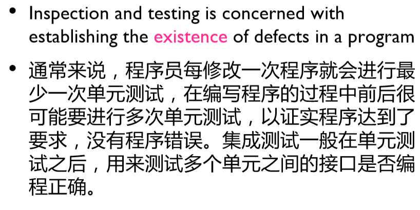
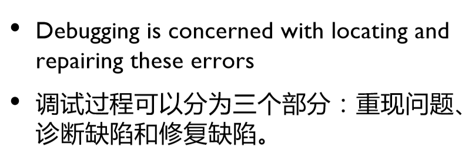
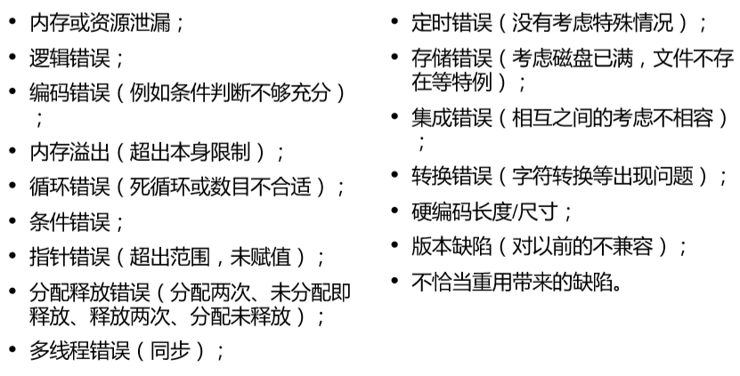
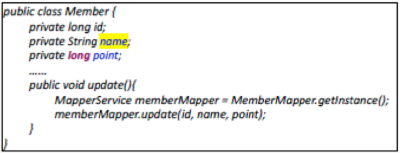
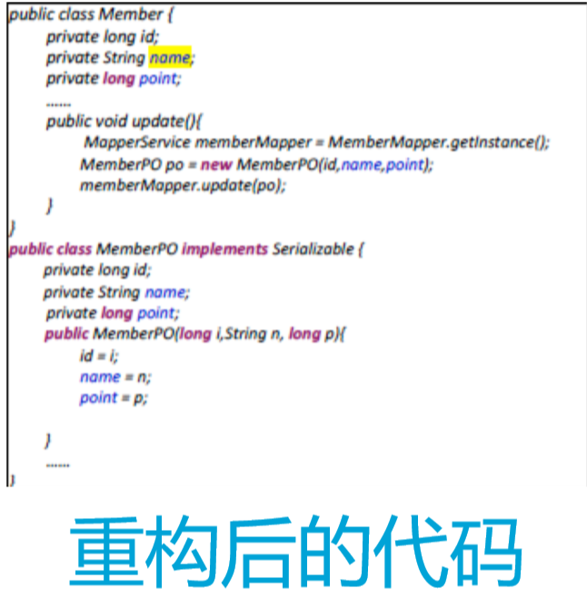
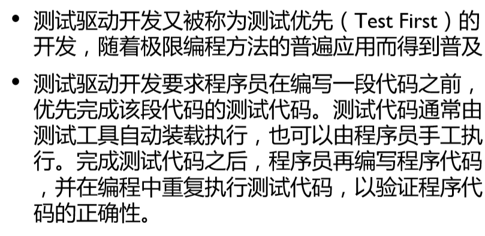
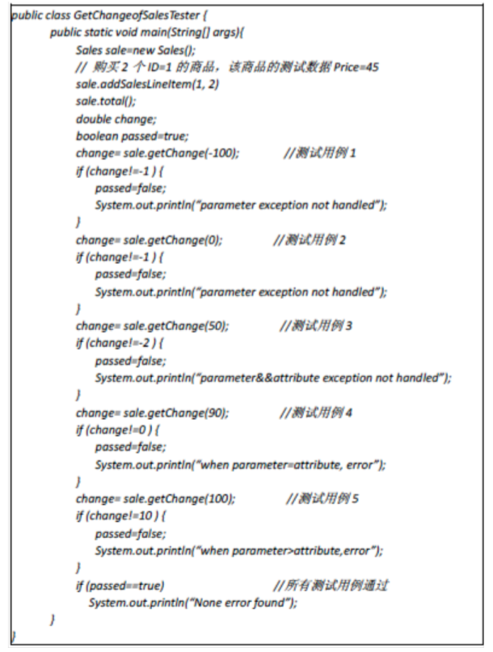
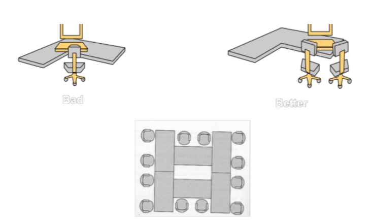
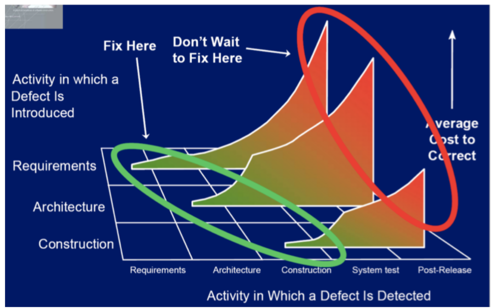
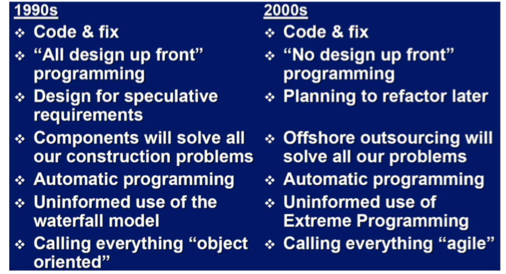

软件构造
---

<!-- TOC -->

- [1. 部分名词解释](#1-部分名词解释)
- [2. 什么是软件构造?](#2-什么是软件构造)
  - [2.1. SWEBOK2004](#21-swebok2004)
  - [2.2. McConnell2004](#22-mcconnell2004)
  - [2.3. Reeves 1992:软件构造是设计的延续](#23-reeves-1992软件构造是设计的延续)
- [3. 软件构造活动 重要](#3-软件构造活动-重要)
  - [3.1. 详细设计](#31-详细设计)
  - [3.2. 编程](#32-编程)
    - [3.2.1. 程序代码的典型质量](#321-程序代码的典型质量)
    - [3.2.2. 编程的主要技术](#322-编程的主要技术)
  - [3.3. 测试](#33-测试)
  - [3.4. 调试](#34-调试)
    - [3.4.1. 重现问题的方法](#341-重现问题的方法)
    - [3.4.2. 寻找和定位缺陷的方法](#342-寻找和定位缺陷的方法)
    - [3.4.3. 常见错误](#343-常见错误)
    - [3.4.4. 修复缺陷的注意点](#344-修复缺陷的注意点)
  - [3.5. 代码评审](#35-代码评审)
    - [3.5.1. 实践经验](#351-实践经验)
    - [3.5.2. CheckList](#352-checklist)
  - [3.6. 集成与构建](#36-集成与构建)
  - [3.7. 构造管理](#37-构造管理)
- [4. 实践方法](#4-实践方法)
  - [4.1. 重构](#41-重构)
  - [4.2. 代码的坏味道](#42-代码的坏味道)
    - [4.2.1. 注意事项](#421-注意事项)
  - [4.3. 测试驱动开发](#43-测试驱动开发)
    - [4.3.1. 测试驱动开发的过程](#431-测试驱动开发的过程)
    - [4.3.2. 测试启动开发示例](#432-测试启动开发示例)
  - [4.4. 结对编程 概念](#44-结对编程-概念)
    - [4.4.1. 为什么结对编程有效？](#441-为什么结对编程有效)
    - [4.4.2. 工作区域层](#442-工作区域层)
  - [4.5. 配对选择](#45-配对选择)
- [5. 有建设性的想法](#5-有建设性的想法)
  - [5.1. 十年的软件建设进展](#51-十年的软件建设进展)
    - [5.1.1. 设计已提高到一个水平](#511-设计已提高到一个水平)
    - [5.1.2. 每日构建和冒烟测试](#512-每日构建和冒烟测试)
    - [5.1.3. 标准库](#513-标准库)
    - [5.1.4. Visual Basic](#514-visual-basic)
    - [5.1.5. 开源软件](#515-开源软件)
    - [5.1.6. 网络，用于研究](#516-网络用于研究)
    - [5.1.7. 增量开发的广泛应用](#517-增量开发的广泛应用)
    - [5.1.8. 测试优先开发](#518-测试优先开发)
    - [5.1.9. 重构为学科](#519-重构为学科)
    - [5.1.10. 更快的计算机](#5110-更快的计算机)
  - [5.2. 现代软件建设的十个现实](#52-现代软件建设的十个现实)
    - [5.2.1. -1-"构造"是正当的话题](#521--1-构造是正当的话题)
    - [5.2.2. -2-个人差异很大](#522--2-个人差异很大)
    - [5.2.3. -3-个人纪律事项](#523--3-个人纪律事项)
    - [5.2.4. -4-专注于简单比专注于复杂性更好](#524--4-专注于简单比专注于复杂性更好)
    - [5.2.5. -5-缺陷成本增长依然有效](#525--5-缺陷成本增长依然有效)
    - [5.2.6. -6-设计的重要性](#526--6-设计的重要性)
    - [5.2.7. -7-技术浪潮影响施工实践](#527--7-技术浪潮影响施工实践)
    - [5.2.8. -8增量方法效果最佳](#528--8增量方法效果最佳)
    - [5.2.9. -9-工具箱的隐喻继续发亮](#529--9-工具箱的隐喻继续发亮)
    - [5.2.10. -10-软件的基本张力](#5210--10-软件的基本张力)
  - [5.3. 1990年代和2000年代最糟糕的建筑思想](#53-1990年代和2000年代最糟糕的建筑思想)

<!-- /TOC -->

# 1. 部分名词解释
1. 测试驱动开发：测试驱动开发要求程序员在编写一段代码之前，优先完成该段代码的测试代码。并在编程中重复执行测试代码，以验证程序的正确性。
2. 结对编程：两个程序员挨着坐在一起，共同协作进行软件构造活动。

# 2. 什么是软件构造?

## 2.1. SWEBOK2004
1. 通过编码、验证、单元测试、集成测试和调试等工作的集合，生产可工作的、有意义的软件的详细创建过程。

## 2.2. McConnell2004
1. 软件构造除了核心的编程任务之外，还涉及详细设计(数据结构与算法设计)、单元测试、集成与集成测试、以及其他活动。

## 2.3. Reeves 1992:软件构造是设计的延续
1. 设计是**规划软件构造方法**的过程，实现是依据**规划的软件构造方案建造真正产品**的过程
2. 源程序是软件构建方案的**最后一个规划**，不是产品本身，真正的产品是运行于计算机上的由二进制代码组成的可执行程序。
3. 源程序的生产过程-编程，属于设计活动，编译器完成的编译和链接才是依据规划建造软件产品的实现活动。
4. **编程不是一个简单的活动，核心是编码的设计**。

# 3. 软件构造活动 重要
包含详细设计、编程、测试、调试、代码评审、集成与构建、构造与管理。

## 3.1. 详细设计
1. 有些项目会将主要的详细设计工作分配在软件构造阶段完成。
2. 无论是哪种项目，在软件构造阶段都不可避免的会设计到详细设计的调整工作。因为编程语言是软件设计的一个重要约束，随着编程工作的进行和约束，人们可能会发现与预想不一致的情况和更多的约束，这个时候就需要在软件构造阶段修改详细设计方案。
3. 软件构造阶段详细设计使用的方法与技术与软件设计阶段是一样的，只是应用在**更小**的规模上。
4. 详细设计已经包含实际的代码实现了，不同编程语言的代码行数不同。

## 3.2. 编程

### 3.2.1. 程序代码的典型质量
1. 易读性:让软件更容易开发，尤其是易于调试；可以使的程序更加容易维护，减少理解代码的难度和成本：降低交流的成本，自己写完之后要修正代码使其易读。
2. 易维护性:
   1. 要求代码易读、易修改，增量开发。
   2. 关键业务流程应该是易于扩展的。
3. 可靠性:执行正确，并能妥善处理故障。
4. 性能:高性能，包括时间性能和空间性能，需要设计数据结构和算法设计。
   1. 快排在实际上应用的更多。
   2. 如果利用多核的操作。
5. 安全性:不留系统漏洞，不出现重要信息的泄露(内存数据区泄露)，别的程序可以嗅探到。
6. 上面的五个要求，是有顺序的，做好前面才可以去做下面的。

### 3.2.2. 编程的主要技术

- 什么才是好的代码?
- for循环带来运行代价(谨慎使用控制结构):串行代码无法并行
- Java的异常处理：try...catch的使用
- 代码级的安全泄露:C和C++中会出现
- 进程线程和数据库锁:互斥机制会带来性能消耗
- 代码文档:进行一些DOC和注释

## 3.3. 测试

- 保证写的程序是正确的
- 写完一次就进行一次单元测试
- 写的时候就要进行单元测试进行检测
- 集成测试是在单元测试之后才进行的操作。

## 3.4. 调试

- 测试发现了问题之后我们要进行调试，通过重现和调试来完成。

### 3.4.1. 重现问题的方法

- 控制输入:缺陷和控制相关等
- 控制环境:和具体的机器、操作系统、数据库管理系统等，关机重启，内存问题减少。(和队友看看)

### 3.4.2. 寻找和定位缺陷的方法

- 路径debug，检查刚刚写了的部分的代码

### 3.4.3. 常见错误

- Java对象如果用不到了就重置为NULL，然后把对象交给GC处理
- 降低控制的复杂程度
- 多线程的错误(同步的问题)
- 多线程的定时问题
- 存储错误(磁盘已经满了)
- 字符集编码问题
- 版本缺陷，对以前不兼容。

### 3.4.4. 修复缺陷的注意点

## 3.5. 代码评审

1. 重新回到软件构造的过程中去
2. 让别人发现你的问题，更多使用轻量级的代码评审

### 3.5.1. 实践经验

### 3.5.2. CheckList
课本287页

## 3.6. 集成与构建

## 3.7. 构造管理

1. 独狼和配置管理的详细描述见课本288页

# 4. 实践方法
重构、测试驱动开发和结对编程

## 4.1. 重构

1. 保留业务功能，避免出现问题

## 4.2. 代码的坏味道

- 太长的方法:一个方法里面有太多的行为。
- 太大的类:一个类不是单一职责的

- 上图中(课本17-3):name和point不要分开

- 使用PO来传递参数，而不是通过过多的参数。

### 4.2.1. 注意事项
1. 详见课本290页。
2. 重构是基于已有代码的设计改进，不是开发新代码的方法。
3. 重构要防止副作用。
4. 重构的重点是改进详细设计结构。

## 4.3. 测试驱动开发

### 4.3.1. 测试驱动开发的过程

- 常见的过程

### 4.3.2. 测试启动开发示例

- 详见课本292页

## 4.4. 结对编程 概念
1. 两位程序员并排工作，在相同的设计，算法，代码或测试上进行协作
2. 一个程序员(驱动程序)可以控制键盘/鼠标并主动执行程序
3. 另一个程序员(观察员)不断观察驾驶员的工作，以发现战术上的(语法上的，拼写的等)缺陷，并从战略上考虑工作的方向
4. 根据需要，两位程序员可以集思广益解决任何难题
5. 两位程序员定期切换角色，他们平等地合作开发软件

### 4.4.1. 为什么结对编程有效？
1. 双压力：彼此保持专注并专注于任务
2. 配对思考：为任务带来不同的先前经验
3. 配对中继：每个人依次为自己的知识和能力做出最大贡献，然后坐下来思考，而他们的伴侣继续奋斗
4. 配对审查
   1. 持续的设计和代码审查
   2. 极高的缺陷去除效率
   3. 消除程序员对评论的厌恶
   4. 在所有(单独)程序员中，有80％都不定期或根本不这样做
   5. 预防缺陷总是比消除缺陷更有效
5. 配对调试：成对谈论问题可能会导致解决方案变得显而易见
6. 配对学习：持续审核->向合作伙伴学习技术，语言知识，领域等。

### 4.4.2. 工作区域层

## 4.5. 配对选择
1. 简化员工培训和过渡
2. 知识管理/降低产品风险
3. 加强团队建设

# 5. 有建设性的想法
1. 十年的软件建设进展
2. 现代软件建设的十个实践
3. 1990年代和2000年代最糟糕的建筑思想

## 5.1. 十年的软件建设进展

### 5.1.1. 设计已提高到一个水平
1. 编程通过创建更大的代码聚合而变得先进
   1. 语句
   2. 过程
   3. 类
   4. 包
2. OO的真正意义可能是更大的聚合

### 5.1.2. 每日构建和冒烟测试
1. 将增量集成制度化
2. 最小化以前很常见的严重集成问题
3. 还有很多其他好处
4. 冒烟测试:将比较重要的部分进行测试,大规模的如果每次都测试问题太大

### 5.1.3. 标准库
1. 优秀的程序员一直使用库
2. 现在提供了语言(Java，C ++ 、. NET)

### 5.1.4. Visual Basic
1. 视觉编程创新
2. 第一个广泛使用COTS组件的开发环境
3. 唯一可以学习Ada语法课程的语言(case语句，control语句等)
4. 高度集成的环境
5. 集成大量的商业组件。

### 5.1.5. 开源软件
1. 在开发过程中对程序员的极大帮助
2. 减少提供代码的障碍
3. 从可用代码中学习的机会
4. 提高了读取代码的能力
5. 好的程序员"社区"
6. 开源 不等于 免费，鲲鹏社区，Github上Star比较高的项目

### 5.1.6. 网络，用于研究
1. FAQs
2. 讨论小组
3. 一般的可搜索性

### 5.1.7. 增量开发的广泛应用
1. 概念在1990年代众所周知
2. 实践在2000年代已确立

### 5.1.8. 测试优先开发
1. 缩短缺陷检测时间
2. 增加个人纪律
3. 补充日常构建和烟雾测试

### 5.1.9. 重构为学科
1. 提供进行变更的纪律
2. 不如整体设计策略
3. 增量主义的好例子

### 5.1.10. 更快的计算机
1. 优化的意义
2. 对编程语言的影响
3. 对发展的影响

## 5.2. 现代软件建设的十个现实

### 5.2.1. -1-"构造"是正当的话题
1. 软件"构造" –现在看起来像这样

### 5.2.2. -2-个人差异很大
1. 变化在哪里存在？
2. 研究人员发现以下方面的变化范围是10倍至28倍：
   1. 编码速度
   2. 调试速度
   3. 发现缺陷的速度
   4. 发现缺陷的百分比
   5. 发现缺陷的百分比...
   6. 设计品质
   7. 设计生成的代码量
   
### 5.2.3. -3-个人纪律事项
1. 为什么个人纪律很重要
   1. 在预测未来时要现实
   2. 纪律很重要的领域
      1. 重构
      2. 原型制作
      3. 优化
      4. 最小复杂度的设计
      5. 一般管理复杂性
   3. 端点—纪律和勇气
      1. 汉弗莱(PSP)
      2. 贝克谈极限编程

### 5.2.4. -4-专注于简单比专注于复杂性更好
1. 专注于读取时间的方便，而不是写入时间的方便
2. 让别人更加任意的理解

### 5.2.5. -5-缺陷成本增长依然有效

1. 指数增长的修复代价

### 5.2.6. -6-设计的重要性
1. "无设计" —"所有设计"连续体上有很多有效的观点
2. 要点：极端情况通常没有生产力
   1. 全部预先设计与没有预先设计
   2. 完全计划与完全即兴(迭代/增量)
   3. 纯迭代与直序列
   4. 所有结构与所有创意
   5. 记录一切，什么都不记录

### 5.2.7. -7-技术浪潮影响施工实践
1. 技术浪潮对施工的影响
   1. "技术浪潮"的定义
      1. 初潮特征
      2. 成熟波特征
      3. 后波特性
   2. 施工受技术的影响–比我想象的要多(哦！)
   3. 可以根据一般原则解决技术

### 5.2.8. -8增量方法效果最佳
1. 增量主义观点
   1. 纯瀑布模型完全不是增量模型或迭代模型，这就是为什么它不能很好地工作的原因
   2. 螺旋发展具有高度的增量性和迭代性，这就是其运作良好的部分原因
   3. 所有项目在某个时候都会经历迭代
   4. 想一想在项目中何时何地获得增量主义—便宜还是昂贵？

### 5.2.9. -9-工具箱的隐喻继续发亮
1. 工具箱隐喻
   1. 什么才好 敏捷？ XP？ Scrum？ CMM？
   2. 工具箱说明没有一项适合每一项工作的工具
   3. 不同的行业部门将具有不同的工具，甚至会有不同的工具箱
   4. 软件工程工具箱中有什么？
      1. 最佳实践
      2. 生命周期模型
      3. 模板，清单，模式，示例
      4. 软件工具

### 5.2.10. -10-软件的基本张力
1. 多年来，软件的主要矛盾一直没有改变：
   1. 刚性计划与即兴创作
   2. 规划与算命
   3. 创意与结构
   4. 纪律与灵活性
   5. 定量与定性
   6. 工艺与产品
   7. 优化与满意
2. 平衡摇杆，但基本张力是恒定的

## 5.3. 1990年代和2000年代最糟糕的建筑思想 

