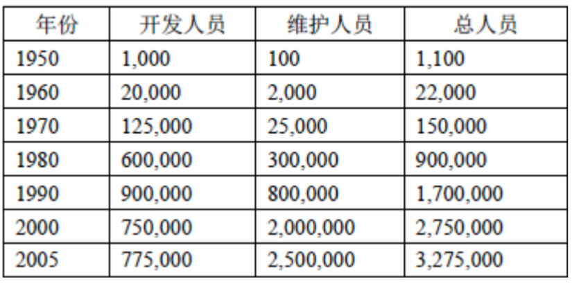
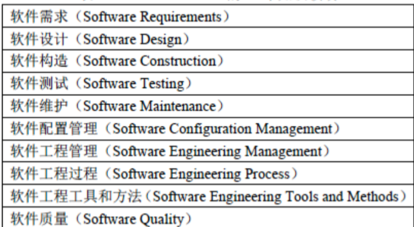
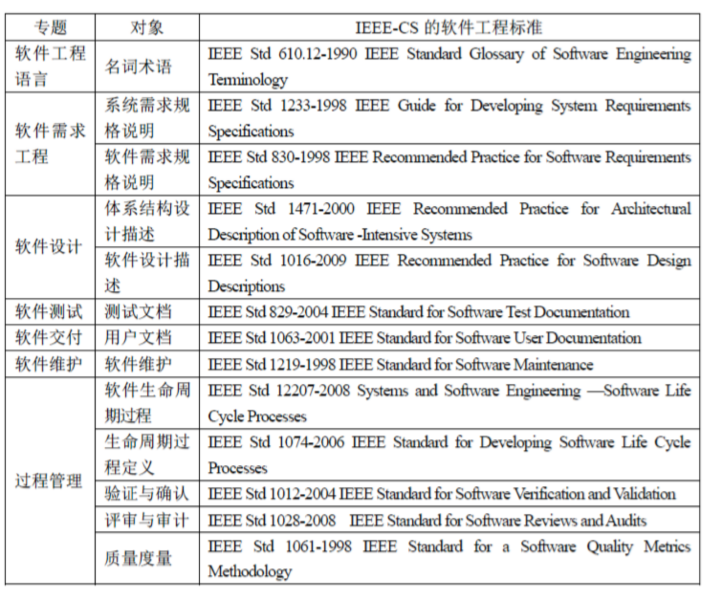
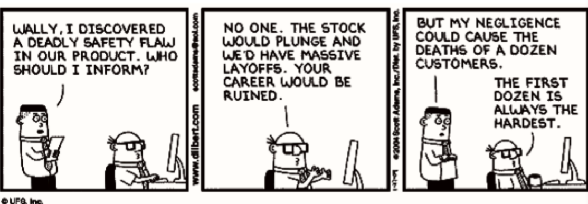

23-软件工程职业基础
---

<!-- TOC -->

- [1. 软件工程职业的出现](#1-软件工程职业的出现)
  - [1.1. 美国软件开发与维护人员分布 [Jones2006]](#11-美国软件开发与维护人员分布-jones2006)
  - [1.2. 二十世纪五十年代](#12-二十世纪五十年代)
  - [1.3. 二十世纪六十年代](#13-二十世纪六十年代)
  - [1.4. 二十世纪七十年代](#14-二十世纪七十年代)
  - [1.5. 二十世纪八十年代](#15-二十世纪八十年代)
  - [1.6. 二十世纪九十年代](#16-二十世纪九十年代)
  - [1.7. 二十世纪九十年代之后](#17-二十世纪九十年代之后)
- [2. 软件工程职业概况](#2-软件工程职业概况)
  - [2.1. 一个行业（Occupation）成熟为职业需要具备下列几个基本特征](#21-一个行业occupation成熟为职业需要具备下列几个基本特征)
  - [2.2. 软件工程师职业素质](#22-软件工程师职业素质)
  - [2.3. 软件工程知识体系](#23-软件工程知识体系)
  - [2.4. SWEBOK的建设目的](#24-swebok的建设目的)
    - [2.4.1. SWEBOK V2的10个知识域](#241-swebok-v2的10个知识域)
    - [2.4.2. SWEBOK V3增加的5个知识领域](#242-swebok-v3增加的5个知识领域)
  - [2.5. 教育体系](#25-教育体系)
    - [2.5.1. CCSE2004的内容](#251-ccse2004的内容)
    - [2.5.2. CCSE2004](#252-ccse2004)
    - [2.5.3. 职业道德规范](#253-职业道德规范)
  - [2.6. Short version 概述](#26-short-version-概述)
  - [2.7. 认证体系](#27-认证体系)
  - [2.8. 软件职业认证的区别](#28-软件职业认证的区别)
  - [2.9. 行业协会](#29-行业协会)
  - [2.10. 国际会议](#210-国际会议)
  - [2.11. 软件工程的行业标准](#211-软件工程的行业标准)
  - [2.12. IEEE-CS常见软件工程标准](#212-ieee-cs常见软件工程标准)
  - [2.13. 对职业道德规范的需要](#213-对职业道德规范的需要)
    - [2.13.1. Scenario 1 场景一](#2131-scenario-1-场景一)
    - [2.13.2. Scenario 2](#2132-scenario-2)
    - [2.13.3. Scenario 3](#2133-scenario-3)
    - [2.13.4. Scenario 4](#2134-scenario-4)
- [3. 道德案例](#3-道德案例)
- [4. History](#4-history)
- [5. Joint Commission Steering Committee](#5-joint-commission-steering-committee)
- [6. Research](#6-research)
- [7. Brief History Timeline](#7-brief-history-timeline)
- [8. 职业道德规范](#8-职业道德规范)
  - [8.1. 公众](#81-公众)
  - [8.2. 客户和雇主](#82-客户和雇主)
  - [8.3. 产品](#83-产品)
  - [8.4. 判断](#84-判断)
  - [8.5. 管理](#85-管理)
  - [8.6. 专业](#86-专业)
  - [8.7. 同行](#87-同行)
  - [8.8. 自身](#88-自身)

<!-- /TOC -->

# 1. 软件工程职业的出现

## 1.1. 美国软件开发与维护人员分布 [Jones2006]

## 1.2. 二十世纪五十年代
计算机还是研究性机器，只有重要的科研院所机构才拥有研究性计算机，与此相应，从事软件开发的人员基本都是数量较少的研究人员，他们出于研究的目的编写软件。

## 1.3. 二十世纪六十年代
有些大型企业开始使用商业大型机，但是商业大型机的高昂费用使得其使用限制在少数企业范围内，基于商业大型机开发和维护应用软件的人员自然也数量不多。

## 1.4. 二十世纪七十年代
两个趋势——小型商业机和结构化编程理论，前者扩大了应用软件的需求，后者降低了开发难度、提高了开发成功率，二者联合起来，使得软件行业的公司和从业人员都出现了显著增长，一个软件行业的雏形开始显现。

## 1.5. 二十世纪八十年代
个人PC和GUI的普及，急剧扩大了应用软件的需求，以至于出现了“急需提高生产力”的呼声，这使得软件行业的公司和人员数量也出现了急剧增长。

## 1.6. 二十世纪九十年代
随着Internet和小型设备（嵌入式设备、移动设备）的发展，软件规模日益增长、领域越发广泛、作用越发凸显，使得软件深入了人类社会的各个角落，软件行业的公司和从业人员数量也继续在急剧增长。

## 1.7. 二十世纪九十年代之后
各个细分市场都已经出现了众多软件企业的身影，在新领域开疆扩土的情况只有在全新技术领域（例如移动终端）中会较多地出现，所以全新的软件开发不再像1990s之前那样快速地增长，反而是软件维护随着遗留软件越来越多而快速增长。

# 2. 软件工程职业概况
1. 在一个行业中市场的高度细分化往往意味着“职业”（Profession）的出现，软件行业也在1990s之后开始出现“软件工程职业”。

## 2.1. 一个行业（Occupation）成熟为职业需要具备下列几个基本特征
1. 有一批专职的从业人员
2. 界定了一个知识体系，能够明确从业人员需要具备的知识和技能
3. 建立了合格的教育体系，能够批量培养职业人员
4. 建立了严格的认证体系，能够保障从业人员的合格资质
5. 形成了职业的道德规范认同
6. 组织了指导性的行业协会。

## 2.2. 软件工程师职业素质
1. 团队工作能力
2. 交流沟通能力，包括与同事的交流，也包括与用户的交流
3. 遵守职业的道德标准和操行规范
4. 积极参与行业协会活动，遵守行业标准，推进行业发展
5. 了解软件工程对社会、经济、法律等相关领域的影响、问题和观点。

## 2.3. 软件工程知识体系
1. SWEBOK(www.swebok.org)
2. IEEE-CS组织建立的
3. 2004年的SWEBOK第二版产生了广泛的影响。
4. 2014年SWEBOK的第三版正式发布。
   1. P. Bourque and R.E. Fairley, eds., Guide to the Software Engineering Body of Knowledge, Version 3.0, IEEE Computer Society, 2014; www.swebok.org.

## 2.4. SWEBOK的建设目的
1. 描述软件工程学科的内容
2. 建立全球范围内一致的软件工程视角
3. 区分软件工程相对于其他学科的位置，并定义边界
4. 为教程制定和培训提供基础 
5. 为软件工程提供基础培训教材和课程发展
6. 为软件工程师的认证(certification)和授权(license)提供了基础。

### 2.4.1. SWEBOK V2的10个知识域

### 2.4.2. SWEBOK V3增加的5个知识领域

## 2.5. 教育体系
1. 基于SWEBOK，IEEE-CS和ACM成立了联合工作组，建设并发布了软件工程专业本科教程CCSE2004，为软件工程专业本科教育计划制定和实施提供指导规范。
2. 基于CCSE2004，我国也建立了《中国软件工程学科教程》[CSEC2005]。
3. 2009年，IEEE-iSSEc又发布了软件工程专业研究生教程GSwE2009。

### 2.5.1. CCSE2004的内容
1. 软件工程学科；
2. 指导原则；
3. SEEK；
4. SE教程设计与实施的指导原则；
5. 建议课程与课程顺序；
6. 对不同环境的适应；
7. 教育计划的实现与评价。

### 2.5.2. CCSE2004
1. CCSE2004对软件工程专业本科教育的目标、产出、指导原则、知识体系和课程体系等给出了详细的描述。
2. CCSE2004认为计算科学基础、数学与工程基础、职业实践和软件工程知识（软件建模与分析、软件设计、软件验证与确认、软件演化、软件过程、软件质量、软件管理）是软件工程本科教育的核心知识领域。

### 2.5.3. 职业道德规范
1. 因为软件对世界的影响力，使得软件工程师的行为会在很大程度上影响人们的财产、健康甚至生命安全，因此社会开始关注软件工程师的行为，希望他们遵从一个能够服务于社会的职业指导规范。
2. 在1999年，ACM和IEEE-CS联合指导委员会的软件工程道德和职业实践的联合工作小组提出了《软件工程道德和职业实践规范（5.2版）》[SEEPP1999]
3. 软件工程师应履行其实践承诺，使软件的需求分析、规范说明、设计、开发、测试和维护成为一项有益和受人尊敬的职业。为实现他们对公众健康、安全和利益的承诺，软件工程师应当坚持以下八项原则。

## 2.6. Short version 概述
1. PUBLIC - Software engineers shall act consistently with the public interest 公共利益
2. CLIENT AND EMPLOYER - Software engineers shall act in a manner that is in the best interests of their client and employer, consistent with the public interest. 满足客户
3. PRODUCT - Software engineers shall ensure that their products and related modifications meet the highest professional standards possible. 产品，便于维护
4. JUDGMENT - Software engineers shall maintain integrity and independence in their professional judgment. 判断:保证专业性的判断
5. MANAGEMENT - Software engineering managers and leaders shall subscribe to and promote an ethical approach to the management of software development and maintenance. 管理:选择管理人员
6. PROFESSION - Software engineers shall advance the integrity and reputation of the profession consistent with the public interest. 专业化和职业化
7. COLLEAGUES - Software engineers shall be fair to and supportive of their colleagues. 对于同事的关系
8. SELF - Software engineers shall participate in lifelong learning regarding the practice of their profession and shall promote an ethical approach to the practice of the profession. 独立性

## 2.7. 认证体系
1. 教育鉴定。
   1. 教育鉴定是政府主导的，是用来确认教育机构（主要是大学的相关专业）资质的评审过程。
2. 职业认证。
   1. 职业认证更多得是行业主导的，用来确认从业人员所掌握的软件工程知识和技能。
   2. 作为最权威的软件工程专业协会，IEEE-CS提出了SCP（SWEBOK Certificate Program）、CSDA（Certified Software Development Associate）和CSDP（Certified Software Development Professional）组成的分级分阶段的软件从业人员认证。
   3. SCP主要认证一个人（主要是在校学生）对SWEBOK主要内容的掌握情况。CSDA主要认证一个人（主要是毕业生）是否准备好开始职业工作。CSDP主要认证软件开发职业人员的技能水平。
3. 从业执照。
   1. 执照通常由政府部门颁发的，只有拥有执照的人才可以参与被认定对公共卫生、安全或者财产有重大利益影响的项目。
   2. 目前，国内还没有要求软件工程师具备执照才能从事关键项目的要求。

## 2.8. 软件职业认证的区别
1. 鉴定不同于认证，认证也不同于执照；
2. 鉴定针对专业，认证针对个人，而执照则表示行政或者法律允许个人从事关键软件开发的许可。

## 2.9. 行业协会
1. 软件工程主要有两个专业协会提供支持：IEEE-CS（计算机学会）和ACM（Association for Computing Machinery）。
2. 其中，IEEE-CS是IEEE（国际电子电器工程师协会）众多专业学会机构中最大的一个。IEEE-CS致力于发展计算机和信息处理技术的理论、实践和应用。通过其会议、应用类和研究类的期刊、远程教育、技术委员会和标准制定工作组，学会在它的成员中间不断推动信息互动、思想交流和技术创新。另外一个专业学会ACM则是于1947年创建，旨在提高世界范围内信息科技工作者和学生的技能。

## 2.10. 国际会议
1. 软件工程的第一次国际会议ICSE（International Conference on Software Engineering）于1975年举行，并且在IEEE-CS和ACM-SIGSOFT的联合赞助下成为软件工程方面的主要会议。
2. 同时，ACM-SIGSOFT还举办软件工程创立的年会。
3. 此外，这两个专业学会还通过单独赞助或者联合赞助的形式，举办很多软件工程课题的研讨会或讨论会。

## 2.11. 软件工程的行业标准
1. IEEE-CS是软件工程行业标准的主要制定者。IEEE的第一个软件工程标准委员会成立于1976年，旨在为软件质量保障提供一个规范化标准。
2. 现在，IEEE的计算机学会有一个软件工程标准化 委员会，其目标如下：
   1. 将专业软件工程实践中的名词标准化
   2. 促进客户、从业者和教育人士使用标准化软件工程语言
   3. 协调国际软件工程标准化的发展。

## 2.12. IEEE-CS常见软件工程标准

## 2.13. 对职业道德规范的需要

1. 发现了重要的安全缺陷
2. 谁也不要报告，不然职业生涯可能就没了
3. 万事开头难

### 2.13.1. Scenario 1 场景一
1. Jean, a statistical database programmer, is trying to write a large statistical program needed by her company.  Programmers in this company are encouraged to write about their work and to publish their algorithms in professional journals.  After months of tedious programming, Jean has found herself stuck on several parts of the program.  Her manager not recognizing the complexity of the problem, wants the job completed within the next few days. Not knowing how to solve the problems, Jean remembers that a coworker had given her source listings from his current work and from an early version of a commercial software package developed at another company. **On studying these programs, she sees two areas of code which could be directly incorporated into her own program.** She uses segments of code from both her coworker and the commercial software, but does **not tell anyone** or mention it in the documentation.  She completes the project and turns it in a day ahead of time.
2. 直接使用github和商用软件等等

### 2.13.2. Scenario 2
1. Three years ago Diane started her own consulting business. She has been so successful that she now has several people working for her and has many clients.  Their consulting work included advising on how to network microcomputers, designing database management systems, and advising about security.
2. Presently she is designing a database management system for the personnel office of a medium-sized company.  Diane has involved the client in the design process, informing the CEO, the directory of computing, and the director of personnel about the progress of the system. Diane has described several options to the client.  Because the system is going to cost more than they planned, the client has decided to opt for a less secure system.  She believes the information they will be storing is extremely sensitive. It will include performance evaluations, medical records for filing insurance claims, salaries, and so forth.
3. With weak security, employees working on microcomputers may be able to figure out ways to get access to this data, not to mention the possibilities for on-line access from hackers.  Diane feels strongly that the system should be much more secure. **She has tried to explain the risks, but the CEO, director of computing and director of personnel all agree that less security will do.** What should she do?  Should she refuse to build the system as they request?
4. 成本太高，降低安全性拉低成本的操作？

### 2.13.3. Scenario 3
1. Max works in a large state department of alcoholism and drug abuse.  The agency administers programs for individuals with alcohol and drug problems, and maintains a huge database of information on the clients who use their services.  Some of the data files contain the names and current addresses of clients.
2. Max has been asked to take a look at the track records of the treatment programs.  He is to put together a report that contains the number of clients seen in each program each month for the past five years, length of each client’s treatment, number of clients who return after completion of a program, criminal histories of clients, and so on.  In order to put together this report, Max has been given access to all files in the agency’s mainframe computer.  After assembling the data into a new file that includes the client names, he downloads it to the computer in his office.
3. Under pressure to get the report finished by the deadline, Max decides he will have to work at home over the weekend in order to finish on time.  He copies the information onto several disks and takes them home.  After finishing the report he leaves the disks at home and forgets about them.
4. 忘记了拷贝的副本，不允许软件源码和客户信息的拷贝

### 2.13.4. Scenario 4
1. In determining requirements for an information system to be used in an employment agency, the client explains that, when displaying applicants whose qualifications appear to match those required for a particular job, the names of white applicants are to be displayed ahead of those of nonwhite applicants, and names of male applicants are to be displayed ahead of those of female applicants.

# 3. 道德案例
1. 虚拟世界的案件
   1. Facebook
      1. 好友行为的广播
      2. 广告
      3. 信息是否可以被招聘、法律等目的所利用
   2. 招聘时候去调查应聘者的SNS网站
   3. 给老年人RFID芯片的皮下植入

# 4. History
1. IEEE Board of Governors established steering committee (May, 1993). 
2. ACM Council endorsed Commission on Software Engineering (Late 1993).
3. Joint steering committee established by both societies (January, 1994).

# 5. Joint Commission Steering Committee
1. 4 goals:
   1. Adopt standard definitions.
   2. Define required body of knowledge and recommended practices.
   3. Define ethical standards.
   4. Define educational curricula for undergraduate, graduate (Masters), and continuing education (for retraining and migration).
2. 3 initial task forces:
   1. Software engineering body of knowledge and recommended practices.
   2. Software engineering ethics and professional practices.
   3. Software engineering curriculum.

# 6. Research
1. Review of available computing and engineering codes:
   1. The American Association of Engineering Societies
   2. Accreditation Board for Engineering Technology • ACM’s Code of Ethics for Professional Conduct
   3. The British Computer Society Code of Practice
   4. Institute for the Certification of Computing Professionals
   5. Engineer’s Council for Professional Development
   6. The IEEE Code of Ethics
   7. National Society of Professional Engineers Code of Ethics
   8. Project Management Institute Code of Ethics

# 7. Brief History Timeline
1. January 1994 - International Task Force formed the Software Engineering Ethics and Professional Practice (SEEPP).
2. July 1997 - Initial version shown to professional societies including ACM’s SIGSOFT.
3. November 1997 - Version 3 published in IEEE-CS and ACM magazines.
4. Version 4 presented to IEEE review process.
5. October 1998 - Version 5.2 unanimously adopted by ACM and IEEE.

# 8. 职业道德规范
1. 详见PPT

## 8.1. 公众

## 8.2. 客户和雇主

## 8.3. 产品

## 8.4. 判断

## 8.5. 管理

## 8.6. 专业

## 8.7. 同行

## 8.8. 自身