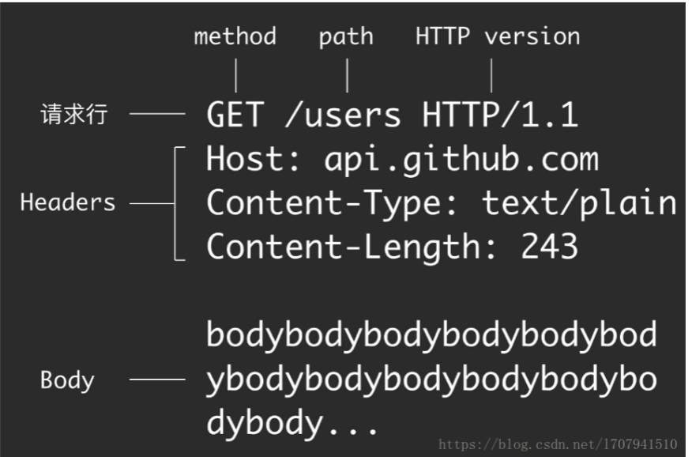
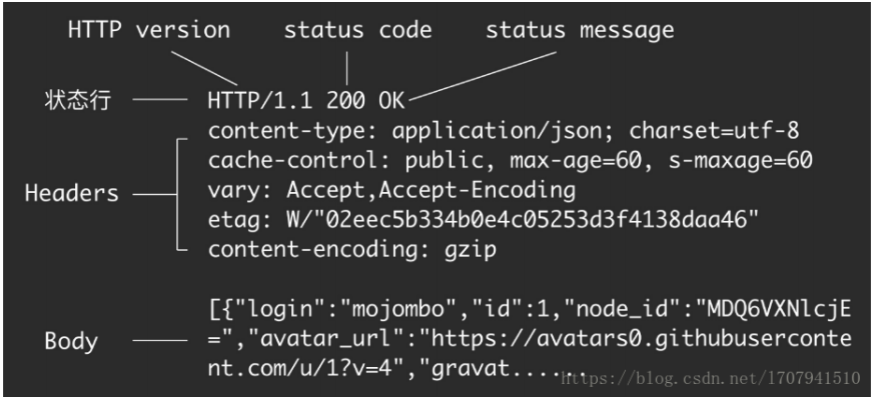

02-HTTP协议
---

<!-- TOC -->

- [1. HTTP协议原理](#1-http协议原理)
  - [1.1. 网络通讯](#11-网络通讯)
    - [1.1.1. 协议栈](#111-协议栈)
    - [1.1.2. 数据包](#112-数据包)
  - [1.2. HTTP协议](#12-http协议)
    - [1.2.1. 客户端服务器模式](#121-客户端服务器模式)
    - [1.2.2. HTTP⼯作过程](#122-http作过程)
  - [1.3. URL 格式](#13-url-格式)
    - [1.3.1. Request](#131-request)
    - [1.3.2. GET](#132-get)
    - [1.3.3. POST](#133-post)
    - [1.3.4. Response](#134-response)
    - [1.3.5. Status Code 状态码](#135-status-code-状态码)

<!-- /TOC -->

# 1. HTTP协议原理

## 1.1. 网络通讯

### 1.1.1. 协议栈


### 1.1.2. 数据包


## 1.2. HTTP协议

### 1.2.1. 客户端服务器模式
1. HTTP是⼀个客户端服务器模型（B/S）。客户端发起请求（Request），服务器回送响应
（Response）。HTTP是⼀个⽆状态的协议。⽆状态是指客户机（Web浏览器）和服务器之间不需要建
⽴持久的连接，这意味着当⼀个客户端向服务器端发出请求，然后服务器返回响应(response)，连接就
被关闭了，在服务器端不保留连接的有关信息。

### 1.2.2. HTTP⼯作过程
>⼀次HTTP操作称为⼀个事务，其⼯作整个过程如下：
1. 地址解析
   1. 如⽤客户端浏览器请求这个⻚⾯：`http://localhost.com:8080/index.html`
   2. 从中分解出协议名、主机名、端⼝、对象路径等部分，对于我们的这个地址，解析得到的结果如下：
      1. 协议名：http
      2. 主机名：localhost.com
      3. 端⼝：8080
      4. 对象路径：/index.html
   3. 在这⼀步，需要域名系统DNS解析域名localhost.com,得主机的IP地址。
2. 封装HTTP请求数据包
   1. 把以上部分结合本机⾃⼰的信息，封装成⼀个HTTP请求数据包
3. 封装成TCP包，建⽴TCP连接（TCP的三次握⼿）
   1. 在HTTP⼯作开始之前，客户机（Web浏览器）⾸先要通过⽹络与服务器建⽴连接，该连接是通过 TCP来完成的，该协议与IP协议共同构建Internet，即著名的TCP/IP协议族，因此Internet⼜被称作是 TCP/IP⽹络。HTTP是⽐TCP更⾼层次的应⽤层协议，根据规则，只有低层协议建⽴之后才能，才能进⾏更层协议的连接，因此，⾸先要建⽴TCP连接，⼀般TCP连接的端⼝号是80。这⾥是8080端⼝
4. 客户机发送请求命令
   1. 建⽴连接后，客户机发送⼀个请求给服务器，请求⽅式的格式为：统⼀资源标识符（URL）、协议版本号，后边是MIME信息包括请求修饰符、客户机信息和可内容。
5. 服务器响应
   1. 服务器接到请求后，给予相应的响应信息，其格式为⼀个状态⾏，包括信息的协议版本号、⼀个成功或错误的代码，后边是MIME信息包括服务器信息、实体信息和可能的内容。
   2. 实体消息是服务器向浏览器发送头信息后，它会发送⼀个空⽩⾏来表示头信息的发送到此为结束，接着，它就以Content-Type应答头信息所描述的格式发送⽤户所请求的实际数据
6. 服务器关闭TCP连接
   1. ⼀般情况下，⼀旦Web服务器向浏览器发送了请求数据，它就要关闭TCP连接，然后如果浏览器或者服务器在其头信息加⼊了这⾏代码Connection:keep-alive
   2. TCP连接在发送后将仍然保持打开状态，于是，浏览器可以继续通过相同的连接发送请求。保持连接节省了为每个请求建⽴新连接所需的时间，还节约了⽹络带宽。

## 1.3. URL 格式
1. 三部分：协议类型、服务器地址(和端⼝号)、路径(Path)
2. 协议类型://服务器地址[:端⼝号]路径

### 1.3.1. Request


1. 问号后面表示参数

### 1.3.2. GET
1. ⽤于获取资源
2. 对服务器数据不进⾏修改
3. 不发送 Body
```
GET /users/1 HTTP/1.1
Host: api.github.com
```

### 1.3.3. POST
1. ⽤于增加或修改资源
2. 发送给服务器的内容写在Body⾥⾯
```
POST /users HTTP/1.1
Host: api.github.com
Content-Type: application/x-www-form-urlencoded
Content-Length: 13
name=rengwuxian&gender=male
```

### 1.3.4. Response


### 1.3.5. Status Code 状态码
1. 三位数字，⽤于对响应结果做出类型化描述（如「获取成功」「内容未找到」）
```
1xx：临时性消息。如：100（继续发送）、101（正在切换协议）
2xx：成功。最典型的的是200（OK）、201（创建成功）
3xx：重定向。如：301（永久移动）302（暂时移动）、304（内容未改变）
4xx：客户端错误。如：400（客户端请求错误）、401（认证失败）、403（被禁⽌）、404（找不到
内容）
5xx：服务器错误。如：500（服务器内部错误）
```