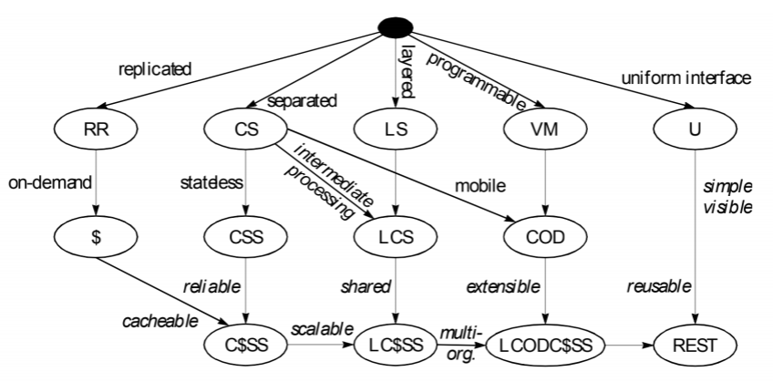
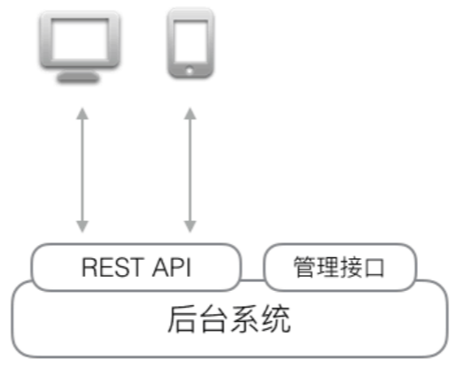
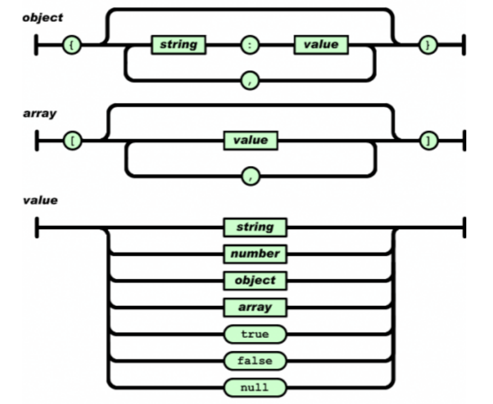

web- 03-REST和JSON
---

<!-- TOC -->

- [1. REST和JSON](#1-rest和json)
  - [1.1. REST Style](#11-rest-style)
    - [1.1.1. 论⽂(推荐)](#111-论推荐)
    - [1.1.2. Web API 与前后端分离](#112-web-api-与前后端分离)
  - [1.2. REST API 规范](#12-rest-api-规范)
  - [1.3. JSON](#13-json)
- [2. RESTful介绍](#2-restful介绍)
  - [2.1. 什么是RESTFul](#21-什么是restful)

<!-- /TOC -->

# 1. REST和JSON

## 1.1. REST Style

### 1.1.1. 论⽂(推荐)
>“The modern Web is one instance of a REST-style architecture.”
1. ⾃从Roy Fielding博⼠在2000年他的博⼠论⽂中提出REST（Representational State Transfer）⻛格的软件架构模式后，REST就基本上迅速取代了复杂⽽笨重的SOAP，成为Web API的标准了。
2. REST是推导出来的，而不是突然想出来的



3. 上图是推导过程:具体过程参考论文
4. 无状态才可以做到扩展，然后可以做一些负载均衡等等操作。

### 1.1.2. Web API 与前后端分离
1. 如果我们想要获取某个电商⽹站的某个商品，输⼊ `http://localhost:3000/products/123` ，就可以看到id为123的商品⻚⾯，但这个结果是HTML页面，它同时混合包含了Product的数据和Product的展示两个部分。对于⽤户来说，阅读起来没有问题，但是，如果机器读取，就很难从HTML中解析出Product的数据。
2. 如果⼀个URL返回的不是HTML，⽽是机器能直接解析的数据，这个URL就可以看成是⼀个Web API。⽐如，读取 `http://localhost:3000/api/products/123` ，如果能直接返回Product的数据，那么机器就可以直接读取。
3. REST就是⼀种设计API的模式。最常⽤的数据格式是JSON。由于JSON能直接被JavaScript读取，所以，以JSON格式编写的REST⻛格的API具有简单、易读、易⽤的特点。
4. 编写API有什么好处呢？由于API就是把Web App的功能全部封装了，所以，通过API操作数据，可以极⼤地把前端和后端的代码隔离，使得后端代码易于测试，前端代码编写更简单。
5. 此外，如果我们把前端⻚⾯看作是⼀种⽤于展示的客户端，那么API就是为客户端提供数据、操作数据的接⼝。这种设计可以获得极⾼的扩展性。例如，当⽤户需要在⼿机上购买商品时，只需要开发针对iOS和Android的两个客户端，通过客户端访问API，就可以完成通过浏览器⻚⾯提供的功能，⽽后端代码基本⽆需改动。
6. 当⼀个Web应⽤以API的形式对外提供功能时，整个应⽤的结构就扩展为：



## 1.2. REST API 规范
1. 编写REST API，实际上就是编写处理HTTP请求的async函数，不过，REST请求和普通的HTTP请求有⼏
个特殊的地⽅：
   1. REST请求仍然是标准的HTTP请求，但是，除了GET请求外，POST、PUT等请求的body是JSON数据格式，请求的 Content-Type 为 application/json ；
   2. REST响应返回的结果是JSON数据格式，因此，响应的 Content-Type 也是 application/json 。
1. REST规范定义了资源的通⽤访问格式，虽然它不是⼀个强制要求，但遵守该规范可以让⼈易于理解。
2. 例如，商品Product就是⼀种资源。获取所有Product的URL如下：
```
GET /api/products
```
3. ⽽获取某个指定的Product，例如，id为 123 的Product，其URL如下:
```
GET /api/products/123
```
4. 新建⼀个Product使⽤POST请求，JSON数据包含在body中，URL如下：
```
POST /api/products
```
5. 更新⼀个Product使⽤PUT请求，例如，更新id为 123 的Product，其URL如下：
```
PUT /api/products/123
```
6. 删除⼀个Product使⽤DELETE请求，例如，删除id为 123 的Product，其URL如下：
```
DELETE /api/products/123
```
7. 资源还可以按层次组织。例如，获取某个Product的所有评论，使⽤：
```
GET /api/products/123/reviews
```
8. 当我们只需要获取部分数据时，可通过参数限制返回的结果集，例如，返回第2⻚评论，每⻚10项，按
时间排序：
```
GET /api/products/123/reviews?page=2&size=10&sort=time
```

## 1.3. JSON
1. JSON（JavaScript Object Notation，JavaScript对象表示法，读作/ˈdʒeɪsən/）是⼀种由道格拉斯·克罗克福特构想和设计、轻量级的数据交换语⾔，该语⾔以易于让⼈阅读的⽂字为基础，⽤来传输由属性值或者序列性的值组成的数据对象。尽管JSON是JavaScript的⼀个⼦集，但JSON是独⽴于语⾔的⽂本格式，并且采⽤了类似于C语⾔家族的⼀些习惯。
2. JSON 数据格式与语⾔⽆关。即便它源⾃JavaScript，但当前很多编程语⾔都⽀持 JSON 式数据的⽣成和解析。JSON 的官⽅ MIME 类型是 application/json ，⽂件扩展名是 .json 。



3. 本质是⼀个正则表达式，JSON的parser是⼀个有限状态机。

# 2. RESTful介绍

## 2.1. 什么是RESTFul
1.  REST（RepresentationalState Transfer）是一种软件架构的设计风格（不是标准），通过 HTTP接口处理数据，主要用于客户端和服务器的数据交互。该风格的具体特点——在服务器端，应用程序对象、数据库记录、算法、文本、图片等都是一个实体资源，使用 URI标识，所有资源都共享统一的接口（标准的HTTP方法）比如 GET、PUT、POST 和 DELETE，在客户端和服务器之间传输数据。

